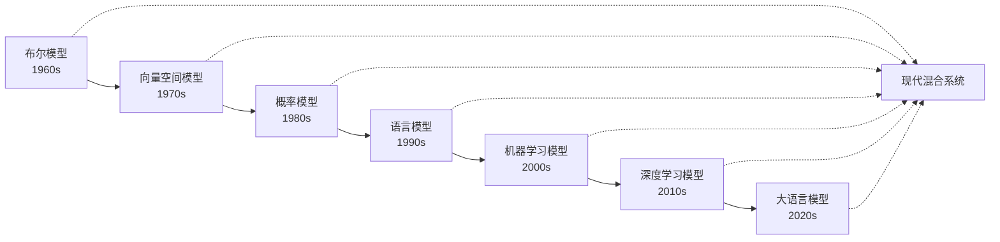

## 🏛️ 布尔模型门派：搜索世界的"开关逻辑"

> **布尔模型是信息检索的"少林派"**——最古老、最基础，却历久弥新的检索门派。它用最简单的"与或非"逻辑，奠定了现代搜索引擎的基石。

### 🧠 门派核心理念：非黑即白的检索哲学

布尔门派认为：信息检索应该像电路开关一样清晰——要么匹配，要么不匹配，没有模糊地带。

想象你是一位图书管理员，有人来问："我想找一本关于'机器学习'的书，要么涉及'Python'要么涉及'Java'，**但不**要涉及'深度学习'的。"

你会怎么做？
1. 找出所有提到"Python"的书 → **集合A**
2. 找出所有提到"Java"的书 → **集合B**
3. 将这两个集合合并 → **A∪B**（并集）
4. 找出所有提到"机器学习"的书 → **集合C**
5. 找出既满足编程语言要求又涉及机器学习的书 → **(A∪B)∩C**（交集）
6. 最后，排除掉涉及"深度学习"的书 → **((A∪B)∩C)-D**（差集）

恭喜！你刚刚施展了布尔门派的"基础拳法"。

### 🎯 实际应用场景

布尔模型在日常生活中无处不在：

**📚 学术搜索**
- 在知网搜索："深度学习 AND (计算机视觉 OR 自然语言处理) NOT 综述"
- 在Google Scholar："machine learning AND python NOT tutorial"

**🛒 电商平台**
- 淘宝搜索："手机 AND (华为 OR 小米) AND -二手"
- 京东筛选：品牌=苹果 AND 价格>5000 AND 库存>0

**💼 招聘网站**
- Boss直聘："Python AND (机器学习 OR 数据分析) AND 北京 NOT 实习"
- LinkedIn："Software Engineer AND (Java OR Python) AND Remote"

**🔍 代码搜索**
- GitHub："language:python AND machine AND learning NOT deprecated"
- Stack Overflow："[python] AND [pandas] NOT [duplicate]"

## 🔧 核心原理：用逻辑运算符连接世界

布尔模型将搜索问题简化为一个**集合运算**问题。每个词项（term）对应一个文档集合，通过逻辑运算符组合这些集合。

### 三大逻辑运算符

| 运算符  | 含义           | 集合运算        | 示例查询                |
| ------- | -------------- | --------------- | ----------------------- |
| **AND** | 与（两者都要） | 交集 $A \cap B$ | `Python AND 机器学习`   |
| **OR**  | 或（至少一个） | 并集 $A \cup B$ | `深度学习 OR 机器学习`  |
| **NOT** | 非（排除）     | 差集 $A - B$    | `机器学习 NOT 深度学习` |

### 数学表示

对于查询 $Q$ 和文档 $D$：
- 文档 $D$ 被表示为一个二进制向量：$D = (d_1, d_2, ..., d_n)$
- 其中 $d_i = 1$ 表示词项 $t_i$ 在文档中出现，$d_i = 0$ 表示未出现

匹配规则：
$$
\text{Match}(Q, D) = \begin{cases}
1, & \text{如果 } D \text{ 满足查询 } Q \text{ 的布尔条件} \\
0, & \text{否则}
\end{cases}
$$

## 📊 工作流程：从查询到结果


### 示例：处理复杂查询

查询：`(Python OR Java) AND 机器学习 AND NOT 深度学习`

1. **解析成表达式树**：
```
            AND
           /   \
          AND   NOT
         /  \    |
        OR  机器学习 深度学习
       / \
   Python Java
```

2. **执行运算**（假设有文档集合）：
   - $D_{Python} = \{1, 3, 5, 7\}$ （包含Python的文档）
   - $D_{Java} = \{2, 3, 6, 8\}$ （包含Java的文档）
   - $D_{机器学习} = \{1, 2, 3, 4, 5\}$ （包含机器学习的文档）
   - $D_{深度学习} = \{3, 4, 5\}$ （包含深度学习的文档）

3. **计算过程**：
   - 步骤1：$D_{Python} \cup D_{Java} = \{1, 2, 3, 5, 6, 7, 8\}$ （Python或Java）
   - 步骤2：$(D_{Python} \cup D_{Java}) \cap D_{机器学习} = \{1, 2, 3, 5, 6, 7, 8\} \cap \{1, 2, 3, 4, 5\} = \{1, 2, 3, 5\}$ （加上机器学习条件）
   - 步骤3：$\{1, 2, 3, 5\} - D_{深度学习} = \{1, 2, 3, 5\} - \{3, 4, 5\} = \{1, 2\}$ （排除深度学习）
   - **最终结果**：文档1和文档2

## 💡 优势与局限

### ✅ 优势
1. **简单直观**：用户容易理解和使用
2. **精确控制**：可以准确表达复杂的信息需求
3. **高效执行**：基于倒排索引的集合运算非常快速
4. **确定性结果**：同样的查询总是返回同样的结果

### ❌ 局限
1. **全有或全无**：文档要么完全匹配，要么完全不匹配，没有"相关度"概念
   - 例如：搜索"机器学习"时，提到100次的论文和只提到1次的博客被同等对待
2. **查询构造困难**：用户需要精确知道要用哪些关键词
   - 普通用户很难构造复杂的布尔表达式
   - 容易出现"空结果"或"结果过多"的极端情况
3. **无法处理同义词**：`car` 和 `automobile` 被视为完全不同的词
   - 搜索"汽车"找不到包含"轿车"的文档
   - 需要手动枚举所有可能的同义词：`(汽车 OR 轿车 OR 车辆)`
4. **结果无排序**：所有匹配的文档都是"平等"的
   - 无法区分哪个文档更相关
   - 用户需要自己筛选大量结果
5. **语义理解缺失**：无法理解查询意图和上下文
   - 搜索"苹果"无法区分是水果还是公司
   - 无法处理否定语义："不贵的手机"中的"不贵"

### 🎯 适用场景建议

**✅ 适合使用布尔模型的场景：**
- **精确查找**：法律文档、技术规范、API文档
- **结构化数据**：数据库查询、日志分析
- **专业搜索**：学术论文、专利检索
- **过滤条件**：电商筛选、招聘网站

**❌ 不适合使用布尔模型的场景：**
- **模糊查询**：日常网页搜索、问答系统
- **语义搜索**：相似文档推荐、智能客服
- **个性化搜索**：基于用户历史的推荐
- **多语言搜索**：跨语言信息检索

## 🔄 现实应用：布尔模型的进化

虽然纯粹的布尔模型有诸多限制，但它的思想在现代搜索系统中依然发挥着重要作用：

### 1. **高级搜索功能**
Google、百度等搜索引擎都支持布尔运算符：
- 引号表示精确匹配：`"机器学习"`
- 减号表示排除：`Python -深度学习`
- site限定网站：`机器学习 site:edu.cn`

### 2. **数据库查询**
SQL的WHERE子句本质上就是布尔逻辑：
```sql
SELECT * FROM books
WHERE (language = 'Python' OR language = 'Java')
  AND topic = '机器学习'
  AND topic != '深度学习'
```

### 3. **编程语言中的布尔查询实现**

**Python + Elasticsearch**
```python
from elasticsearch import Elasticsearch

es = Elasticsearch()

# 布尔查询
query = {
    "query": {
        "bool": {
            "must": [
                {"match": {"topic": "机器学习"}}
            ],
            "should": [
                {"match": {"language": "Python"}},
                {"match": {"language": "Java"}}
            ],
            "must_not": [
                {"match": {"topic": "深度学习"}}
            ],
            "minimum_should_match": 1
        }
    }
}

result = es.search(index="books", body=query)
```

**JavaScript + MongoDB**
```javascript
// MongoDB查询
db.books.find({
    $and: [
        { topic: "机器学习" },
        {
            $or: [
                { language: "Python" },
                { language: "Java" }
            ]
        },
        { topic: { $ne: "深度学习" } }
    ]
})
```

**Java + Lucene**
```java
// Lucene布尔查询
BooleanQuery.Builder builder = new BooleanQuery.Builder();

// 必须包含"机器学习"
builder.add(new TermQuery(new Term("topic", "机器学习")),
           BooleanClause.Occur.MUST);

// 必须包含Python或Java
BooleanQuery.Builder langBuilder = new BooleanQuery.Builder();
langBuilder.add(new TermQuery(new Term("language", "Python")),
               BooleanClause.Occur.SHOULD);
langBuilder.add(new TermQuery(new Term("language", "Java")),
               BooleanClause.Occur.SHOULD);
builder.add(langBuilder.build(), BooleanClause.Occur.MUST);

// 不能包含"深度学习"
builder.add(new TermQuery(new Term("topic", "深度学习")),
           BooleanClause.Occur.MUST_NOT);

Query query = builder.build();
```

### 4. **混合模型**
现代搜索引擎通常将布尔模型作为"硬过滤器"，配合其他排序模型使用：
1. 先用布尔条件筛选候选集
2. 再用TF-IDF或BM25等算法排序

## 🔄 与其他检索模型的对比

| 特性 | 布尔模型 | 向量空间模型 | 概率模型(BM25) | 深度学习模型 |
|------|----------|--------------|----------------|--------------|
| **匹配方式** | 精确匹配 | 相似度计算 | 概率排序 | 语义理解 |
| **结果排序** | 无排序 | 余弦相似度 | 概率得分 | 神经网络得分 |
| **查询复杂度** | 高(需要逻辑表达式) | 中等 | 低(自然语言) | 低(自然语言) |
| **计算复杂度** | 低 | 中等 | 中等 | 高 |
| **同义词处理** | 不支持 | 部分支持 | 部分支持 | 强支持 |
| **语义理解** | 无 | 弱 | 弱 | 强 |
| **适用场景** | 精确查找 | 文档相似性 | 网页搜索 | 智能问答 |

### 🔄 模型演进路径



### 📊 性能对比示例

假设查询："机器学习入门教程"

**布尔模型结果**：
- 查询转换：`机器学习 AND 入门 AND 教程`
- 结果：15个完全匹配的文档（无排序）
- 优点：结果精确，无噪音
- 缺点：可能遗漏相关但用词不同的文档

**向量空间模型结果**：
- 计算查询向量与文档向量的余弦相似度
- 结果：150个文档按相似度排序
- 优点：能找到语义相关的文档
- 缺点：可能包含不太相关的结果

**BM25模型结果**：
- 考虑词频、文档频率、文档长度
- 结果：200个文档按BM25得分排序
- 优点：平衡了精确性和召回率
- 缺点：仍然基于词汇匹配

## 🔧 现代实现：布尔模型的技术细节

### 1. **倒排索引优化**

现代搜索引擎通过优化倒排索引来加速布尔查询：

```python
# 简化的倒排索引结构
inverted_index = {
    "Python": [1, 3, 5, 7, 9],      # 文档ID列表
    "Java": [2, 3, 6, 8, 10],
    "机器学习": [1, 2, 3, 4, 5, 8],
    "深度学习": [3, 4, 5, 7]
}

def boolean_search(query_tree):
    """执行布尔查询"""
    if query_tree.operator == "AND":
        left_docs = boolean_search(query_tree.left)
        right_docs = boolean_search(query_tree.right)
        return set(left_docs) & set(right_docs)  # 交集

    elif query_tree.operator == "OR":
        left_docs = boolean_search(query_tree.left)
        right_docs = boolean_search(query_tree.right)
        return set(left_docs) | set(right_docs)  # 并集

    elif query_tree.operator == "NOT":
        all_docs = set(range(1, 11))  # 假设总共10个文档
        exclude_docs = boolean_search(query_tree.child)
        return all_docs - set(exclude_docs)  # 差集

    else:  # 叶子节点（词项）
        return inverted_index.get(query_tree.term, [])
```

### 2. **查询优化策略**

**短路求值（Short-circuit Evaluation）**：
- AND操作：如果左操作数为空，直接返回空集
- OR操作：如果左操作数包含所有文档，直接返回全集

**查询重写（Query Rewriting）**：
```python
# 原查询：A AND (B OR C) AND D
# 优化后：(A AND D) AND (B OR C)
# 先执行选择性高的操作，减少中间结果集大小
```

### 3. **分布式布尔查询**

在大规模系统中，布尔查询需要跨多个节点执行：

```python
def distributed_boolean_search(query, shards):
    """分布式布尔查询"""
    partial_results = []

    # 并行查询各个分片
    for shard in shards:
        result = shard.execute_boolean_query(query)
        partial_results.append(result)

    # 合并结果
    if query.root_operator == "AND":
        return intersect_all(partial_results)
    elif query.root_operator == "OR":
        return union_all(partial_results)
    else:
        return merge_complex_query(partial_results, query)
```

## 🎓 知识拓展：从布尔到模糊

布尔模型的"非黑即白"特性促使研究者们思考：能否让搜索变得更"模糊"、更"人性化"？

这催生了后续的发展：
- **扩展布尔模型**：引入部分匹配的概念
- **模糊集合理论**：允许元素以不同程度属于集合
- **向量空间模型**：用连续的相似度替代离散的匹配

### 🔄 扩展布尔模型示例

传统布尔模型：文档要么匹配(1)，要么不匹配(0)
扩展布尔模型：文档可以部分匹配(0.0-1.0)

```python
def extended_boolean_match(query, document):
    """扩展布尔模型：支持部分匹配"""
    if query.operator == "AND":
        left_score = extended_boolean_match(query.left, document)
        right_score = extended_boolean_match(query.right, document)
        return min(left_score, right_score)  # AND取最小值

    elif query.operator == "OR":
        left_score = extended_boolean_match(query.left, document)
        right_score = extended_boolean_match(query.right, document)
        return max(left_score, right_score)  # OR取最大值

    else:  # 词项匹配
        return calculate_term_relevance(query.term, document)
```

## 📖 延伸阅读

- [George Boole - 布尔代数的创始人](https://en.wikipedia.org/wiki/George_Boole)
- [布尔检索在Elasticsearch中的实现](https://www.elastic.co/guide/en/elasticsearch/reference/current/query-dsl-bool-query.html)
- [从布尔模型到现代搜索引擎的演进](https://nlp.stanford.edu/IR-book/html/htmledition/boolean-retrieval-1.html)

## 🤔 思考题

> 1. 为什么说布尔模型是"语法正确但语义贫乏"的？
> 2. 如果要搜索"不太贵的笔记本电脑"，布尔模型会遇到什么困难？
> 3. 现代搜索引擎如何在保持布尔模型精确性的同时，又能提供相关度排序？
> 4. 设计一个布尔查询来找到："讨论Python或Java，涉及Web开发，但不是入门教程的技术博客"
> 5. 在电商网站中，如何用布尔逻辑实现多维度商品筛选（价格、品牌、评分、库存等）？
> 6. 为什么法律文档检索系统仍然大量使用布尔模型，而不是更"智能"的语义搜索？
> 7. 如果你要设计一个支持布尔查询的搜索引擎，如何处理以下挑战：
>    - 查询解析的歧义性（如括号优先级）
>    - 大规模数据的分布式查询
>    - 查询性能优化
> 8. 在什么情况下，布尔模型的"全有或全无"特性反而是优势而不是劣势？
> 9. 人工智能时代，布尔模型是否已经过时？它在现代搜索系统中还有什么不可替代的价值？
> 10. 如何将布尔模型与机器学习模型结合，既保持精确控制又获得智能排序？

::: tip 🎉 章节小结
布尔模型用最朴素的"与或非"逻辑，开创了计算机处理信息检索的先河。它的核心价值不在于能解决所有搜索问题，而在于提供了一个**清晰、可计算、可扩展**的起点。正如编程从"Hello World"开始，搜索技术的学习也从理解布尔模型开始。它教会我们：复杂的搜索需求，可以分解为简单的逻辑组合。
:::

> **布尔模型就像搜索世界的"开关电路"——虽然每个开关只有开和关两种状态，但通过巧妙的组合，却能控制整个信息世界的流动。**


