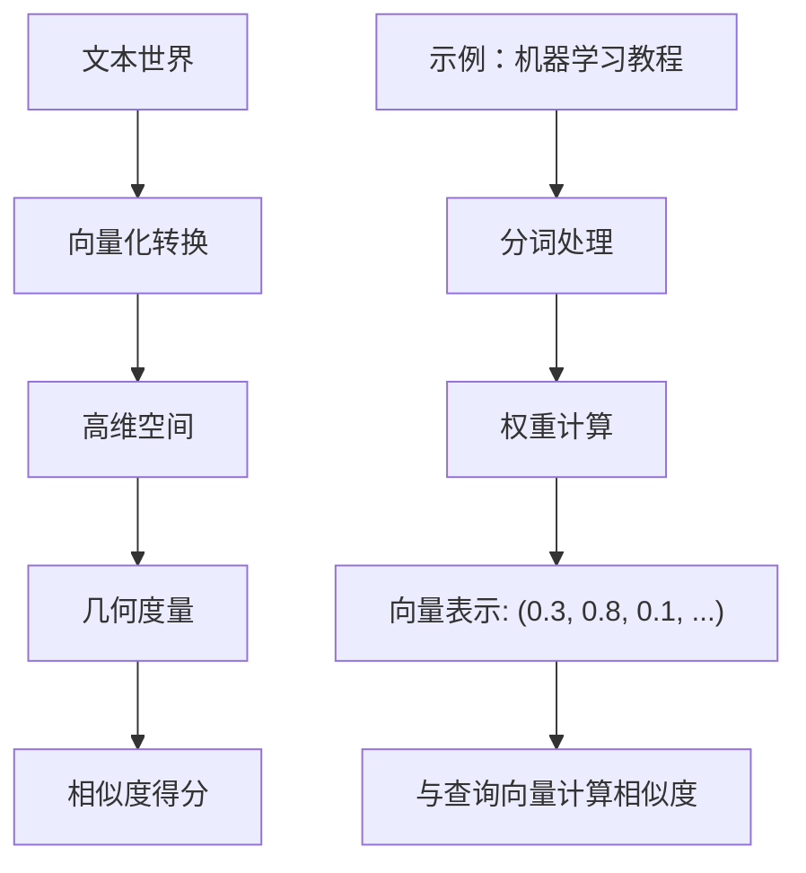
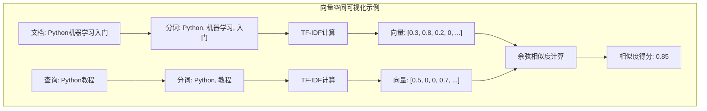
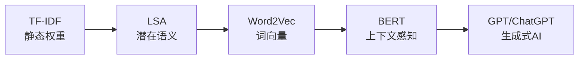

## 🌌 向量空间门派：搜索世界的"量化大师"

> **向量空间门派是信息检索的"武当派"**——以内功深厚（数学基础）著称，擅长将模糊的文本关系转化为精确的几何度量，开创了搜索从"定性匹配"到"定量排序"的新纪元。

**核心概念**：向量空间模型（Vector Space Model，简称**VSM**）是一种将文档和查询表示为高维向量的数学模型，通过计算向量间的几何关系来衡量文本相似度。

### 🧠 门派核心理念：万物皆可向量化

布尔门派的"非黑即白"哲学在复杂信息世界中显得力不从心：
- 一篇提到100次"机器学习"的专业论文
- 一篇只在引言中提及"机器学习"的新闻报道

在布尔门派眼中，它们都是"匹配"的；而在向量空间门派看来，这两者的相关度有天壤之别！

**核心顿悟**：文本可以表示为高维空间中的向量，词语是维度，权重是坐标。两篇文档的相似度，就是它们向量之间的夹角大小。

### 🔄 从布尔到向量：思维的转变

让我们通过一个直观的对比来理解这种转变：

**布尔模型的世界观**：
- 文档要么匹配，要么不匹配（0或1）
- 就像开关：要么开，要么关

**向量空间模型的世界观**：
- 文档有不同程度的相关性（0.0到1.0的连续值）
- 就像调光器：可以精细调节亮度

下图展示了VSM的核心工作流程：



### 🤔 关键问题：如何确定词语的重要性？

在向量空间中，每个词语都对应一个维度，但关键问题是：**如何确定每个词在文档中的权重？**

这就引出了VSM的核心技术——**TF-IDF权重计算方法**。

**TF-IDF**（Term Frequency-Inverse Document Frequency，词频-逆文档频率）是一种统计方法，用于评估一个词对于一个文档集或语料库中某份文档的重要程度。

让我们先通过一个简单例子理解这个概念，然后再深入数学细节。

## 🎨 核心思想：文本的几何表示

### 从文字到向量的魔法

想象一个三维空间，每个维度代表一个词：
- X轴：Python
- Y轴：机器学习  
- Z轴：深度学习

一篇文档就是这个空间中的一个点：
- 文档A：大量讨论Python和机器学习 → 坐标(8, 10, 2)
- 文档B：专注深度学习理论 → 坐标(1, 3, 15)
- 查询Q："Python机器学习教程" → 坐标(1, 1, 0)

为了更好地理解这个过程，让我们看一个具体的向量化示例：



这个图展示了从原始文本到最终相似度得分的完整流程。

### 数学表示

对于包含 $n$ 个不同词项的词汇表：
- 文档 $d$ 表示为：$\vec{d} = (w_{1,d}, w_{2,d}, ..., w_{n,d})$
- 查询 $q$ 表示为：$\vec{q} = (w_{1,q}, w_{2,q}, ..., w_{n,q})$

其中 $w_{i,d}$ 是词项 $i$ 在文档 $d$ 中的权重。

## 📐 相似度计算：余弦的妙用

### 为什么选择余弦相似度？

两个向量的相似度可以用多种方式衡量，但余弦相似度最受青睐：

$$\text{similarity}(d, q) = \cos(\theta) = \frac{\vec{d} \cdot \vec{q}}{|\vec{d}| \times |\vec{q}|} = \frac{\sum_{i=1}^{n} w_{i,d} \times w_{i,q}}{\sqrt{\sum_{i=1}^{n} w_{i,d}^2} \times \sqrt{\sum_{i=1}^{n} w_{i,q}^2}}$$

**直观理解**：
- 余弦值范围：[-1, 1]，在文本检索中通常为[0, 1]
- 1 = 完全相同方向（最相似）
- 0 = 正交（无关）
- -1 = 完全相反方向（在文本中很少出现）

**关键优势**：余弦相似度只关注方向，不受向量长度影响。这意味着一篇短文和一篇长文，只要主题比例相似，就能获得高分。

## 🔢 深入理解TF-IDF：智慧的权重设计

现在让我们深入了解TF-IDF的数学原理和设计智慧。

### 🥋 第一式：词频拳（TF）

**核心思想**：一个词在文档中出现得越频繁，它对该文档就越重要。

$$\text{TF}(t, d) = \frac{\text{词项 } t \text{ 在文档 } d \text{ 中出现的次数}}{\text{文档 } d \text{ 的总词数}}$$

**招式要义**：高频词通常更重要，但有上限——出现10次和5次的重要性并非简单的2倍关系。

**实际问题**：简单的词频有个致命缺陷："的"、"是"、"在"这些停用词出现频率极高，却没什么信息量。这就需要第二式来平衡。

### 🥋 第二式：逆文档频率掌（IDF）

**核心思想**：一个词在整个文档集中出现得越少，它的区分能力就越强。

$$\text{IDF}(t) = \log \frac{\text{文档总数 } N}{\text{包含词项 } t \text{ 的文档数 } df_t}$$

**招式要义**：稀有词更珍贵！在1000篇文档中只出现10次的词，比出现在900篇文档中的词更能代表独特主题。

**IDF的智慧**：
- 常见词（如"的"）→ 出现在几乎所有文档中 → IDF接近0
- 稀有词（如"量子计算"）→ 只在少数文档中出现 → IDF较大
- 对数函数确保IDF不会过大，避免稀有词权重过度膨胀

### 🥋 组合技：TF-IDF合璧

$$\text{TF-IDF}(t, d) = \text{TF}(t, d) \times \text{IDF}(t)$$

**威力展示**：这个公式实现了绝妙的平衡，一个词必须同时满足：
- 在当前文档中频繁出现（高TF）
- 在整个文档集中相对稀有（高IDF）
- 才能获得高权重

## 🎯 实战示例：一步步计算TF-IDF

假设我们有3个文档的迷你语料库：

| 文档 | 内容 |
|------|------|
| D1 | Python 机器学习 机器学习 实战 |
| D2 | 深度学习 Python 深度学习 |
| D3 | 机器学习 实战 项目 |

**步骤1：构建词汇表**
词汇表：[Python, 机器学习, 实战, 深度学习, 项目]

**步骤2：计算TF**
以D1为例：
- TF(Python, D1) = 1/4 = 0.25
- TF(机器学习, D1) = 2/4 = 0.5
- TF(实战, D1) = 1/4 = 0.25

**步骤3：计算IDF**
- IDF(Python) = log(3/2) ≈ 0.176
- IDF(机器学习) = log(3/2) ≈ 0.176  
- IDF(深度学习) = log(3/1) ≈ 0.477

**步骤4：计算TF-IDF向量**
D1的TF-IDF向量：[0.044, 0.088, 0.044, 0, 0]

## 💪 向量空间模型的威力：实际应用

### 1. 搜索引擎排序
现代搜索引擎的基础排序信号之一就是TF-IDF相似度：
```python
# 伪代码示例
def search(query, documents):
    query_vector = compute_tfidf_vector(query)
    scores = []
    for doc in documents:
        doc_vector = compute_tfidf_vector(doc)
        score = cosine_similarity(query_vector, doc_vector)
        scores.append((doc, score))
    return sorted(scores, key=lambda x: x[1], reverse=True)
```

### 2. 文档聚类
相似的文档在向量空间中距离较近，可以用K-means等算法自动聚类。

### 3. 推荐系统
基于内容的推荐本质上就是找到与用户历史兴趣向量最相似的物品向量。

## 🎭 向量空间模型的优雅与局限

### ✨ 优雅之处
1. **数学基础坚实**：建立在线性代数之上，理论完备
2. **直观可解释**：权重和相似度都有明确的物理意义
3. **计算高效**：稀疏向量的点积运算可以高度优化
4. **效果稳定**：不需要训练，开箱即用

### 🚧 局限性
1. **词袋假设**：忽略词序，"机器学习"和"学习机器"被视为相同
2. **独立性假设**：假设词与词之间相互独立
3. **同义词问题**：无法识别"汽车"和"轿车"的语义相似性
4. **维度灾难**：词汇表可能有数十万维，计算和存储成本高

## 🔮 从向量空间模型到语义搜索的演进

向量空间模型的局限性为我们指明了下一代搜索技术的发展方向。让我们了解一下这些更高级的技术：

### 🚀 技术演进路径

**1. LSA（Latent Semantic Analysis，潜在语义分析）**
- **核心思想**：通过奇异值分解（SVD）降维，发现词与词之间的潜在语义关系
- **突破**：能够识别同义词，如"汽车"和"轿车"在降维后的空间中距离很近
- **局限**：计算复杂度高，难以处理大规模数据

**2. Word2Vec（词向量）**
- **核心思想**：学习词的分布式表示，将词映射到低维稠密向量空间
- **突破**：著名的"国王-男人+女人≈女王"语义运算
- **优势**：能够捕捉词汇间的语义和语法关系

**3. BERT（Bidirectional Encoder Representations from Transformers）**
- **核心思想**：考虑上下文的动态词向量，同一个词在不同语境下有不同表示
- **突破**：真正理解语言的上下文含义
- **应用**：现代搜索引擎和问答系统的核心技术

### 🔄 从静态到动态的转变



这个演进过程展示了搜索技术从简单的词汇匹配，逐步发展到真正理解语言语义的历程。

## 📖 延伸阅读

- [向量空间模型的数学原理](https://nlp.stanford.edu/IR-book/html/htmledition/the-vector-space-model-for-scoring-1.html)
- [TF-IDF的各种变体](https://en.wikipedia.org/wiki/Tf%E2%80%93idf#Term_frequency_2)
- [从TF-IDF到BM25的演进](https://www.elastic.co/blog/practical-bm25-part-2-the-bm25-algorithm-and-its-variables)
- [Scikit-learn中的TF-IDF实现](https://scikit-learn.org/stable/modules/feature_extraction.html#tfidf-term-weighting)

## 🤔 思考题

> 1. 为什么余弦相似度比欧氏距离更适合文本相似度计算？
> 2. TF-IDF中的对数（log）起到了什么作用？如果不用对数会怎样？
> 3. 一个词的IDF值为0意味着什么？这种词应该如何处理？
> 4. 向量空间模型假设词与词相互独立，但"机器"和"学习"显然有关联。如何改进？
> 5. 为什么说向量空间模型实现了从"开关"到"调光器"的转变？这个比喻的深层含义是什么？

::: tip 🎉 章节小结
向量空间模型实现了信息检索从"定性"到"定量"的飞跃。通过TF-IDF这个简单而精妙的公式，我们第一次能够用数字来衡量"相关度"这个模糊的概念。虽然它有着词袋模型的种种局限，但其核心思想——**将文本映射到向量空间，用几何方法解决语义问题**——深刻影响了后续所有的文本处理技术，从LSA到Word2Vec，再到今天的BERT，都是这个思想的延续和深化。
:::

> **TF-IDF就像一个经验丰富的图书管理员——它知道哪些词是"大路货"（高频低价值），哪些词是"镇馆之宝"（低频高价值），从而帮你找到真正有价值的信息。**


