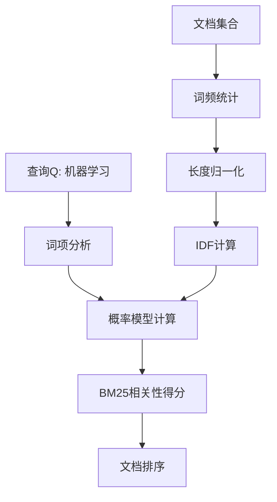
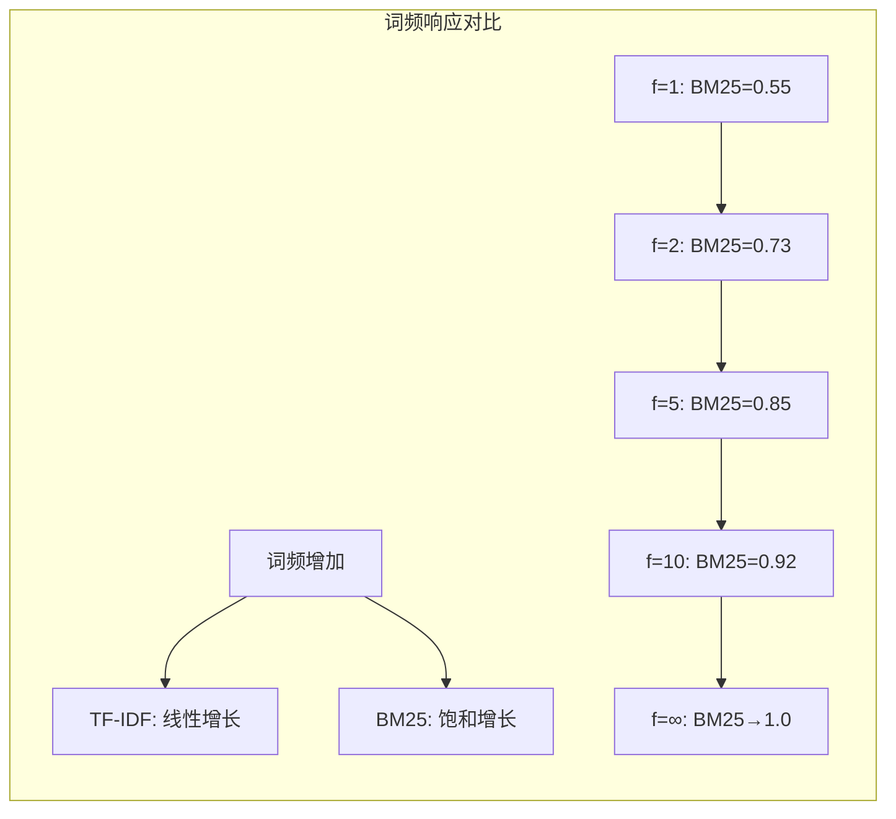

## 🛡️ BM25门派：搜索江湖的"实战派"

> **BM25门派是信息检索的"丐帮"**——人数最多（工业界应用最广）、招式最实用（效果稳定可靠）、历经实战考验（数十年行业标准），以概率模型为内功心法，在复杂的搜索场景中始终保持强大战斗力。

**核心概念**：BM25（Best Matching 25，最佳匹配25）是一种基于概率理论的文档排序算法，它改进了TF-IDF模型的不足，成为现代搜索引擎的工业标准。

### 🔄 从TF-IDF到BM25：技术演进的必然

在前面的章节中，我们学习了向量空间模型和TF-IDF算法。TF-IDF虽然优雅，但在实际应用中暴露出一些问题，这促使研究者们寻找更好的解决方案，BM25就是这种探索的结晶。

### 🧠 门派核心理念：从几何相似到概率相关

回顾一下我们的学习历程：
- **布尔模型**：文档要么匹配，要么不匹配（0或1）
- **向量空间模型**：通过TF-IDF计算文档与查询的几何相似度（0.0到1.0）
- **BM25模型**：基于概率理论计算文档与查询的相关概率

### 🔍 TF-IDF的三大局限

虽然TF-IDF在很多场景下表现良好，但在实战中暴露出三大破绽：

1. **词频迷思**：一个词出现10次真的比5次重要2倍吗？
   - TF-IDF假设词频与重要性成正比
   - 但现实中，词频的边际效用递减

2. **长度偏见**：长文档天然包含更多词，容易获得不公平优势
   - 长文档更容易包含查询词
   - 缺乏有效的长度归一化机制

3. **僵化不变**：一套公式打天下，无法适应不同场景
   - 没有可调参数来适应不同类型的文档集合
   - 无法针对特定应用场景优化

### 💡 BM25的解决方案：概率相关性模型

BM25采用**概率相关性模型（Probabilistic Relevance Model）**作为理论基础，这是一个根本性的思维转变：

- **TF-IDF思路**：计算文档与查询的相似度
- **BM25思路**：计算文档与查询相关的概率

这种转变让排序有了坚实的数学基础，并为解决TF-IDF的问题提供了理论支撑。


### 🔄 BM25工作流程

下图展示了BM25算法的核心工作流程，从查询输入到最终排序的完整过程：



## 🎯 BM25的核心创新：三大突破

BM25之所以能够成为工业标准，在于它针对TF-IDF的三大局限提出了对应的解决方案。让我们深入了解这三大创新：

### 💡 创新一：词频饱和机制

**问题**：TF-IDF中词频与重要性成正比，但这不符合现实
**解决方案**：引入饱和函数

$$\text{词频得分} = \frac{f(q_i, D) \cdot (k_1 + 1)}{f(q_i, D) + k_1}$$

**核心思想**：
- 第1次出现：重要性显著提升
- 后续出现：重要性增长逐渐放缓
- 无限次出现：重要性趋于上限

这个设计避免了关键词堆砌，更符合人类对文本重要性的直觉认知。

### ⚖️ 创新二：文档长度归一化

**问题**：长文档天然包含更多词汇，获得不公平优势
**解决方案**：动态长度调整

$$\text{长度因子} = 1 - b + b \cdot \frac{|D|}{\text{avgdl}}$$

**核心思想**：
- 短文档（< 平均长度）：权重适当提升
- 长文档（> 平均长度）：权重适当降低
- 参数b控制归一化强度（通常取0.75）

### 🔍 创新三：改进的IDF计算

**问题**：传统IDF可能出现数值不稳定
**解决方案**：添加平滑项

$$\text{IDF}(q_i) = \ln \frac{N - df(q_i) + 0.5}{df(q_i) + 0.5}$$

**核心思想**：
- 加入0.5平滑项，避免除零错误
- 保持稀有词的高权重特性
- 数值更加稳定可靠

## 📊 理论基础：概率相关性模型深入解析

### 🎲 概率思维的转变

BM25的理论基础是**概率相关性模型（Probabilistic Relevance Model）**，这代表了信息检索思维的重大转变：

**传统思维（TF-IDF）**：
- 问题：这个文档与查询有多相似？
- 方法：计算向量间的几何距离
- 结果：相似度得分

**概率思维（BM25）**：
- 问题：给定查询，这个文档相关的概率是多少？
- 方法：基于统计模型估算概率
- 结果：相关性概率

### 🔢 概率模型的核心假设

BM25模型基于以下关键假设：

1. **二元相关性**：给定查询，文档要么相关（R=1），要么不相关（R=0）
2. **词项独立性**：查询中的不同词项对相关性的贡献相互独立
3. **统计可估算性**：可以通过文档集合的统计特征估算相关概率

虽然这些假设在现实中并不完全成立，但它们为构建实用的排序算法提供了可行的数学框架。

## 🧮 BM25公式：精妙的平衡艺术

现在让我们看看BM25如何将前面提到的三大创新整合到一个统一的数学公式中。

### 🔍 完整公式展示

$$\text{BM25}(D, Q) = \sum_{i=1}^{n} \text{IDF}(q_i) \cdot \frac{f(q_i, D) \cdot (k_1 + 1)}{f(q_i, D) + k_1 \cdot (1 - b + b \cdot \frac{|D|}{\text{avgdl}})}$$

这个公式看起来复杂，但实际上是三个核心组件的优雅组合。让我们逐步拆解：

### 公式解析

1. **IDF部分**：
   $$\text{IDF}(q_i) = \ln \frac{N - df(q_i) + 0.5}{df(q_i) + 0.5}$$
   - 与TF-IDF类似，但加入了平滑项0.5，避免除零错误

2. **TF部分的饱和函数**：
   $$\frac{f(q_i, D) \cdot (k_1 + 1)}{f(q_i, D) + k_1}$$
   - $f(q_i, D)$：词项$q_i$在文档$D$中的频率
   - $k_1$：控制词频饱和速度的参数（通常取1.2）
   - 这是一个**饱和函数**：词频增加，分数增长但增速递减

3. **文档长度归一化**：
   $$1 - b + b \cdot \frac{|D|}{\text{avgdl}}$$
   - $|D|$：文档长度
   - $\text{avgdl}$：平均文档长度
   - $b$：长度归一化参数（通常取0.75）

## 📈 BM25的实际效果：直观理解

### 🔄 词频饱和效果可视化

为了更好地理解BM25的词频饱和机制，让我们通过图表对比TF-IDF和BM25的不同表现：



**关键洞察**：
- **第1次出现**：重要性显著提升（0→0.55）
- **第2次出现**：仍有明显提升（0.55→0.73）
- **第5次出现**：提升放缓（0.85）
- **第10次出现**：增益很小（0.92）
- **无限次出现**：趋于上限（1.0）

这种设计完美解决了关键词堆砌问题，更符合人类对文本重要性的认知。

### ⚖️ 长度归一化的智慧

BM25通过参数化的方式优雅地解决了文档长度偏见：

**长度效应**：
- 短文档（< 平均长度）：$\frac{|D|}{\text{avgdl}} < 1$ → 权重提升
- 长文档（> 平均长度）：$\frac{|D|}{\text{avgdl}} > 1$ → 权重降低

**参数b的作用**：
- $b=0$：完全忽略长度差异
- $b=1$：完全按长度归一化
- $b=0.75$：平衡考虑（经验最优值）

### 🎛️ 参数调优的灵活性

不同应用场景需要不同的参数配置：

| 应用场景 | k₁ | b | 原因 |
|----------|----|----|------|
| **网页搜索** | 1.2 | 0.75 | 标准配置，适用于大多数场景 |
| **标题搜索** | 2.0 | 0.0 | 标题短且长度相近，不需要长度归一化 |
| **学术论文** | 1.2 | 0.9 | 论文长度差异大，需要强归一化 |
| **短文本** | 1.6 | 0.3 | 文本较短，减少长度归一化影响 |

## 🔬 实战演练：计算BM25分数

假设我们有一个简单的场景：
- 查询Q："机器学习"
- 文档D：包含3次"机器学习"，总长度100词
- 语料库：1000篇文档，"机器学习"出现在100篇中
- 平均文档长度：150词
- 参数：$k_1=1.2, b=0.75$

**计算步骤**：

1. **IDF计算**：
   $$\text{IDF} = \ln \frac{1000 - 100 + 0.5}{100 + 0.5} = \ln \frac{900.5}{100.5} \approx 2.19$$

2. **长度归一化因子**：
   $$1 - 0.75 + 0.75 \times \frac{100}{150} = 0.25 + 0.5 = 0.75$$

3. **BM25分数**：
   $$\text{BM25} = 2.19 \times \frac{3 \times 2.2}{3 + 1.2 \times 0.75} = 2.19 \times \frac{6.6}{3.9} \approx 3.71$$

## 💼 BM25的实际应用

### 1. Elasticsearch/Lucene
BM25是Elasticsearch的默认评分算法：
```json
{
  "query": {
    "match": {
      "content": {
        "query": "机器学习",
        "boost": 1.0
      }
    }
  }
}
```

### 2. 搜索引擎优化
理解BM25帮助SEO：
- 关键词密度有上限（饱和效应）
- 页面长度要适中（长度归一化）
- 稀有词更有价值（IDF效应）

### 3. 问答系统
BM25常用作第一阶段召回：
```python
# 伪代码
def retrieve_passages(question, passages, top_k=10):
    bm25 = BM25(passages)
    scores = bm25.get_scores(question)
    top_passages = sorted(passages, key=lambda x: scores[x], reverse=True)[:top_k]
    return top_passages
```

## 🎯 BM25 vs TF-IDF：实战对比

| 特性 | TF-IDF | BM25 |
|------|--------|------|
| **理论基础** | 启发式 | 概率模型 |
| **词频处理** | 线性增长 | 饱和增长 |
| **长度归一化** | 无 | 内置 |
| **参数调优** | 无参数 | k1, b可调 |
| **计算复杂度** | O(n) | O(n) |
| **实际效果** | 好 | 更好 |

## 🔮 BM25的演进：变体与未来发展

BM25作为经典算法，在不同应用场景中催生了多种变体，同时在深度学习时代仍然发挥着重要作用。

### 🏗️ 主要变体

**BM25F（Field-based BM25）**
针对结构化文档的改进版本：
- **核心思想**：不同字段（标题、正文、标签）应有不同权重
- **应用场景**：网页搜索、电商搜索
- **优势**：标题匹配比正文匹配获得更高权重

**BM25+**
改进IDF计算的版本：
$$\text{IDF} = \ln \frac{N + 1}{df(q_i)}$$
- **改进点**：解决长尾词的IDF计算问题
- **优势**：数值更稳定，避免极端情况

### 🤖 深度学习时代的BM25

即使在神经网络大行其道的今天，BM25依然扮演着重要角色：

**1. 作为特征工程的基础**
- 神经排序模型常将BM25得分作为输入特征
- 提供传统统计信息的补充

**2. 作为负采样的依据**
- 训练深度模型时，BM25帮助选择困难负样本
- 提高模型训练效率

**3. 作为混合模型的基线**
- 现代搜索系统常采用BM25+神经网络的混合架构
- BM25提供稳定的基础排序，神经网络提供语义理解

### 🚀 未来发展趋势

- **个性化BM25**：结合用户历史行为调整参数
- **上下文感知BM25**：考虑查询上下文和用户意图
- **多模态BM25**：扩展到图像、视频等多媒体内容

## 📖 延伸阅读

- [The Probabilistic Relevance Framework: BM25 and Beyond](https://www.staff.city.ac.uk/~sbrp622/papers/foundations_bm25_review.pdf)
- [Elasticsearch中的BM25实现](https://www.elastic.co/blog/practical-bm25-part-2-the-bm25-algorithm-and-its-variables)
- [BM25算法详解与优化](https://github.com/dorianbrown/rank_bm25)

## 🤔 思考题

> 1. 为什么BM25使用饱和函数而不是线性函数来处理词频？这种设计解决了什么实际问题？
> 2. 参数b=0.75是如何确定的？不同类型的文档集合是否需要不同的b值？
> 3. BM25假设查询词之间相互独立，这个假设合理吗？如何改进？
> 4. 在什么情况下，简单的TF-IDF可能比BM25效果更好？
> 5. 为什么说BM25代表了从"几何相似"到"概率相关"的思维转变？这种转变的意义是什么？

::: tip 🎉 章节小结
BM25代表了经典信息检索技术的巅峰。它不仅在理论上优雅——基于概率相关性模型，在实践中也极其有效——成为工业标准。通过词频饱和、长度归一化和参数可调这三大创新，BM25解决了TF-IDF的主要缺陷，为后续的学习排序（Learning to Rank）和神经信息检索奠定了基础。即使在深度学习大行其道的今天，理解BM25依然是理解现代搜索技术的关键。
:::

> **BM25就像一位经验丰富的大厨——它知道盐放多了会咸（词频饱和），知道大盘菜和小碟菜不能用同样的调料量（长度归一化），还能根据不同客人的口味调整配方（参数可调）。**


