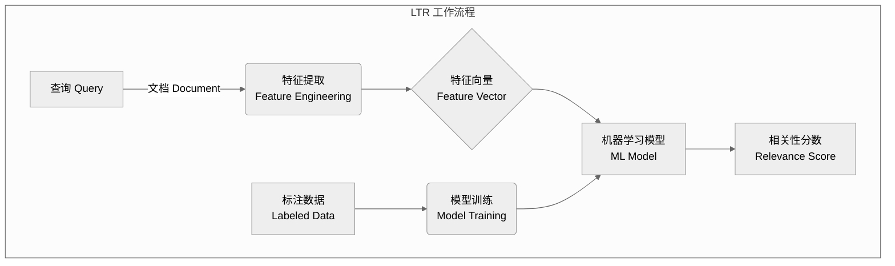
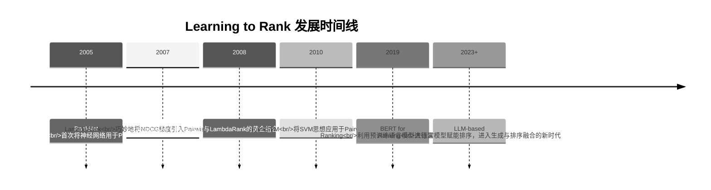

## 🎓 从规则到学习：搜索排序的范式转变

> **如果说BM25是"手工打造的瑞士手表"，那么Learning to Rank就是"AI驱动的智能手表"**——它让排序从人工设计规则进化到机器自动学习。

回顾我们学过的经典模型：
- **布尔模型**：硬性规则，非黑即白，简单粗暴。
- **TF-IDF**：启发式公式，依赖经验进行设计。
- **BM25**：基于概率模型，有理论支撑但仍是预设公式。

它们都有一个共同特点：**排序规则是人为设定的**。但现实世界远比公式复杂：
- 用户搜索"苹果"，是想买iPhone还是水果？
- 同样包含"机器学习"的两篇文章，哪篇对初学者更友好？
- 除了文本相关性，点击率、停留时间、用户画像等成百上千的信号是否也该考虑？

**Learning to Rank（LTR）** 的革命性思想是：与其煞费苦心地设计复杂规则，不如让机器从海量数据中自动学习什么是"好的排序"。

## 🌍 LTR到底在解决什么问题？

### 传统方法的困境

想象你是Google的工程师，需要设计一个精妙的排序公式：
```
Score = α×BM25 + β×PageRank + γ×点击率 + δ×新鲜度 + ...
```

挑战接踵而至：
1.  **特征爆炸**：可能有上百个相关特征，如何优雅地组合它们？
2.  **权重困境**：参数α、β、γ、δ... 应该如何设置？靠"炼丹"吗？
3.  **非线性关系**：特征之间可能存在复杂的高阶交互作用，简单的线性叠加无法捕捉。
4.  **场景差异**：搜索新闻和搜索商品的排序逻辑可能完全不同，一套公式难以通用。

### LTR的解决方案

LTR巧妙地将排序问题转化为了一个标准的**监督学习问题**，三步走：
- **输入 (X)**：一个"查询-文档"对的特征向量 (feature vector)。
- **输出 (Y)**：该文档的相关性分数或排序位置。
- **训练数据**：海量的人工标注或用户行为日志。
- **模型 (f)**：训练一个机器学习模型 `f`，使得 `f(X)` 的输出尽可能接近 `Y`。



## 📊 LTR的三大流派：Pointwise, Pairwise, Listwise

根据如何定义损失函数（即如何"惩罚"模型的错误），LTR方法主要分为三大流派。

### 1. Pointwise (单点法): 把排序当成回归/分类

**核心思想**：独立预测每个文档的"绝对"相关性分数，对其他文档一无所知。

- **回归 (Regression)**：直接预测一个精确的相关性分数，例如 [0, 5] 区间的分值。
- **分类 (Classification)**：将其看作一个多分类问题，预测文档所属的相关性等级（如：完美、优秀、良好、一般、差）。

**优点**：简单直观，可以无缝套用任何现成的回归或分类算法。
**缺点**：完全忽略了文档之间的相对顺序，而这恰恰是排序的本质。它只关心“这个文档有多好”，不关心“它是否比另一个文档更好”。

### 2. Pairwise (配对法): 把排序当成两两比较

**核心思想**：学习文档对的"相对"顺序，更符合排序的本质。

- **问题转化**：对于同一个查询，如果文档A比文档B更相关，那么 `(A, B)` 就构成一个正样本对，反之亦然。模型需要学习判断哪个文档更优。
- **二分类**：将排序问题巧妙地转化为一个二分类问题：“A是否比B更相关？”。

**优点**：直接优化文档间的相对顺序关系，比Pointwise更接近排序目标。
**缺点**：忽略了文档在列表中的绝对位置信息。并且，不同查询下的文档对数量可能差异巨大，给训练带来不便。

### 3. Listwise (列表法): 直接优化整个排序列表

**核心思想**：将整个文档排序列表作为一个完整的实例来学习和优化，力求全局最优。

- **直接优化排序指标**：其损失函数通常直接与排序的最终评价指标（如NDCG, MAP）挂钩或近似。
- **全局视角**：模型在预测时会考虑列表中所有文档，最大化整个列表的期望指标。

**优点**：与最终的评价指标完全一致，理论上效果最好。
**缺点**：优化过程通常非常复杂，计算成本也更高。

## 🔧 LTR的核心三要素

### 1. 特征工程：排序的"原材料"

LTR模型的性能很大程度上取决于特征的质量。这些特征通常分为三类：

| 特征类型 | 示例 | 作用 |
|---|---|---|
| **查询特征 (Query Features)** | 查询长度、查询词的搜索频率、查询的意图分类 | 理解用户的搜索意图 |
| **文档特征 (Document Features)** | PageRank、文档长度、内容时效性、作者权威度 | 评估文档本身的静态质量 |
| **查询-文档特征 (Query-Doc Features)** | BM25分数、TF-IDF相似度、查询词在标题/正文的覆盖率 | 衡量查询与文档之间的动态相关性 |

### 2. 训练数据：排序的"教科书"

高质量的训练数据是LTR成功的关键，主要有两种来源：

**人工标注 (Human Labeling)**：
- 由专业的标注员对"查询-文档"对的相关性进行评估。
- 通常分为多个等级（例如：0-4分，从不相关到完美相关）。
- **优点**：质量高，是"黄金标准"。
- **缺点**：成本极其高昂。

**用户行为日志 (Log-based Data)**：
- 利用用户的点击、停留、收藏等行为作为隐式反馈 (Implicit Feedback)。
- 例如，一个被高频点击的文档通常被认为是相关的。
- **优点**：数据量巨大，可持续获取。
- **缺点**：充满噪声，需要处理用户的位置偏差 (Position Bias) 等问题。

### 3. 评价指标：排序的"考试成绩"

如何衡量一个排序列表的好坏？以下是几种核心指标：

- **NDCG (Normalized Discounted Cumulative Gain)**：最常用也是最重要的指标之一。它同时考虑了相关性等级和文档在列表中的位置，排名越靠前的相关文档得分越高。
- **MAP (Mean Average Precision)**：衡量系统在所有相关文档上召回的平均精确度。
- **MRR (Mean Reciprocal Rank)**：衡量系统找到第一个相关文档的效率，特别适用于问答、导航类搜索。

## 🎯 为什么LTR如此重要？

### 1. 强大的适应性与扩展性
- **新特征？** 随时加入模型，无需重构整个排序公式。
- **新场景？** 用新场景的数据重新训练一个模型即可。
- **用户反馈？** 可以融入到下一轮的训练数据中，实现持续优化。

### 2. 效果显著，业界标配
- Google、Baidu、Bing、Taobao... 所有头部的搜索引擎和推荐系统都在广泛使用LTR。
- 相比纯BM25等传统模型，能够带来显著的点击率和用户满意度提升。

### 3. 一定的可解释性
- 许多LTR模型（如GBDT）可以分析特征的重要性，帮助我们理解哪些因素对排序最关键。
- 便于进行错误案例诊断和A/B测试验证。

## 🚀 LTR的演进历程



## 📖 延伸阅读

- [Learning to Rank for Information Retrieval](https://www.microsoft.com/en-us/research/wp-content/uploads/2016/02/MSR-TR-2010-82.pdf) - 刘铁岩博士的经典教材，LTR领域的"圣经"。深入理解微软LTR三部曲思想演进的必读之作。
- [TF-Ranking: A Scalable TensorFlow Library for Learning-to-Rank](https://github.com/tensorflow/ranking) - Google开源的工业级LTR框架。

> **🤔 思考题**
> 1. 为什么说Pointwise方法"没有真正理解排序的本质"？它在什么场景下可能依然有用？
> 2. 如果你的训练数据中90%的文档都是不相关的，这会对Pointwise、Pairwise、Listwise方法的训练过程分别产生什么影响？
> 3. 用户点击数据存在"位置偏差"（排名靠前的文档，即使不那么相关，也更容易被点击），你能想到哪些方法来缓解这个问题？
> 4. LTR模型学到的到底是"用户想看的"还是"真正客观相关的"？这两者之间可能存在哪些冲突？

::: tip 🎉 章节小结
Learning to Rank (LTR) 标志着搜索排序从"规则驱动"到"数据驱动"的根本性转变。它将排序这个复杂的艺术问题，成功地转化为一个可以被机器学习框架解决的科学问题。通过Pointwise、Pairwise、Listwise三大流派，LTR为不同精度和成本要求的场景提供了灵活的解决方案。更重要的是，LTR建立了一个可持续迭代优化的闭环：收集数据 → 训练模型 → 在线服务 → 收集反馈 → 改进模型。这个强大的正循环，是现代搜索引擎和推荐系统质量不断提升的核心引擎。
:::

> **Learning to Rank就像是从"照食谱做菜"进化到"看着食客表情调味"——它不再拘泥于固定配方，而是通过不断学习用户的反馈，烹饪出越来越合口味的搜索结果。**


