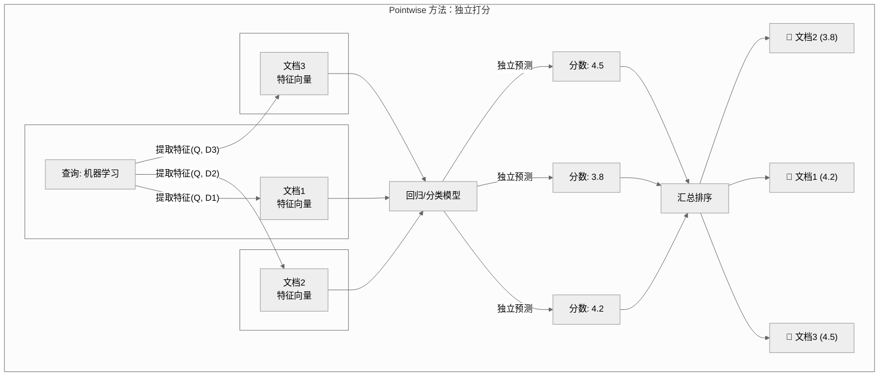

## 🎯 三种视角看排序：Pointwise, Pairwise, Listwise

> **排序问题就像整理书架**：Pointwise是给每本书贴上"好书"、"差书"的标签；Pairwise是拿起任意两本书，决定哪本应放在更顺手的位置；而Listwise则是着眼于整个书架，直接规划出一个能让读者最满意、最高效的全局布局。

Learning to Rank的精髓在于如何定义"什么是好的排序"，并将其转化为一个机器学习可以优化的数学问题。三大流派（Pointwise, Pairwise, Listwise）正是对这个问题给出的三种不同层次的回答。让我们逐一深入，理解每种方法的智慧与权衡。

## 📍 Pointwise (单点法)：像打分一样排序

### 核心思想

Pointwise方法将排序问题**极度简化**，将其视为一个常规的**回归或分类问题**。它完全孤立地看待每一个"查询-文档"对。

- **基本单元**：单个"查询-文档"对 $(q, d)$。
- **目标**：为每个文档 $d$ 预测一个"绝对"的相关性分数 $f(x_{q,d})$ 或类别。
- **核心假设**：每个文档的相关性可以独立判断，与其他文档无关。



### 典型算法

#### 1. **回归方法**
将相关性标注（例如0-4分）作为回归目标，使用最小均方误差损失：

$$L_{\text{reg}} = \sum_{(q,d)} (y_{q,d} - f(x_{q,d}))^2$$

其中：
- $y_{q,d}$：人工标注的真实相关性分数。
- $f(x_{q,d})$：模型对特征向量 $x_{q,d}$ 的预测分数。

#### 2. **分类方法**
将相关性等级（例如"差"、"一般"、"好"、"完美"）作为类别，使用交叉熵损失：

$$L_{\text{class}} = -\sum_{(q,d)} \sum_{r=0}^{R} y_{q,d}^r \log p_r(x_{q,d})$$

其中 $p_r$ 是模型预测该文档属于等级 $r$ 的概率。

### 优缺点分析

| 优点 (Pros) | 缺点 (Cons) |
| :--- | :--- |
| ✅ **简单直观**：完美套用现有机器学习算法，易于实现。 | ❌ **忽略相对顺序**：排序的本质是相对好坏，而它只关心绝对分值。 |
| ✅ **高效**：训练和预测的计算复杂度低，与文档数呈线性关系。 | ❌ **分数不可比**：不同查询间预测的分数无法直接比较。 |
| ✅ **易于扩展**：添加新特征非常方便。 | ❌ **对位置不敏感**：损失函数没有考虑文档在最终列表中的位置。 |
| ✅ **适用场景广**：作为入门或Baseline效果不错。 | ❌ **数据不平衡**：通常负样本（不相关文档）远多于正样本。 |

## 🔄 Pairwise (配对法)：像裁判一样排序

### 核心思想

Pairwise方法前进了一步，认为排序的本质是**比较**。它将问题转化为判断"查询-文档对"的**相对顺序**。

- **基本单元**：一个"查询"和**一对**从该查询结果中抽取的文档 $(d_i, d_j)$。
- **目标**：学习一个打分函数 $f$，如果真实情况是 $d_i$ 比 $d_j$ 更相关，那么我们希望 $f(x_{q,d_i}) > f(x_{q,d_j})$。
- **问题转化**：将排序问题转化为一个**二元分类**问题：对于文档对 $(d_i, d_j)$，哪个更优？

```mermaid
%%{init: { "theme": "neutral" } }%%
graph TD
    subgraph "Pairwise 方法：两两比较"
        Q[查询 q]
        
        subgraph "构建训练样本"
            direction LR
            di[文档 dᵢ<br/>(更相关)]
            dj[文档 dⱼ<br/>(次相关)]
            di -- vs -- dj --> Pair(dᵢ, dⱼ)
        end
        
        Q -- "生成文档对" --> Pair

        Model[学习一个打分函数 f]
        
        subgraph "模型预测与比较"
            direction LR
            Pair -- "输入特征" --> Model
            Model -- "输出分数" --> si[sᵢ = f(dᵢ)] & sj[sⱼ = f(dⱼ)]
            si -- "比较" --> Comp(sᵢ - sⱼ)
            sj -- "比较" --> Comp
        end

        Comp --> Sigmoid(σ) --> P["P(dᵢ > dⱼ)<br>预测dᵢ更优的概率"]
        
        subgraph "计算损失"
            direction LR
            P -- "与真实偏好比较" --> Loss{交叉熵损失}
            Label["真实偏好: 1"] --> Loss
        end
    end
```

### 典型算法

#### 1. **RankNet (2005)**
微软提出的经典之作，使用神经网络学习排序函数 $f(x)$，并通过交叉熵损失来优化文档对的偏序关系概率：

$$L = -\sum_{(i,j)\in S} [P_{ij} \log \hat{P}_{ij} + (1-P_{ij}) \log (1-\hat{P}_{ij})]$$

其中：
- $S$ 是所有偏序对的集合，如果 $d_i$ 比 $d_j$ 更相关，则 $(i,j) \in S$。
- $P_{ij}$ 是真实的偏序概率，通常如果 $d_i > d_j$ 则为1，否则为0。
- $\hat{P}_{ij} = \sigma(s_i - s_j) = \frac{1}{1 + e^{-(s_i - s_j)}}$ 是模型预测的 $d_i$ 比 $d_j$ 更优的概率。

#### 2. **RankSVM (2002)**
将SVM思想引入排序。目标是找到一个权重向量 $w$，使得正样本对（相关 > 不相关）的得分差 $w^T(x_i - x_j)$ 尽可能大于等于1。

$$\min_{w} \frac{1}{2}||w||^2 + C\sum_{(i,j)} \xi_{ij}$$
$$s.t. \quad w^T(x_i - x_j) \geq 1 - \xi_{ij}, \quad \xi_{ij} \geq 0$$

#### 3. **LambdaRank (2007)**
RankNet的巧妙升级版。它在计算梯度时，乘上了一个因子 $|\Delta_{\text{NDCG}}|$，这个因子代表交换这对文档会带来多大的NDCG指标变化。这使得模型在训练时更关注那些对最终排序指标影响大的文档对。其核心的"Lambda梯度"定义为：

$$\lambda_{ij} = \frac{\partial L}{\partial s_i} = \frac{-\sigma'(s_i - s_j)}{1 + e^{\sigma(s_i - s_j)}} \cdot |\Delta_{\text{NDCG}}|$$

### 优缺点分析

| 优点 (Pros) | 缺点 (Cons) |
| :--- | :--- |
| ✅ **更符合排序本质**：直接优化文档间的相对顺序。 | ❌ **文档对爆炸**：一个查询下的文档对数量是 $O(n^2)$，训练成本高。 |
| ✅ **理论更优**：相比Pointwise，其优化目标更接近排序任务本身。 | ❌ **忽略绝对位置**：只关心相对顺序，不关心文档在列表中的具体位置。 |
| ✅ **效果更好**：在大多数场景下，效果显著优于Pointwise方法。 | ❌ **样本选择敏感**：如何采样文档对会显著影响训练效率和效果。 |
| ✅ **应用广泛**：如经典的`XGBoost Ranker`就是基于Pairwise思想。 | ❌ **对噪声敏感**：一个错误的偏序标注会产生一个错误的训练样本。 |

## 📋 Listwise (列表法)：像将军一样排序

### 核心思想

Listwise方法拥有最宏大的视角，它将**整个文档列表**视为一个完整的、不可分割的整体来进行优化。

- **基本单元**：一个"查询"和它对应的**所有**候选文档列表 $D = \{d_1, d_2, ..., d_n\}$。
- **目标**：学习一个模型，直接输出一个能最大化最终排序评价指标（如NDCG）的排序结果 $\pi$。
- **问题转化**：一个复杂的**排列学习 (Learning to Permute)** 问题。

### 典型算法

#### 1. **ListNet (2007)**
很有创意的想法。它假设每个文档的预测分数对应一个概率（通过Softmax归一化），从而为整个列表生成一个"预测的排序概率分布"。然后通过KL散度等方法，让这个预测分布去逼近"真实的排序概率分布"。损失函数定义为：

$$L = -\sum_q \sum_{\pi \in \Omega_n} P_y(\pi|q) \log P_s(\pi|q)$$

其中 $\pi$ 是一个排列, $P_y$ 和 $P_s$ 分别是真实和预测的排序分布。

#### 2. **ListMLE (2008)**
从最大似然估计的角度出发，直接最大化"生成真实排序"这一事件的概率。

$$L = -\sum_q \log P(y|x_q) = -\sum_q \sum_{i=1}^n \log \frac{\exp(s_{y_i})}{\sum_{j=i}^n \exp(s_{y_j})}$$

#### 3. **LambdaMART (2010)**
**业界的王者**。它完美结合了LambdaRank的思想和MART(GBDT)的强大能力。在每一轮迭代中，它都用"Lambda梯度"作为目标来训练一棵新的决策树。
::: details 伪代码：LambdaMART核心思想
```python
# 核心思想
for tree in trees:
    # 计算每个文档对的梯度 (Lambda梯度)
    lambdas = compute_lambda_gradients(current_scores, labels)
    # 用梯度作为目标，训练一棵新的回归树
    tree = fit_regression_tree(features, lambdas)
    # 将新树的预测结果加入总分
    current_scores += learning_rate * tree.predict(features)
```
:::

### 直接优化NDCG的挑战

NDCG是一个非常理想的指标，但它本身是**非连续、非凸**的，无法直接求导。
$$\text{NDCG}@k = \frac{\text{DCG}@k}{\text{IDCG}@k}, \quad \text{DCG}@k = \sum_{i=1}^k \frac{2^{\text{rel}_i} - 1}{\log_2(i+1)}$$
这就是为什么我们需要LambdaRank/LambdaMART这样的"梯度技巧"来间接优化它。

### 优缺点分析

| 优点 (Pros) | 缺点 (Cons) |
| :--- | :--- |
| ✅ **目标一致**：直接优化业务最关心的排序指标 (如NDCG)。 | ❌ **复杂度极高**：列表的可能排列数是 $n!$，优化空间巨大。 |
| ✅ **考虑全局信息**：模型能看到列表中的所有文档，做出全局最优决策。| ❌ **实现困难**：算法和优化过程通常比前两者复杂得多。 |
| ✅ **理论上界最高**：其优化目标和评估目标完全一致。 | ❌ **需要更多数据**：复杂的模型需要更多数据来避免过拟合。 |
| ✅ **效果顶尖**：在许多数据集上都是State-of-the-art。 | ❌ **对数据敏感**：对训练数据的分布和噪声可能更敏感。 |

## 🔍 三大流派大比拼

| 维度 | Pointwise (单点法) | Pairwise (配对法) | Listwise (列表法) |
| :--- | :--- | :--- | :--- |
| **核心隐喻** | 独立打分员 | 两两对决的裁判 | 运筹帷幄的将军 |
| **问题定义** | 回归 / 分类 | 二元分类 | 排列学习 |
| **优化目标** | 单个样本的预测误差 | 文档对的相对顺序 | 整个列表的排序指标 |
| **样本单位** | 单个文档 | 文档对 | 文档列表 |
| **计算复杂度** | 低 (O(n)) | 中 (O(n²)) | 高 (O(n!)) |
| **实现难度** | 简单 | 中等 | 复杂 |
| **业界地位** | Baseline / 快速验证 | 主流 / 工业界常用 | 最佳实践 / SOTA |

## 💡 如何选择？决策指南

**选择Pointwise，当...**
- 刚开始探索LTR，需要一个**快速且简单的Baseline**。
- 训练数据量较小，或标注形式就是简单的数值分（如1-5星）。
- 对线上服务的**推理延迟**要求极其苛刻。

**选择Pairwise，当...**
- 拥有充足的训练数据，且标注是成对的偏好关系（A > B）。
- 希望在**效果和效率之间取得最佳平衡**，这是工业界最常见的选择。
- 你正在使用像 `XGBoost` 或 `LightGBM` 这类内置了强大Pairwise排序功能的框架。

**选择Listwise，当...**
- **不计成本地追求最佳的离线排序效果**，希望模型直接优化NDCG等核心业务指标。
- 拥有海量的高质量训练数据和强大的计算资源。
- 排序是业务的核心，微小的指标提升都能带来巨大价值。

<!-- ## 📖 延伸阅读 -->

> **🤔 思考题**
> 1. 在真实的电商搜索场景中，为什么一个团队可能会先上线一个Pointwise模型，然后逐步迭代到Pairwise或Listwise？这背后有哪些工程和业务上的考量？
> 2. Pairwise方法会产生 $O(n^2)$ 数量的文档对。如果一个查询返回1000个文档，将产生近50万个训练样本对，这在训练上是难以承受的。你会如何设计采样策略来高效地构建训练集，同时最大程度地保留排序信息？
> 3. LambdaMART如此成功的核心在于其"Lambda梯度"。你能用自己的话，通俗地解释为什么将RankNet的梯度乘以 $|\Delta_{\text{NDCG}}|$ 会让模型更"聪明"吗？
> 4. Listwise方法理论上最好，但计算开销大。你能否设想一种混合方法，结合Pointwise或Pairwise的优点，来设计一个更高效的Listwise模型？

::: tip 🎉 章节小结
LTR的三大流派——Pointwise, Pairwise, Listwise——代表了对排序问题理解的不断深化。
- **Pointwise** 将其简化为我们最熟悉的**回归/分类**，简单高效，但忽略了排序的本质。
- **Pairwise** 抓住了排序的核心是**比较**，通过优化相对顺序，在效果和效率间取得了很好的平衡，成为工业界的主流。
- **Listwise** 则直面最终目标，将**整个列表**作为优化对象，虽然复杂，但理论和实践上都达到了最佳效果。
理解这三种方法的思想演进和它们之间的权衡，是掌握LTR并将其成功应用于实际业务的关键。
:::

> **👨‍🍳 趣味总结**
> **LTR三大流派的进化，就像厨艺的三个境界：Pointwise是给每种食材独立打分（这根葱不错，那块姜很好）；Pairwise是懂得食材的搭配（葱和姜在一起，比蒜和姜更好）；而Listwise则是宗师手笔，通盘考虑所有食材的特性、食客的口味和上菜顺序，直接设计出一整桌能获得米其林三星的国宴。**


