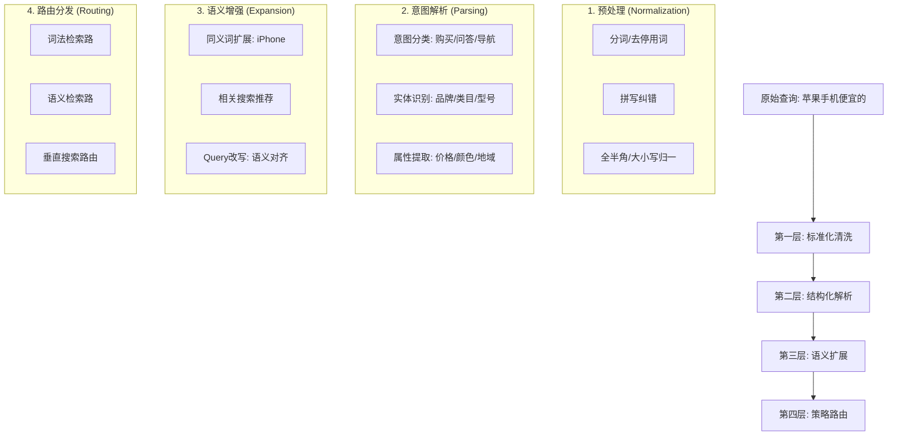

## 🧠 查询理解门派：搜索江湖的"智囊团"

> **查询理解 (Query Understanding, QU) 是搜索系统的"智囊团"** —— 承接布尔模型的精准、向量空间的语义、BM25的概率，将用户的"三言两语"转化为搜索引擎能理解的"标准武功招式"。

### 🎯 从词法匹配到语义理解的跃迁

回顾我们的学习历程：
- **布尔模型**：精确匹配，但用户很难构造完美的布尔表达式。
- **向量空间模型**：引入相似度，但对多义词和歧义处理仍显单薄。
- **BM25**：概率排序，但本质上依然是词面匹配（Lexical Matching）。

**问题的根源**：再强的排序算法，也无法弥补"理解错误"的查询。

| 用户输入 | 表面需求 | 真实意图 (QU后) |
| :--- | :--- | :--- |
| "苹果手机便宜的" | 匹配包含这些词的文档 | 品牌:苹果, 类目:手机, 属性:价格敏感 |
| "pythn 机器学习" | 匹配失败 (错别字) | 修正为 "python", 搜索相关教程 |
| "退烧药" | 仅匹配"退烧药"三个字 | 扩展为: 布洛芬、对乙酰氨基酚、感冒药 |

---

## 🏗️ 查询理解的完整架构

查询理解不是单一算法，而是一个**多层处理漏斗**。

### 🎯 四层处理架构

---

## 🛠️ 核心组件功能一览

不再使用大篇幅代码，我们用逻辑结构来拆解生产级 QU 系统的核心组件：

### 1. 预处理 (Preprocessing)
- **清洗**：去除特殊符号、HTML 标签、统一简繁体。
- **纠错 (Spell Check)**：基于编辑距离和语言模型（LM），将 `jave` 修正为 `java`。
- **分词 (Tokenization)**：理解 `南京市长江大桥` 的语义切分。

### 2. 意图识别 (Intent Classification)
- **目标**：判断用户是想买东西（交易型）、找信息（信息型）还是找某个网站（导航型）。
- **方法**：从简单的关键字规则，到 FastText，再到 BERT 语义分类模型。

### 3. 实体识别 (NER & Linking)
- **目标**：识别查询中的核心实体（Brand, Category, Location 等）。
- **价值**：对于 "北京 故宫 门票"，识别出 `北京` 是地点，`故宫` 是景点，`门票` 是类目。

### 4. 查询改写与扩展 (Rewriting & Expansion)
- **改写**：将口语化查询转化为规范化查询。
- **扩展**：引入同义词（如 "番茄" -> "西红柿"），解决词法匹配的“零召回”问题。

---

## 🧭 入门指北：为什么、误区与学习路线

### 为什么要做查询理解
- **词面 ≠ 语义**：同一个词可能指不同事物（苹果），不同说法可能指同一事物（退烧/解热）。
- **查询短且脏**：平均 2~3 词，充满拼写错误、口语和省略。
- **检索链路的“入口”**：入口错了，后续召回/排序再强也难救。

### 常见误区与难点
- **误区1：全靠规则** -> 初期易奏效，但维护成本爆炸，无法处理长尾。
- **误区2：一把 LLM 梭哈** -> 延迟（Latency）和成本（Cost）在实时搜索中难以接受。
- **难点**：如何平衡扩展带来的“增益（Recall）”与“噪音（Precision）”。

### 循序渐进的学习路线
1. **基础篇**：分词原理、词典管理、正则表达式。
2. **进阶篇**：传统分类模型（SVM/RF）、序列标注（CRF/BiLSTM）。
3. **高阶篇**：预训练模型（BERT/RoBERTa）、生成式改写（LLM）、向量检索路由。

---

## 🤔 思考题

> 1. 在你的业务场景中，查询理解的哪一层（标准化、解析、扩展、路由）最重要？为什么？
> 2. 如何评估查询理解对最终搜索效果的贡献？设计什么样的 A/B 测试？
> 3. 面对新兴的大语言模型，传统的查询理解技术（如规则纠错）还有什么不可替代的价值？

::: tip 🎉 章节小结
查询理解是搜索引擎的"智囊团"。它不仅仅是把词切开，更是要洞察用户的内心需求。通过**标准化、解析、扩展、路由**四层架构，我们能够将模糊的自然语言转化为精确的机器指令，为后续的召回和排序奠定胜局。
:::

> **查询理解就像一位贴心的翻译官 —— 用户说着自己的"方言"（模糊查询），翻译官要准确理解并翻译成搜索引擎能懂的"标准语言"（结构化查询），这样才能实现真正的沟通。**
