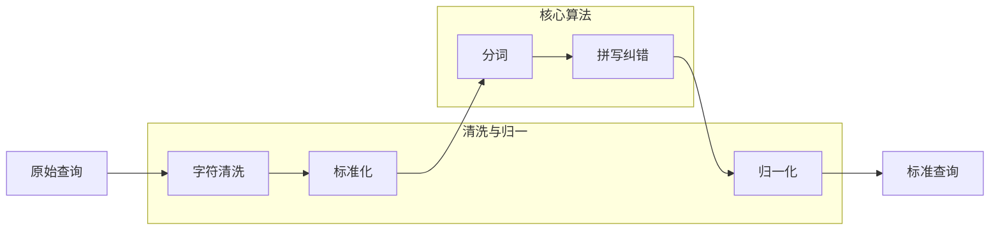

## 🧹 查询预处理：打通经脉的“基础功”

> **预处理 (Preprocessing) 是查询理解的“前哨站”**。植根于词法与语义匹配的三层地基，预处理的质量直接决定了后续链路的上限。

### 🎯 为什么需要预处理？
- **查询“短且脏”**：用户输入充满口语化、错别字、简繁混写、特殊符号甚至表情包。
- **误差放大效应**：如果在入口处没有纠正 `jave` 为 `java`，后续所有的深度学习模型和排序算法都将在错误的基础上运行。

> **比喻**：预处理是“打通任督二脉”。经脉不通，再强的内功（深度学习）也难以施展。

---

## 🔁 关键流程架构

预处理通常是一个线性的流水线（Pipeline），每一级处理都是对 Query 的一次“净化”。



---

## 🧩 核心模块详解

### 1) 字符清洗与规范化 (Cleaning)
- **目标**：去除噪音，统一格式。
- **操作**：
    - 去除不可见字符、HTML 标签、控制字符。
    - **全半角转换**：`AＢＣ` -> `ABC`。
    - **简繁转换**：`機器學習` -> `机器学习`。
    - **大小写统一**：`Python` -> `python`。

### 2) 分词与停用词 (Tokenization)
- **中文挑战**：理解词界，处理歧义（如 `南京市/长江/大桥` vs `南京/市长/江大桥`）。
- **工具**：`jieba` (基础), `HanLP` (专业), `LTP` (学术)。
- **停用词**：移除 `的`、`了`、`呢` 等无实际语义价值的虚词，但需注意别误杀“词义关键停用词”（如“不是”）。

### 3) 拼写纠错 (Spell Correction)
纠错是预处理中最具挑战的环节，通常采用**候选生成 + 候选排序**的策略：
- **候选生成**：基于词典、编辑距离、拼音相似度、键盘邻近性。
- **候选排序**：使用语言模型（n-gram 或 BERT）计算候选词在上下文中的合理性。

### 4) 单位与别名归一化 (Normalization)
- **单位归一**：`100kg` -> `100千克`，`50RMB` -> `50元`。
- **别名映射**：`凤梨` -> `菠萝`，`ip14pm` -> `iphone 14 pro max`。

---

## 🧱 核心逻辑示例 (Python)

不再展示复杂的工程框架，这里提供核心预处理逻辑的精简实现，帮助你建立直觉：

```python
import re
import jieba

class SimplePreprocessor:
    def __init__(self):
        self.stop_words = {"的", "了", "和", "是"}
        self.alias_map = {"ip14pm": "iphone 14 pro max", "凤梨": "菠萝"}

    def clean(self, text: str) -> str:
        # 去除 HTML 和特殊符号，统一大小写
        text = re.sub(r"<[^>]+>", "", text)
        text = text.lower().strip()
        return text

    def normalize(self, text: str) -> str:
        # 别名替换
        for alias, standard in self.alias_map.items():
            text = text.replace(alias, standard)
        return text

    def process(self, query: str) -> list:
        cleaned = self.clean(query)
        normalized = self.normalize(cleaned)
        # 分词并去停用词
        tokens = [w for w in jieba.lcut(normalized) if w not in self.stop_words]
        return tokens

# 使用示例
pre = SimplePreprocessor()
print(pre.process("<b>买 ip14pm 的</b>")) # ['买', 'iphone 14 pro max']
```

---

## 🏭 生产实践与评估指标

在工业级搜索系统中，预处理的运维至关重要：

| 指标类型 | 核心指标 | 说明 |
| :--- | :--- | :--- |
| **质量指标** | 纠错准确率 (Acc) | 纠错结果中正确的比例 |
| | 误纠率 (False Positive) | 原本正确的词被改错的比例 (极其重要) |
| **性能指标** | 平均耗时 (Latency) | 通常需控制在 5ms - 20ms 以内 |
| | 缓存命中率 | 热门查询预处理结果的复用率 |
| **业务指标** | NDCG / CTR 提升 | 预处理对最终搜索排序效果的贡献 |

### 🛠️ 调优经验谈
1. **白名单策略**：对于专有名词、热门新词，通过白名单防止纠错“误伤”。
2. **优雅降级**：如果纠错模块置信度不高，可以仅作为“搜索建议”提示用户，而非强制改写。
3. **词典版本化**：词典的更新必须经过离线回测，防止“修好一个，改坏一堆”。

---

## 🤔 思考题

> 1. 如何平衡纠错的准确率和误纠率？在什么情况下你宁可不纠错？
> 2. 对于 "我想买 50 元左右的苹果" 这个查询，预处理该如何处理 "苹果" 一词？
> 3. 面对层出不穷的网络梗（如 "yyds"），预处理系统该如何保持时效性？

::: tip 🎉 章节小结
预处理是搜索系统的“第一道过滤器”。通过清洗、标准化、分词、纠错与归一化，我们能够将“脏”输入转化为“净”信号。记住：**垃圾进，垃圾出 (Garbage In, Garbage Out)**。把预处理做扎实，能让后续的召回、排序系统事半功倍。
:::
