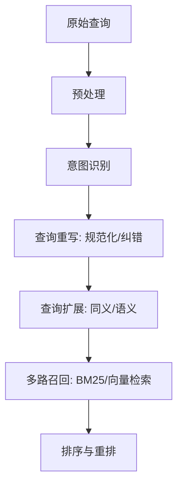

## 🗡️ 扩展与重写：搜索意图的“放大镜”与“定准星”

> **查询扩展 (Expansion) 重在“加料”，查询重写 (Rewriting) 重在“正本清源”。** 它们共同解决了用户表达与系统索引之间的“语义鸿沟”。

### 🎯 为什么需要？
- **语义不匹配**：用户搜“西红柿”，文档写“番茄”。
- **查询过短**：用户搜“苹果”，无法判断是想买手机、找水果还是看电影。
- **长尾查询**：生僻的表达导致词法检索零召回。

---

## 🧭 系统链路中的位置

扩展与重写发生在**意图识别之后，召回之前**。它将原始的输入信号转化为丰富的检索指令。



---

## 🧩 方法谱系与直觉

### 一、查询重写 (Query Rewriting)
重写的目标是将“非标准”转化为“标准”。

| 方法 | 描述 | 示例 |
| :--- | :--- | :--- |
| **纠错重写** | 修正拼写错误 | `jave` -> `java` |
| **别名归一** | 将别名转换为标准实体名 | `ip14pm` -> `iphone 14 pro max` |
| **去噪/精简** | 去除冗余的语气词或修饰语 | `我想买好吃的苹果` -> `苹果` |
| **结构化重写** | 提取属性并转化为 DSL | `红色连衣裙` -> `color:red, cat:dress` |

### 二、查询扩展 (Query Expansion)
扩展的目标是增加“相关信号”，提升召回率。

1.  **同义词扩展 (Synonym)**：基于人工维护的同义词典或知识图谱。
2.  **派生/近义扩展**：基于 Embedding（如 Word2Vec, BERT）寻找空间邻居。
3.  **上下位扩展**：从具体到抽象（如“宝马” -> “德系车”），或从抽象到具体。
4.  **生成式扩展 (Generative)**：利用 LLM 根据上下文生成相关的改写描述（如 RAG 场景下的 HyDE 策略）。

---

## ⚙️ 工程实现：核心逻辑

下面是一个结合“词典”与“语义相似度”的极简扩展原型：

```python
import jieba
from sentence_transformers import SentenceTransformer, util

class QueryExpander:
    def __init__(self):
        # 基础同义词典
        self.synonyms = {"退烧": ["解热", "降温"], "手机": ["智能机", "移动电话"]}
        # 加载轻量级语义模型
        self.model = SentenceTransformer('paraphrase-multilingual-MiniLM-L12-v2')
        self.knowledge_base = ["iPhone", "安卓手机", "退烧药", "感冒灵"]

    def expand(self, query: str):
        tokens = jieba.lcut(query)
        expanded = set(tokens)

        # 1. 词典扩展
        for t in tokens:
            if t in self.synonyms:
                expanded.update(self.synonyms[t])

        # 2. 语义搜索扩展 (仅做演示)
        query_emb = self.model.encode(query)
        kb_embs = self.model.encode(self.knowledge_base)
        hits = util.semantic_search(query_emb, kb_embs, top_k=1)[0]

        for hit in hits:
            if hit['score'] > 0.8:
                expanded.add(self.knowledge_base[hit['corpus_id']])

        return list(expanded)

# 使用示例
expander = QueryExpander()
print(expander.expand("退烧手机")) # ['退烧', '解热', '降温', '手机', '智能机', '移动电话', ...]
```

---

## 📊 效果评估与风险控制

### 核心指标
- **扩展覆盖率**：有多少查询被成功扩展。
- **召回率提升 (Recall Gain)**：引入扩展后，正确答案出现的概率提升。
- **精确度损失 (Precision Drop)**：扩展是否引入了无关的噪音（Query Drift）。

### 风险管理 (Guardrails)
1.  **置信度阈值**：语义模型分数低于 0.8 时不进行扩展。
2.  **黑名单过滤**：禁止扩展敏感词或引发歧义的词。
3.  **分层召回**：将原始 Query 与扩展后的词分两路召回，给予原始词更高的权重（Must Match）。
4.  **A/B 测试**：严格观察 NDCG、点击率以及用户侧的“bad case”反馈。

---

## 🤔 思考题

> 1. 为什么“无脑”增加扩展词可能会导致搜索质量下降？
> 2. 在 RAG（检索增强生成）系统中，查询重写（Query Rewrite）扮演了什么角色？
> 3. 面对“土豆”和“马铃薯”这种同义词，你会选择在召回阶段扩展，还是在索引阶段就做归一化？

::: tip 🎉 章节小结
扩展与重写是搜索系统的“放大镜”与“定准星”。扩展负责“广撒网”，确保不漏掉相关信息；重写负责“定准星”，确保搜索方向不偏。在生产实践中，必须平衡**召回的增益**与**精度的损耗**，通过多层风控机制确保系统的稳定性。
:::
