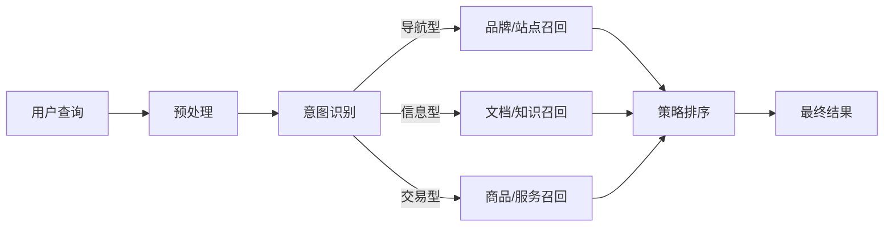

## 🥋 意图识别：定式先手，后续皆活

> **意图识别 (Intent Classification) 是查询理解的“大脑”**。先读懂用户“想干什么”，再谈系统“给什么”。排序像外功，意图则是内功。

### 🎯 为什么需要意图识别？
- **消除歧义**：同一个词“苹果”，在不同场景下可能是想买手机（交易）、找官网（导航）还是搜菜谱（信息）。
- **策略路由**：意图明确后，系统可以决定调用不同的召回路、排序权重或 UI 展示样式。
- **提升效率**：对于导航型查询，直接定位到目标页面，无需复杂的重排。

---

## 🧭 流程与位置

意图识别通常紧随预处理之后，是整个检索管线的“红绿灯”。



---

## 🧩 意图体系设计 (Schema)

意图体系的颗粒度取决于业务目标。

| 类别 (粗粒度) | 描述 | 典型示例 |
| :--- | :--- | :--- |
| **导航型 (Navigational)** | 寻找特定的网站或品牌入口 | "淘宝网", "华为官网" |
| **信息型 (Informational)** | 寻找问题的答案或知识 | "什么是机器学习", "如何做红烧肉" |
| **交易型 (Transactional)** | 表达了明确的购买或服务意向 | "iPhone 15 价格", "买一张去北京的机票" |

---

## ⚙️ 模型与特征工程

在生产环境中，我们通常采用**多级分类架构**来平衡准确率与延迟。

### 1. 特征矩阵
- **词法特征**：N-gram、词性（动词通常代表意图）、核心实体（品牌/类目）。
- **结构特征**：查询长度、是否包含疑问词（“为什么”、“如何”）。
- **上下文特征**：用户地域、当前时间、会话前序查询。

### 2. 算法选型
- **轻量级 (Baseline)**：FastText 或 SVM。适用于高并发、低延迟场景。
- **深度学习 (SOTA)**：BERT 或 RoBERTa 微调。适用于语义复杂的长尾查询。
- **大模型 (LLM)**：用于离线标注或极其复杂的逻辑推理改写。

---

## 🧪 核心逻辑示意 (Python)

下面是一个典型的“规则 + 深度学习”双路意图识别方案：

```python
import torch
from transformers import AutoTokenizer, AutoModelForSequenceClassification

class IntentClassifier:
    def __init__(self):
        self.rules = {"官网": "NAV", "买": "TRANS", "多少钱": "TRANS"}
        self.tokenizer = AutoTokenizer.from_pretrained("hfl/chinese-roberta-wwm-ext")
        self.model = AutoModelForSequenceClassification.from_pretrained("my-intent-model")

    def classify(self, query: str):
        # 1. 快速规则匹配
        for k, v in self.rules.items():
            if k in query: return v, 0.95

        # 2. 模型推理
        inputs = self.tokenizer(query, return_tensors="pt", truncation=True, max_length=64)
        with torch.no_grad():
            logits = self.model(**inputs).logits
            probs = torch.softmax(logits, dim=-1)
            conf, label_id = torch.max(probs, dim=-1)

        labels = ["NAV", "INFO", "TRANS"]
        return labels[label_id.item()], conf.item()

# 使用示例
clf = IntentClassifier()
print(clf.classify("什么是深度学习")) # ('INFO', 0.98)
```

---

## 🏭 生产级运维与监控

| 维度 | 指标 | 调优手段 |
| :--- | :--- | :--- |
| **准确率** | Macro-F1 / AUC | 增加困难样本标注，处理类别不平衡 (Focal Loss) |
| **性能** | P95 Latency (< 10ms) | 模型蒸馏、量化 (INT8)、GPU 批处理推理 |
| **稳定性** | 兜底触发率 | 设置置信度门限，低分进入“通用搜索”路径 |

---

## 🤔 思考题

> 1. 在你的业务中，意图该分多细？如何平衡“细化收益”与“维护成本”？
> 2. 如果意图识别模块挂了，你的搜索系统该如何实现优雅降级？
> 3. 用户的意图会随时间（如双11期间）发生偏移吗？如何应对这种漂移？

::: tip 🎉 章节小结
意图识别是查询理解的“大脑中枢”。它通过理解用户的真实动机，将后续的检索路径引向最合适的召回与排序策略。在实践中，**“快”比“极致的准”往往更重要**，因此多级过滤、模型蒸馏与风控机制是意图系统不可或缺的基石。
:::
