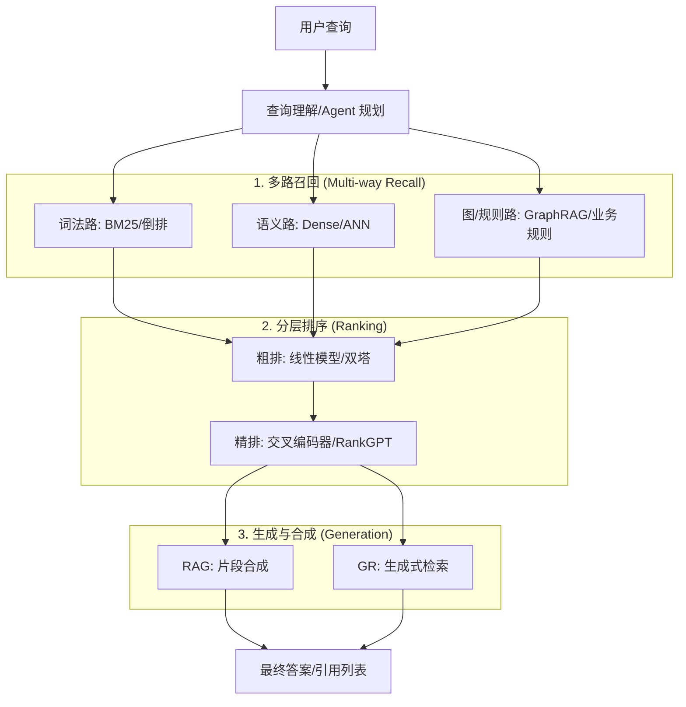

## 🛰️ 现代搜索技术全景：从“寻找”到“理解”与“生成”

> 在前文中，我们已经学习了三层地基：
> - **布尔模型**：精准的“硬匹配”与过滤。
> - **VSM & TF-IDF**：文本向量化的开山鼻祖。
> - **BM25**：工业级词法排序的标杆。
>
> 现代搜索技术在此基础上，融合了深度学习与大语言模型（LLM），正在经历从“寻找相关链接”向“直接提供答案”的范式迁移。

### 🚀 搜索技术的四次革命

| 阶段 | 核心技术 | 搜索范式 | 代表产品 |
| :--- | :--- | :--- | :--- |
| **1.0 词法时代** | TF-IDF, BM25, 倒排索引 | 关键词匹配 | 早期 Google, Lucene |
| **2.0 语义时代** | BERT, 双塔模型, 向量库 | 语义相似度匹配 | Pinterest, 淘宝语义搜索 |
| **3.0 生成时代 (RAG)** | LLM, 向量检索, 交叉编码器 | 检索增强生成 | Perplexity, New Bing |
| **4.0 原生 AI 时代** | 生成式检索 (GR), Agentic Search | 索引即生成、Agent 规划 | DSI (实验性), OpenAI Search |

---

## 🗺️ 现代搜索全景流程图

现代搜索不再是一个简单的线性过程，而是由“多路召回”、“分层排序”和“生成合成”构成的复杂系统。

---

## 🧭 核心技术选型一览

### 1) 混合检索 (Hybrid Search)
- **定义**：将 BM25（关键词精准）与向量检索（语义泛化）通过 RRF（Reciprocal Rank Fusion）等算法进行融合。
- **价值**：既能处理“iPhone 15 Pro”这种专有名词，也能理解“苹果最新款手机”的语义。

### 2) 神经重排 (Neural Reranking)
- **技术**：使用 Cross-Encoder（交叉编码器）或 LLM（如 RankGPT）对 Top 50-100 个候选结果进行“精修”。
- **痛点**：精度极高，但延迟（Latency）也是最大的挑战。

### 3) 检索增强生成 (RAG)
- **核心**：将检索出的知识片段（Chunks）作为“上下文”喂给 LLM，让其生成带有事实依据的答案。
- **演进**：正在从简单的 `Retrieve -> Generate` 转向 `Plan -> Retrieve -> Filter -> Generate -> Verify` 的 **Agentic RAG** 模式。

### 4) 生成式检索 (Generative Retrieval)
- **趋势**：抛弃传统的索引查找，通过模型直接生成文档的 ID 或摘要（如 DSI 架构）。这是目前学术界最前沿的探索。

---

## 🧱 生产级决策矩阵

| 业务场景 | 推荐技术组合 | 核心关注点 |
| :--- | :--- | :--- |
| **电商/商品搜索** | 混合检索 + 树模型精排 | 转化率 (CVR)、关键词精准度 |
| **企业知识库/QA** | 语义检索 + RAG | 事实准确性、引用来源可追溯 |
| **长文档/法律搜索** | 多向量检索 (ColBERT) + 摘要生成 | 细粒度匹配、上下文长度 |
| **高并发海量搜索** | BM25 + 向量检索 + 模型蒸馏 | QPS、内存占用、延迟控制 |

---

## 🤔 思考题

> 1. 为什么在拥有了强大的 LLM 后，传统的 BM25（词法检索）依然在工业界不可替代？
> 2. **向量飘移**（Model Drift）是什么？当你的 Embedding 模型升级时，如何保证线上索引的平滑切换？
> 3. RAG 系统的性能瓶颈通常在哪里？是检索阶段还是 LLM 生成阶段？

::: tip 🎉 章节小结
现代搜索技术已不再仅仅是“寻找链接”。它通过**混合检索**扩展视野，通过**神经重排**确保精度，最终通过 **RAG** 将零散的知识聚合为直观的答案。掌握这些技术的组合方案，是构建下一代智能搜索系统的核心能力。
:::
