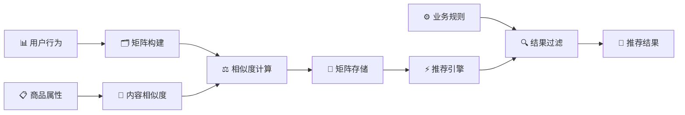
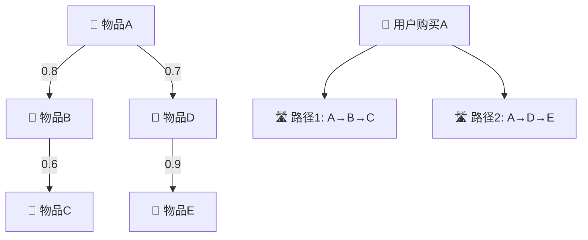
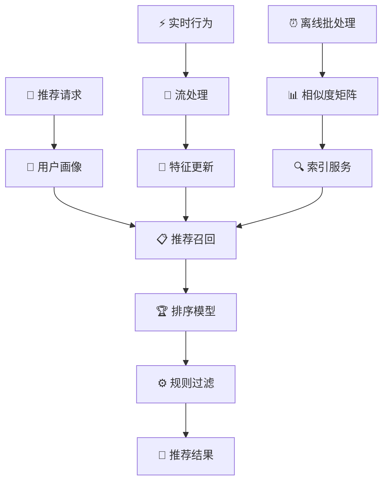

基于物品的协同过滤（Item-based Collaborative Filtering, ItemCF）是另一种经典的协同过滤方法，其核心理念是 **"物以类聚"**。与UserCF不同，ItemCF关注的是物品之间的相似性，通过分析用户对相似物品的偏好来进行推荐。

## 🎯 ItemCF的核心思想

::: tip 物品稳定性
相比于用户偏好的多变性，物品的特征和用户对物品的整体评价相对稳定，这使得ItemCF在很多场景下比UserCF更实用。
:::

### 算法直觉

当你在购物网站上看商品时，经常会看到"买了这个商品的用户还买了..."这样的推荐，这就是ItemCF的典型应用：
1. 分析你已经购买/喜欢的商品
2. 找到与这些商品相似的其他商品
3. 推荐相似度最高的商品

### 数学表达

ItemCF预测用户 $u$ 对物品 $i$ 的评分：

$$\hat{r}_{u,i} = \frac{\sum_{j \in N_k(i)} sim(i,j) \cdot r_{u,j}}{\sum_{j \in N_k(i)} |sim(i,j)|}$$

其中：
- $N_k(i)$ 是与物品 $i$ 最相似的 $k$ 个物品集合
- $sim(i,j)$ 是物品 $i$ 和 $j$ 之间的相似度
- $r_{u,j}$ 是用户 $u$ 对物品 $j$ 的评分

## 📏 ItemCF的核心算法

::: tip 参考协同过滤总览
详细的相似度计算方法请参考 [协同过滤总览](./2.collaborative_filtering.md#相似度度量方法详细对比) 中的完整对比分析。
:::

ItemCF在物品相似度计算上的特点：
- **隐式反馈**：余弦相似度表现最佳
- **显式评分**：调整余弦相似度更准确
- **大规模系统**：杰卡德系数计算效率高

## 💻 ItemCF算法实现

::: details ItemCF核心算法框架
```python
import numpy as np
from sklearn.metrics.pairwise import cosine_similarity

class ItemBasedCF:
    def __init__(self, k_neighbors=20, similarity_method='cosine'):
        self.k_neighbors = k_neighbors
        self.similarity_method = similarity_method
        self.item_similarity_matrix = None
        
    def fit(self, user_item_matrix):
        """训练ItemCF模型"""
        self.user_item_matrix = user_item_matrix.copy()
        
        # 计算物品相似度矩阵
        if self.similarity_method == 'cosine':
            # 转置为物品×用户矩阵，计算余弦相似度
            item_user_matrix = self.user_item_matrix.T
            self.item_similarity_matrix = cosine_similarity(item_user_matrix)
        elif self.similarity_method == 'adjusted_cosine':
            self.item_similarity_matrix = self._adjusted_cosine_similarity()
        else:
            raise ValueError(f"Unknown similarity method: {self.similarity_method}")
        
    def predict_rating(self, user_id, item_id):
        """预测用户对物品的评分"""
        user_ratings = self.user_item_matrix[user_id]
        item_similarities = self.item_similarity_matrix[item_id]
        
        # 找到用户已评分的物品
        rated_items = np.where(user_ratings > 0)[0]
        
        if len(rated_items) == 0:
            return np.mean(self.user_item_matrix[:, item_id][self.user_item_matrix[:, item_id] > 0])
            
        # 选择最相似的k个物品
        similarities = item_similarities[rated_items]
        top_k_indices = np.argsort(similarities)[-self.k_neighbors:]
        
        top_similarities = similarities[top_k_indices]
        top_ratings = user_ratings[rated_items[top_k_indices]]
        
        # 过滤掉相似度为0的物品
        valid_mask = top_similarities > 0
        if np.sum(valid_mask) == 0:
            return np.mean(user_ratings[user_ratings > 0])
            
        # 计算加权平均
        valid_similarities = top_similarities[valid_mask]
        valid_ratings = top_ratings[valid_mask]
        
        predicted_rating = np.sum(valid_similarities * valid_ratings) / np.sum(valid_similarities)
        return np.clip(predicted_rating, 1, 5)
        
    def recommend_items(self, user_id, n_recommendations=10):
        """为用户推荐物品"""
        user_ratings = self.user_item_matrix[user_id]
        candidate_items = np.where(user_ratings == 0)[0]
        
        predictions = [(item_id, self.predict_rating(user_id, item_id)) 
                      for item_id in candidate_items]
        predictions.sort(key=lambda x: x[1], reverse=True)
        
        return predictions[:n_recommendations]
```
:::

## 🎯 ItemCF的独特优势

::: tip 对比分析参考
UserCF与ItemCF的详细对比分析请参考 [协同过滤总览](./2.collaborative_filtering.md#usercf-vs-itemcf-全面对比分析) 中的全面分析。
:::

### ItemCF的核心优势

**稳定性优势**：
- 物品属性相对稳定，相似度矩阵更新频率低
- 适合物品库相对固定的电商、教育等场景

**计算效率**：
- 可以离线预计算物品相似度矩阵
- 实时推荐响应速度快

**工程实现优势**：
- 更容易进行缓存优化
- 分布式计算友好

## 🚀 ItemCF的优化策略

### 相似度计算优化

**1. 共现矩阵优化**：
$$C_{ij} = |U_i \cap U_j|$$

其中 $U_i$ 是购买/评分物品 $i$ 的用户集合。

**2. 惩罚热门物品**：
$$sim'(i,j) = \frac{sim(i,j)}{\log(1 + |U_j|)}$$

防止热门物品主导相似度计算。

**3. 时间衰减因子**：
$$sim_{time}(i,j) = sim(i,j) \cdot \exp(-\lambda \cdot \Delta t)$$

对历史数据进行时间衰减。

### 存储与计算优化

| 优化方法 | 技术手段 | 适用场景 | 效果 |
|----------|----------|----------|------|
| **稀疏存储** | scipy.sparse.csr_matrix | 大规模稀疏矩阵 | 节省90%+内存 |
| **Top-K截断** | 只存储相似度最高的K个物品 | 实时推荐 | 提升查询速度 |
| **分块计算** | 将物品矩阵分块并行计算 | 超大规模数据 | 线性扩展能力 |
| **增量更新** | 只更新新增/变化的物品对 | 动态数据 | 降低更新成本 |

## 🎯 应用场景与行业实践

### 电商推荐系统

**Amazon 商品推荐**：
- **"购买了A的用户还购买了B"**：经典ItemCF应用
- **商品相似度预计算**：离线计算商品相似度矩阵
- **多重过滤机制**：价格区间、品类约束、库存状态

**技术细节**：


### 内容推荐平台

**Netflix 电影推荐**：
- **基于观看历史的ItemCF**：分析观看行为相似性
- **多维度特征融合**：结合电影类型、导演、演员等
- **个性化权重调整**：根据用户画像调整推荐权重

**YouTube 视频推荐**：
- **观看序列分析**：基于观看顺序的物品相似度
- **多目标优化**：平衡点击率、观看时长、用户满意度
- **实时反馈学习**：根据用户实时行为调整推荐

### 音乐流媒体

**Spotify 歌曲推荐**：
- **基于播放行为的ItemCF**：分析歌曲共现模式
- **音频特征融合**：结合音乐的声学特征
- **情境感知推荐**：考虑时间、地点、心情等因素

## 🔧 ItemCF的改进技术

### 多维度相似度融合

**综合相似度计算**：
$$sim_{final}(i,j) = \alpha \cdot sim_{CF}(i,j) + \beta \cdot sim_{content}(i,j) + \gamma \cdot sim_{temporal}(i,j)$$

其中：
- $sim_{CF}(i,j)$：协同过滤相似度
- $sim_{content}(i,j)$：内容相似度  
- $sim_{temporal}(i,j)$：时序相似度

### 基于图的ItemCF

**物品关系图建模**：


**图随机游走算法**：
- **PersonalRank算法**：在用户-物品二部图上进行随机游走
- **SimRank算法**：基于图结构的相似度计算
- **路径多样性**：通过多条路径增加推荐多样性

### 深度学习增强

**Neural ItemCF**：
- **物品嵌入学习**：学习物品的低维稠密表示
- **注意力机制**：动态调整不同物品的重要性权重
- **序列建模**：考虑用户行为的时序性

## 📊 ItemCF专属优化策略

### ItemCF关键参数调优

**物品相似度优化**：
- **相似度阈值**：设置0.1-0.2，过滤弱相关物品
- **邻居数量**：K=10-30，电商场景推荐较小值
- **时间衰减因子**：λ=0.01-0.1，平衡新旧物品

### ItemCF特有改进

**物品特征增强**：
- 结合物品内容特征
- 价格区间约束
- 品类层次关系

**用户偏好建模**：
- 长短期偏好分离
- 情境感知推荐
- 多样性约束优化

## ⚡ 实时推荐架构

### 系统架构设计



### 缓存与存储策略

**多级缓存架构**：
1. **L1缓存（Redis）**：用户最近推荐结果
2. **L2缓存（Memcached）**：物品相似度Top-K
3. **L3存储（HBase）**：完整相似度矩阵

**缓存更新策略**：
- **TTL过期**：设置合理的缓存过期时间
- **主动失效**：物品信息变更时主动清理缓存
- **预热机制**：高频访问数据预先加载到缓存

## 🔮 发展趋势与技术前沿

### 技术演进方向

1. **深度学习融合**：
   - **Auto-Encoder ItemCF**：学习物品的深度表示
   - **Graph Neural Networks**：在物品关系图上学习
   - **Transformer架构**：处理序列化的物品交互

2. **多模态融合**：
   - **图像+文本+行为**：综合多种信息源
   - **跨域知识迁移**：利用其他领域的相似度信息
   - **元学习**：快速适应新物品的相似度计算

3. **实时性增强**：
   - **增量学习**：实时更新物品相似度
   - **边缘计算**：在用户端进行部分推荐计算
   - **流式处理**：实时处理用户行为流

### 应用拓展领域

1. **知识图谱推荐**：基于实体关系的物品相似度
2. **时空推荐**：考虑时间和地理位置的物品相似性
3. **社交推荐**：结合社交关系的物品传播模式
4. **多目标推荐**：同时优化准确性、多样性、公平性

---

*"ItemCF的智慧在于发现物品间的内在联系，让每一次推荐都成为用户兴趣的自然延伸"*


