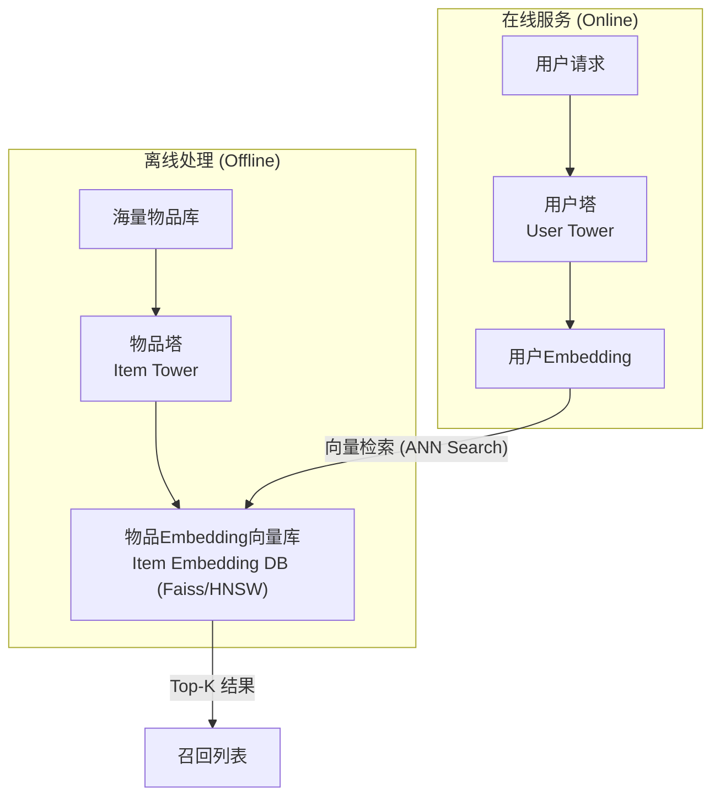

想象一下，你是一个大型视频网站的算法工程师，你的面前是数亿的视频库存和上亿的用户。当一个用户打开APP时，你需要在毫秒之内，从这片视频的“汪洋大海”中，为他挑选出他最可能感兴趣的几百个视频。

这就是 **召回（Recall）** 阶段的核心挑战。

为什么我们不能直接用一个精细的排序模型（比如DeepFM）给所有视频都打个分呢？答案是：**算不动！** 对亿万视频逐一打分，耗时将是灾难性的。

因此，推荐系统被设计为两个核心阶段：
1.  **召回阶段**：快！准！目标是从海量物料库中，快速、批量地筛选出一个较小的候选集（比如几百到几千个），保证用户可能感兴趣的内容基本都在这个池子里。
2.  **排序阶段**：精！细！对召回的候选集使用复杂模型进行精准排序，决定最终的呈现顺序。

召回，就是这场“大海捞针”艺术的第一步，也是决定整个推荐系统天花板的关键一步。

## 💡 核心思想：双塔模型，一场高效的“相亲大会”

为了解决召回的效率问题，**双塔模型（Two-Tower Model）** 应运而生，它已成为深度召回的业界标准范式。

我们可以把它比作一场大型的“线上相亲大会”：
- **物品塔 (Item Tower)**：相当于“女生信息库”。我们提前把所有女生的信息（物品特征）输入物品塔，精心计算并生成每个女生的专属“魅力向量”（Item Embedding）。这项工作可以离线完成，并存入一个可被快速检索的向量数据库（如Faiss）。
- **用户塔 (User Tower)**：相当于“男生信息处理器”。当一位男生（用户）来到会场，我们迅速将他的信息（用户特征、历史行为）输入用户塔，实时计算出他的“择偶标准向量”（User Embedding）。

**匹配过程**：拿着这个新鲜出炉的“男生标准向量”，去庞大的“女生魅力向量库”中进行光速检索，找出匹配度最高的Top-K个女生。



这个架构的精髓在于**将用户和物品的复杂交互，解耦为两个独立塔的向量表示**，从而将排序阶段昂贵的在线计算，转化为召回阶段高效的向量相似度搜索。

### 🧮 数学视角：双塔召回的一般形式

从数学上看，大多数深度召回模型都可以抽象成同一种形式：

- 记一个用户在某次请求下的特征向量为 $\mathbf{x}_u$（包含ID特征、行为序列统计、上下文等）。
- 记一个物品的特征向量为 $\mathbf{x}_i$（包含item ID、类目、内容特征等）。
- 用户塔和物品塔本质上是两个参数不同的神经网络：
  $$
  \mathbf{e}_u = f_u(\mathbf{x}_u;\, \theta_u) \in \mathbb{R}^d, \qquad
  \mathbf{e}_i = f_i(\mathbf{x}_i;\, \theta_i) \in \mathbb{R}^d
  $$
  这里 $d$ 是**Embedding 维度**，$f_u,f_i$ 由若干层线性变换 + 激活函数组成，$\theta_u,\theta_i$ 是需要学习的参数。

#### 相似度计算：从几何到概率

在双塔模型中，用户与物品的匹配程度用一个**相似度函数** $s(u,i)$ 表示，常见选择包括：

- **内积 (Dot Product)**：
  $$
  s(u,i) = \mathbf{e}_u^\top \mathbf{e}_i
  $$
- **余弦相似度 (Cosine Similarity)**：
  $$
  s(u,i) = \cos(\mathbf{e}_u,\mathbf{e}_i)
          = \frac{\mathbf{e}_u^\top \mathbf{e}_i}{\lVert \mathbf{e}_u \rVert_2\, \lVert \mathbf{e}_i \rVert_2}
  $$

几何直觉是：**向量越接近（方向越一致、距离越近），相似度越大**。在工业实践中，召回阶段常用**内积**，因为它可以直接落地到高效的向量检索库（Faiss、HNSW 等）。

为了让模型输出可以被解释为“用户在当前候选集合中选择物品 $i$ 的概率”，会在候选集合 $\mathcal{C}_u$ 上做一个 softmax：

$$
 p(i\mid u, \mathcal{C}_u)
 = \frac{\exp\big(s(u,i)/\tau\big)}{\sum_{j\in \mathcal{C}_u} \exp\big(s(u,j)/\tau\big)}
$$

其中：
- $\tau>0$ 是 **温度 (temperature)**，$\tau$ 越小，分布越“尖锐”，模型更偏向于把概率集中到得分最高的物品上；$\tau$ 越大，分布越“平滑”。

#### 负采样与损失函数：在巨量物品中近似全局 softmax

真实系统中，物品库往往有 $10^6 \sim 10^9$ 个物品，直接在全量物品上做 softmax 不可行。做法是：

- 对于训练集中的每条正样本 $(u, i^+)$，
- 从某个分布 $q(i)$（常与物品流行度相关）中采样 $K$ 个负样本 $\mathcal{N}_u=\{i_1^-, \dots, i_K^-\}$，
- 把正样本和负样本组成**局部候选集合**：$\mathcal{C}_u = \{i^+\} \cup \mathcal{N}_u$。

在这个局部候选集合上定义交叉熵损失：

$$
\mathcal{L}
= -\frac{1}{|\mathcal{D}|}
  \sum_{(u, i^+)\in \mathcal{D}}
  \log p\big(i^+ \mid u, \mathcal{N}_u\big)
= -\frac{1}{|\mathcal{D}|}
  \sum_{(u, i^+)\in \mathcal{D}}
  \log \frac{\exp(s(u,i^+)/\tau)}{\sum_{j\in\{i^+\}\cup \mathcal{N}_u} \exp(s(u,j)/\tau)}
$$

直觉解释：
- 希望模型给正样本 $i^+$ 一个尽可能高的得分 $s(u,i^+)$，
- 同时压低所有负样本 $i^- \in \mathcal{N}_u$ 的得分，
- 从而在局部候选集合中，正样本的“被选中概率”最大。

对用户向量的梯度可以写成：

$$
\frac{\partial \mathcal{L}}{\partial \mathbf{e}_u}
= \sum_{j \in \{i^+\}\cup \mathcal{N}_u}
  \big(p(j\mid u, \mathcal{N}_u) - y_j\big) \, \mathbf{e}_j,
$$

其中 $y_j=1$ 表示正样本、$y_j=0$ 表示负样本。含义是：
- 如果某个负样本的预测概率过高，则 $p(j\mid u,\mathcal{N}_u)-y_j>0$，梯度会把 $\mathbf{e}_u$ 推向“远离该负样本向量”的方向；
- 正样本则相反，会把用户向量拉向正样本的方向。

这就是**梯度下降 + 反向传播**在双塔召回中的几何图景：
> 每一次参数更新，都是在悄悄地“拉近用户与喜欢物品的距离，推远与不感兴趣物品的距离”。

#### 稀疏性与冷启动：为什么低维向量空间能救场？

- **缓解稀疏性**：原始的用户-物品交互矩阵 $R \in \{0,1\}^{|U|\times|I|}$ 极其稀疏，但我们学习到的是维度远小于 $|U|,|I|$ 的向量 $\mathbf{e}_u,\mathbf{e}_i$。只要两个物品经常被相似用户共同点击，它们的向量就会被拉近，即使某个特定用户只与其中一个物品发生过交互，也能通过“邻居”完成泛化。
- **缓解冷启动（尤其是物品冷启动）**：物品塔 $f_i(\cdot)$ 输入的不只是 item id，还可以包含内容特征（文本、图片、类目等）。即便是一个从未被点击过的新物品，只要有这些内容特征，就能通过 $f_i$ 映射到合理的向量位置，在向量空间中“找到组织”。

#### 一个极简数值例子

假设我们把用户和物品都映射到二维空间：

- 某次请求下的用户向量：$\mathbf{e}_u = (1, 0)$；
- 候选物品 A、B 的向量分别为：
  $$
  \mathbf{e}_A = (0.8, 0.6),\qquad
  \mathbf{e}_B = (0.1, 0.99).
  $$

那么：
- 内积：$s(u,A)=1\cdot0.8+0\cdot0.6=0.8$，$s(u,B)=0.1$，A 的得分明显更高；
- 归一化到 softmax 之后，$p(A\mid u,\{A,B\})$ 会远大于 $p(B\mid u,\{A,B\})$，模型就会优先召回 A。

接下来我们要介绍的 DSSM、YouTubeDNN、MIND，本质上都是在这个统一框架下，**设计不同形状的用户塔和物品塔**，以更好地刻画用户兴趣的复杂结构。

## 🏛️ 模型演进之路：从奠基到成熟

### DSSM：双塔模型的“开山鼻祖”

DSSM (Deep Structured Semantic Model) 最初用于解决搜索引擎中查询（Query）和文档（Document）的语义匹配问题，其思想被完美迁移到推荐领域，奠定了双塔模型的基础。

- **核心思想**：用两个结构相同（但参数不共享）的 DNN，分别将用户特征和物品特征映射到同一个低维语义空间，然后通过计算余弦相似度来衡量匹配程度。
- **训练目标**：在给定一条查询/用户 $u$ 时，最大化其与点击文档/物品 $i^+$ 的相似度，并压低未点击物品的相似度，使得 $p(i^+ \mid u)$ 尽可能大。

#### 🧮 数学建模：字符到语义向量

在原始搜索场景中，DSSM 将 Query 和 Document 都表示为高维的**字母 n-gram 计数向量**（例如 $10^5$ 维），记作 $\mathbf{x}_u,\mathbf{x}_i$；在推荐场景中，我们可以把它泛化为任意稀疏特征：

- 用户侧输入：$\mathbf{x}_u \in \mathbb{R}^{d_u}$，可以是 one-hot / multi-hot 编码后的稀疏向量；
- 物品侧输入：$\mathbf{x}_i \in \mathbb{R}^{d_i}$。

DSSM 用多层全连接网络把极其稀疏的输入压缩成稠密语义向量：

$$
\begin{aligned}
\mathbf{h}_u^{(1)} &= \sigma\big(W_u^{(1)} \mathbf{x}_u + \mathbf{b}_u^{(1)}\big),\\
\mathbf{h}_u^{(2)} &= \sigma\big(W_u^{(2)} \mathbf{h}_u^{(1)} + \mathbf{b}_u^{(2)}\big),\\
&\vdots\\
\mathbf{e}_u &= \mathbf{h}_u^{(L_u)} \in \mathbb{R}^d,
\end{aligned}
$$

物品塔同理：

$$
\mathbf{e}_i = f_i(\mathbf{x}_i;\theta_i) \in \mathbb{R}^d.
$$

这里：
- $W_u^{(l)}$ 是第 $l$ 层的权重矩阵，决定了从 $d_{l-1}$ 维到 $d_l$ 维的线性变换；
- $\sigma(\cdot)$ 是非线性激活函数（如 ReLU、tanh），使网络能够表示非线性关系；
- 最后一层输出 $\mathbf{e}_u,\mathbf{e}_i$ 就是我们在“双塔一般形式”中使用的用户/物品 Embedding。

#### 匹配与损失：余弦相似度 + softmax

DSSM 原论文采用**余弦相似度**作为匹配函数：

$$
 s(u,i) = \cos(\mathbf{e}_u,\mathbf{e}_i)
        = \frac{\mathbf{e}_u^\top \mathbf{e}_i}{\lVert \mathbf{e}_u \rVert_2\, \lVert \mathbf{e}_i \rVert_2}.
$$

对每条正样本 $(u,i^+)$，在一个由正样本和若干负样本组成的候选集合 $\mathcal{C}_u$ 上做 softmax：

$$
 p(i \mid u, \mathcal{C}_u)
 = \frac{\exp\big( s(u,i)/\tau \big)}{\sum_{j\in\mathcal{C}_u} \exp\big( s(u,j)/\tau \big)}.
$$

损失函数就是上一节给出的**负采样 softmax 交叉熵**，只是这里的特殊之处在于：
- 相似度采用余弦形式，因此梯度会同时影响向量的方向与模长；
- 在实践中，常用 **in-batch negative**：同一个 batch 中的其他样本文档/物品，天然作为当前 query 的负样本，极大降低了构造 $\mathcal{N}_u$ 的开销。

从稀疏向量压缩到语义空间，再用余弦相似度度量“角度距离”，是 DSSM 的核心数学内核。


::: details 💻 DSSM 模型实现 (参考 torch-rechub)
```python
import torch
import torch.nn as nn
from torch_rechub.models.layers import MLP

class DSSM(nn.Module):
    """
    Deep Structured Semantic Model
    
    Args:
        user_features (list): 用户侧特征列表.
        item_features (list): 物品侧特征列表.
        user_mlp_params (dict): 用户塔MLP的参数.
        item_mlp_params (dict): 物品塔MLP的参数.
        temperature (float): 温度系数，用于调整softmax输出.
    """
    def __init__(self, user_features, item_features, user_mlp_params, item_mlp_params, temperature=1.0):
        super().__init__()
        # 用户塔：特征处理层 + MLP
        self.user_tower = nn.Sequential(
            MLP(input_dim=sum(f.embed_dim for f in user_features), **user_mlp_params)
        )
        # 物品塔：特征处理层 + MLP
        self.item_tower = nn.Sequential(
            MLP(input_dim=sum(f.embed_dim for f in item_features), **item_mlp_params)
        )
        self.temperature = temperature
        
        # torch-rechub中特征处理由专门的feature_layer完成，这里为简化展示，假定输入已是拼接好的特征

    def user_embedding(self, x):
        """获取用户embedding"""
        return self.user_tower(x)
        
    def item_embedding(self, x):
        """获取物品embedding"""
        return self.item_tower(x)

    def forward(self, x_user, x_item):
        """
        计算用户和物品的匹配分数
        Args:
            x_user (torch.Tensor): 用户侧的输入特征.
            x_item (torch.Tensor): 物品侧的输入特征.
        Returns:
            torch.Tensor: 匹配分数 (logits).
        """
        user_embedding = self.user_tower(x_user)
        item_embedding = self.item_tower(x_item)
        
        # 计算余弦相似度，并用温度系数调整
        y = torch.mul(user_embedding, item_embedding).sum(dim=1)
        y = y / self.temperature
        return y
```
:::

### YouTubeDNN：工业界的“集大成者”

Google 的 YouTubeDNN 模型是深度召回在工业界成功应用的典范。它极大地丰富了用户塔的内涵，使其能更精准地刻画用户的**短期兴趣**和**时间动态**。

- **核心直觉**：
  > 你最近看了什么，比你是谁更能代表你“现在想看什么”。

- **整体结构**：
  - 物品塔：给每个视频一个共享的 ID Embedding，通常是简单的查表：$\mathbf{e}_i = \text{Emb}(i)$；
  - 用户塔：把用户最近观看的视频序列 + 人口学特征 + 上下文特征综合起来，生成 $\mathbf{e}_u$。

#### 🧮 用户塔的序列建模

设用户最近观看的 $N$ 个视频序列为 $(i_1, i_2, \dots, i_N)$，共享的物品 Embedding 层给出每个视频的向量：

$$
\mathbf{v}_t = \text{Emb}(i_t) \in \mathbb{R}^d, \quad t=1,\dots,N.
$$

最简单的做法是**平均池化**：

$$
\mathbf{h}_{\text{seq}} = \frac{1}{N} \sum_{t=1}^N \mathbf{v}_t.
$$

在工业界更常见的是**时间衰减加权平均**，最近看的视频权重更大。设权重

$$
\alpha_t = \frac{\exp\big(-\lambda (N-t)\big)}{\sum_{k=1}^N \exp\big(-\lambda (N-k)\big)}, \quad t=1,\dots,N,
$$

则序列兴趣向量为：

$$
\mathbf{h}_{\text{seq}} = \sum_{t=1}^N \alpha_t\, \mathbf{v}_t.
$$

再把其他静态特征拼接进来：

- 用户画像特征向量：$\mathbf{x}_u^{\text{profile}}$（年龄、性别、地区等）；
- 上下文特征向量：$\mathbf{x}_u^{\text{ctx}}$（当前时间、设备等）。

得到用户塔的输入：

$$
\mathbf{z}_u = [\mathbf{h}_{\text{seq}}; \mathbf{x}_u^{\text{profile}}; \mathbf{x}_u^{\text{ctx}}] \in \mathbb{R}^{d_z},
$$

再送入 MLP：

$$
\mathbf{e}_u = f_u(\mathbf{z}_u;\theta_u) \in \mathbb{R}^d.
$$

> 直觉上，YouTubeDNN 把“最近看过的内容”通过加权平均压缩成一个兴趣向量，再和用户的静态偏好、当前场景一起打包，形成当前时刻的“兴趣快照”。

#### 负采样与 Example Age：让热门不过度“霸榜”

YouTubeDNN 采用和上一节相同形式的**负采样 softmax 损失**，但在采样分布上做了更细致的设计：

- 记某个视频在日志中的出现次数为 $\text{freq}(i)$；
- 负样本从分布
  $$
  q(i) = \frac{\text{freq}(i)^\alpha}{\sum_j \text{freq}(j)^\alpha}
  $$
  中采样（$\alpha \in (0,1)$，常取 $\alpha\approx 3/4$）。

这样既保留了热门视频作为负样本的“代表性”，又不会让极少数超级热门视频主导训练。

**Example Age** 可以理解为一维时间特征：

- 设某条样本的时间戳为 $t$，当前训练时刻为 $T$，则样本年龄为 $\Delta t = T-t$；
- 常见做法是构造特征 $x_{\text{age}} = \log(1+\Delta t)$ 或离散分桶后 Embedding；
- 将 $x_{\text{age}}$ 作为额外维度拼到用户塔或物品塔输入中，让模型在优化 softmax 损失时自动学会“给太旧的样本降权”。

从数学上看，负采样 + Example Age 共同作用于 $p(i\mid u,\mathcal{N}_u)$ 的分布形状，使得模型估计的“点击概率”更接近我们真正关心的**未来观看行为**，而不是简单地复刻历史曝光频率。


::: details 💻 YouTubeDNN 模型实现 (参考 torch-rechub)
```python
import torch
import torch.nn as nn
from torch_rechub.models.layers import MLP, SequencePoolingLayer

class YouTubeDNN(nn.Module):
    """
    YouTube Deep Neural Networks for Recommendations
    
    Args:
        user_features (list): 用户侧特征列表.
        item_features (list): 物品侧特征列表 (用于负采样).
        neg_item_feature (str): 负采样物品的特征名.
        user_params (dict): 用户塔MLP的参数.
        temperature (float): 温度系数.
    """
    def __init__(self, user_features, item_features, neg_item_feature, user_params, temperature=1.0):
        super().__init__()
        self.user_features = user_features
        self.item_features = item_features
        self.neg_item_feature = neg_item_feature
        self.temperature = temperature
        
        # 物品的Embedding层是共享的
        # 在torch-rechub中，这通常通过共享embedding_layer的名称实现
        # 此处为简化，假定有一个共享的embedding_layer
        self.embedding_layer = self.get_shared_embedding_layer()
        
        # 用户塔
        # 序列特征的池化层
        self.seq_pooling_layer = SequencePoolingLayer(pooling_type="mean") 
        # 用户塔的MLP
        self.user_tower = MLP(
            input_dim=self.get_user_input_dim(), 
            **user_params["mlp_params"]
        )
        
    def forward(self, x):
        """
        此模型在torch-rechub中通常用于训练，直接输出loss
        这里为了展示，我们分解其核心逻辑
        """
        # 1. 获取所有物品的Embedding
        # 在实际训练中，通过负采样得到一个batch的物品
        item_embs = self.embedding_layer(x[self.neg_item_feature]) # (batch_size, n_neg+1, emb_dim)
        
        # 2. 构建用户塔输入
        # a. 聚合用户历史行为序列
        watch_history_emb = self.seq_pooling_layer(self.embedding_layer(x["watch_history"]))
        # b. 获取其他用户特征 (如年龄、性别)
        user_other_features_emb = self.get_user_other_features(x)
        # c. 拼接所有用户侧特征
        user_tower_input = torch.cat([watch_history_emb, user_other_features_emb], dim=1)
        
        # 3. 计算用户Embedding
        user_embedding = self.user_tower(user_tower_input) # (batch_size, emb_dim)
        
        # 4. 计算用户与所有采样物品的相似度 (内积)
        # user_embedding需要扩展维度以进行批次矩阵乘法
        logits = torch.bmm(item_embs, user_embedding.unsqueeze(-1)).squeeze(-1) # (batch_size, n_neg+1)
        
        # 训练时，这里的logits会直接送入交叉熵损失函数
        return logits
```
:::

### MIND：洞悉用户的“多面人生”

一个用户可能既喜欢看烧菜视频，又喜欢看篮球集锦。用**单一的向量**来概括他的全部兴趣，显然是有局限的——几种完全不同的兴趣会被“挤压”在同一个方向里，互相干扰。MIND (Multi-Interest Network with Dynamic Routing) 模型应运而生。

- **核心思想**：为每个用户生成 **K 个兴趣向量**，每个向量代表用户的一个兴趣簇（诸如“美食”“篮球”“二次元”等）。
- **动态路由 (Dynamic Routing)**：借鉴**胶囊网络 (Capsule Network)** 的思想，把用户的历史行为 Embedding 自动聚成 K 个簇，得到 K 个兴趣中心。
- **匹配过程**：给定候选物品时，先找到与它最匹配的那个兴趣向量，再按该兴趣向量与物品的相似度进行召回打分。

#### 🧮 多兴趣建模：从行为序列到兴趣胶囊

设用户的历史行为序列为 $\{i_1, i_2, \dots, i_L\}$（点击/观看/购买过的物品），共享 Embedding 层给出每个行为的向量：

$$
\mathbf{v}_j = \text{Emb}(i_j) \in \mathbb{R}^d, \quad j=1,\dots,L.
$$

MIND 的目标是从这 $L$ 个行为向量中，自动凝练出 $K$ 个兴趣向量 $\mathbf{u}_1,\dots,\mathbf{u}_K$。核心步骤可以概括为一种**软聚类 + 动态更新**：

1. **预测向量 (prediction vectors)**：对每个兴趣簇 $k$，用一个线性变换 $W_k$ 映射行为向量：
   $$
   \mathbf{p}_{jk} = W_k \mathbf{v}_j, \quad j=1,\dots,L,\ k=1,\dots,K.
   $$
2. **初始化路由 logits**：令所有 $b_{jk}=0$，表示“行为 $j$ 属于兴趣 $k$ 的先验相信程度”。
3. **动态路由迭代 $r=1,\dots,R$**：
   - 计算归一化的路由系数（类似 soft assignment）：
     $$
     c_{jk} = \text{softmax}_k(b_{jk}) = \frac{\exp(b_{jk})}{\sum_{k'} \exp(b_{jk'})};
     $$
   - 按加权和得到第 $k$ 个兴趣簇的“暂态表示” $\mathbf{s}_k$：
     $$
     \mathbf{s}_k = \sum_{j=1}^L c_{jk}\, \mathbf{p}_{jk};
     $$
   - 通过一个压缩函数（squash）得到兴趣向量：
     $$
     \mathbf{u}_k = \text{squash}(\mathbf{s}_k)
     = \frac{\lVert \mathbf{s}_k \rVert^2}{1+\lVert \mathbf{s}_k \rVert^2}\, \frac{\mathbf{s}_k}{\lVert \mathbf{s}_k \rVert};
     $$
   - 用“与兴趣向量的一致性”更新路由 logits：
     $$
     b_{jk} \leftarrow b_{jk} + \mathbf{p}_{jk}^\top \mathbf{u}_k.
     $$

经过若干轮迭代后，每个行为向量都会更强烈地“归属”到某几个兴趣簇，得到 $K$ 个方向差异明显、语义清晰的兴趣向量 $\mathbf{u}_1,\dots,\mathbf{u}_K$。

> 类比武侠门派：每条历史行为像一个“弟子”，动态路由就是在决定它最应该投奔哪一个门派（兴趣簇），而每个门派的掌门人就是最终学成的兴趣向量 $\mathbf{u}_k$。

#### 一对多匹配：物品如何“选中”合适的兴趣？

候选物品 $i$ 经过物品塔得到向量 $\mathbf{e}_i$。MIND 的匹配方式可以写成：

1. 首先计算物品与每个兴趣向量的得分：
   $$
   s_k(u,i) = \mathbf{e}_i^\top \mathbf{u}_k, \quad k=1,\dots,K.
   $$
2. 再取最大值作为最终匹配分数（或用加权和/\log\sum\exp）：
   $$
   s(u,i) = \max_k s_k(u,i).
   $$

于是，同一个用户对不同候选物品的得分，可能来自**不同的兴趣向量**：
- 对“篮球视频”，主要由“篮球兴趣向量” $\mathbf{u}_{\text{basketball}}$ 决定；
- 对“美食视频”，则主要由“美食兴趣向量” $\mathbf{u}_{\text{food}}$ 决定。

在损失函数层面，仍然使用上一节的负采样 softmax，只是把 $s(u,i)$ 换成上述的一对多匹配方式即可。

#### 为什么多兴趣能缓解稀疏性与“兴趣混叠”？

- **缓解兴趣混叠 (Interest Mixture)**：单向量用户表示相当于在一个方向上同时兼顾所有兴趣，梯度会把相互矛盾的更新“混在一起”；把用户拆成多个兴趣向量后，每条样本只会主要更新与之相关的兴趣簇，大大减轻了梯度冲突。
- **提升长尾召回能力**：对于偏冷门的垂类（如“小众乐器”“冷门球类”），对应的行为往往数量很少。如果这些行为能聚到某个兴趣簇上，那么只要候选物品与该簇在向量空间里接近，就有机会被召回，有利于发现用户的“小众爱好”。
- **数学上看**，MIND 实际上是在学习一个从行为序列到 $K$ 个向量的非线性映射
  $$
  g:\{\mathbf{v}_1,\dots,\mathbf{v}_L\} \mapsto \{\mathbf{u}_1,\dots,\mathbf{u}_K\},
  $$
  它比简单的平均/加权平均具有更高的表示能力，能够自动“分拆”兴趣空间。


这使得召回模型从传统的“一对一”匹配，升级为更灵活的“一对多”匹配：
> 不再是“用一个向量概括一生”，而是“为每种人生角色都保留一个专属向量”。

## ⚙️ 工业部署：从模型到服务

一个深度召回模型要真正上线发挥作用，还需要一整套强大的工程体系支撑。

1.  **离线流程 (Offline)**
    - **模型训练**：使用海量用户行为日志，训练双塔模型。
    - **向量产出**：训练完成后，将**物品塔**单独拿出来，对全量物品进行推理，产出所有物品的Embedding向量。
    - **索引构建**：将全量物品向量灌入**ANN检索引擎**（如Faiss、HNSW），构建高效的向量索引文件，并推送到线上。

2.  **在线流程 (Online)**
    - **实时特征**：当用户请求到达时，实时获取用户的基本特征和短期行为序列。
    - **实时推理**：将特征输入到线上的**用户塔**模型中，实时计算出用户当前的Embedding向量。
    - **实时检索**：用新鲜出炉的用户Embedding，去ANN引擎中进行检索，拉取最相似的Top-K个物品ID。
    - **物料补充**：将检索到的物品ID，去缓存（如Redis）中补全物品的标题、封面图等信息，返回给下游的排序服务。

## 🔧 关键超参数与调参心法

从工程角度看，DSSM / YouTubeDNN / MIND 主要有一批共通的关键超参数。理解它们的**数学含义**，有助于在实战中更有原则地调参。

### Embedding 维度 $d$

- **含义**：向量空间的维度，决定了模型可以刻画多少“独立方向”的兴趣与语义因素。
- **过小**：不同兴趣被“挤”在一起，$\mathbf{e}_u^\top \mathbf{e}_i$ 难以同时拉高多个语义相关方向，表现为召回覆盖率不足。
- **过大**：参数量和内积计算量 $O(d)$ 增大，易过拟合，召回向量库内存与检索时间急剧上升。
- **经验范围**：
  - 召回阶段常用 $d\in[32,256]$，多数场景 64 / 128 已足够；
  - 若物品种类极多且丰富（如短视频、内容平台），可适当增大到 256。

### 负采样数量 $K$ 与采样分布 $q(i)$

- **含义**：每个正样本 $(u,i^+)$ 所搭配的负样本个数 $K$ 决定了 softmax 近似的精度。
  损失中的分母
  $$
  \sum_{j\in\{i^+\}\cup\mathcal{N}_u} \exp(s(u,j)/\tau)
  $$
  越接近“全局所有物品”的求和，越接近理论上的最大似然目标。
- **$K$ 太小**：梯度高方差，模型容易过拟合少量负样本，召回结果不稳定；
- **$K$ 太大**：计算成本 $O(B\cdot K \cdot d)$ 过高（$B$ 为 batch 大小），训练速度无法接受；
- **经验范围**：
  - 一般推荐 $K\in[20,200]$；
  - 早期调试可先取 20～50，模型稳定后再视资源提高到 100～200。
- **分布 $q(i)$ 的选择**：常用 $q(i)\propto \text{freq}(i)^\alpha$，$\alpha\in(0,1)$，平衡“热门代表性”与“防止头部霸榜”。

### 温度系数 $\tau$

- **含义**：控制 softmax 的“尖锐程度”。
  - $\tau$ 越小，$\exp(s/\tau)$ 放大高分样本的权重，$p(i^+\mid u)$ 更容易接近 1，但梯度容易饱和；
  - $\tau$ 越大，分布更平滑，训练更稳定，但区分度下降。
- **经验范围**：
  - 通常在 $[0.5,1.0]$ 之间调节；
  - 如果发现 logits 数值非常大（如 $\lVert\mathbf{e}_u\rVert$、$\lVert\mathbf{e}_i\rVert$ 较大），可适当增大 $\tau$，防止 softmax 过于极端。

### 序列相关参数：长度 $N/L$ 与兴趣数 $K$

- **YouTubeDNN 中的序列长度 $N$**：
  - 太短：无法覆盖足够多的兴趣信号，序列兴趣向量 $\mathbf{h}_{\text{seq}}$ 噪声大；
  - 太长：包含大量陈旧行为，即使有时间衰减，也会带来额外计算与存储成本；
  - 常见做法是截断最近的 50～200 条行为，结合时间衰减或 Example Age 使用。
- **MIND 中的兴趣数 $K$**：
  - $K$ 太小：不同兴趣被迫混在同一兴趣向量里，退化为单向量用户表示；
  - $K$ 太大：许多兴趣簇几乎没有行为“认领”，导致训练不稳定、表示浪费；
  - 工程上可先从 $K=2\sim4$ 起步，对复杂场景再逐步增加到 8 左右。
- **动态路由迭代轮数 $R$**：
  - $R=1$ 时几乎退化为一次性 soft assignment；
  - $R=2\sim3$ 通常足够，更多轮数收益有限但计算开销显著增加。

### 一个小的 PyTorch 实战片段：样本级 softmax 损失

以下示例展示了如何按照本章的数学公式，用 PyTorch 实现“1 个正样本 + $K$ 个负样本”的 softmax 损失（可用于 DSSM / YouTubeDNN / MIND 的召回阶段）：

```python
import torch
import torch.nn.functional as F

# user_emb: (B, d)
# item_emb: (B, K+1, d)，假设第 0 维是正样本，其余是负样本
# tau: 温度系数

def sampled_softmax_loss(user_emb, item_emb, tau=1.0):
    # (B, 1, d) 与 (B, K+1, d) 做逐元素乘，再在最后一维求和，得到 logits
    logits = (item_emb * user_emb.unsqueeze(1)).sum(dim=-1) / tau  # (B, K+1)
    # 标签全为 0，表示第 0 个位置是正样本
    labels = torch.zeros(user_emb.size(0), dtype=torch.long, device=user_emb.device)
    loss = F.cross_entropy(logits, labels)
    return loss
```

这个实现与前文的数学公式一一对应：
- `logits[b, 0]` 对应 $s(u_b, i_b^+)$，`logits[b, k]` 对应负样本得分；
- `F.cross_entropy` 内部就是对每一行做 softmax 并计算负对数似然，正是本章推导的损失函数。

## 📖 **延伸阅读**
1. [Deep Neural Networks for YouTube Recommendations](https://research.google/pubs/pub45530/) - YouTubeDNN的经典论文，工业界深度召回的必读文献。
2. [Sampling-Bias-Corrected Neural Modeling for Large Corpus Item Recommendations](https://dl.acm.org/doi/10.1145/3298687.3306678) - 深入探讨YouTube召回中负采样偏差问题的论文。
3. [Multi-Interest Network with Dynamic Routing for Recommendation at Tmall](https://arxiv.org/abs/1904.08030) - 阿里巴巴提出的MIND模型，开启多兴趣召回的先河。
4. [Faiss: A library for efficient similarity search](https://engineering.fb.com/2017/03/29/faiss-a-library-for-efficient-similarity-search/) - Facebook关于其ANN引擎Faiss的介绍，了解向量检索背后的工程。
5. [Torch-RecHub Matching Models](https://github.com/datawhalechina/torch-rechub/tree/main/torch_rechub/models/matching) - Datawhale开源的torch-rechub项目中，包含了多种经典召回模型的PyTorch实现。

> 🧠 **思考题**
>
> 1. 如果你的物品库规模从 $10^5$ 升级到 $10^8$，在保持召回效果不崩的前提下，你会如何同时调整 Embedding 维度 $d$、负采样数 $K$ 和温度 $\tau$？
> 2. 在你的业务中，哪些特征更适合作为“用户塔输入”（短期行为、上下文），哪些更适合作为“物品塔输入”（内容特征、类目）？请尝试画出对应的数学符号映射 $\mathbf{x}_u,\mathbf{x}_i$。
> 3. 对于长尾兴趣占比较高的场景，你会如何选择 MIND 中的兴趣数 $K$ 和路由轮数 $R$，以在表达能力与计算成本之间取得平衡？
> 4. 如果线上监控发现热门物品在召回列表中占比过高，但整体点击率提升有限，你更倾向于从哪几个角度（如 $q(i)$ 的指数 $\alpha$、Example Age 设计、正负样本构造策略）做数学层面的调整？

::: tip 🎉 章节小结
深度召回模型以双塔架构为核心，巧妙地将复杂的用户-物品交互解耦为高效的向量检索问题。从DSSM的语义匹配思想，到YouTubeDNN的工业化实践，再到MIND的多兴趣建模，召回模型在"大海捞针"的效率与效果之间找到了完美平衡。它不仅是推荐系统的第一道关卡，更是决定整个系统天花板的关键环节。掌握深度召回，就是掌握了在海量数据中快速定位用户兴趣的核心能力。
:::

---

> "The art of being wise is knowing what to overlook." —— William James  
> 在召回的世界里，智慧不在于看到所有，而在于知道什么值得被发现。

