想象一下，你是一个大型视频网站的算法工程师，你的面前是数亿的视频库存和上亿的用户。当一个用户打开APP时，你需要在毫秒之内，从这片视频的“汪洋大海”中，为他挑选出他最可能感兴趣的几百个视频。

这就是 **召回（Recall）** 阶段的核心挑战。

为什么我们不能直接用一个精细的排序模型（比如DeepFM）给所有视频都打个分呢？答案是：**算不动！** 对亿万视频逐一打分，耗时将是灾难性的。

因此，推荐系统被设计为两个核心阶段：
1.  **召回阶段**：快！准！目标是从海量物料库中，快速、批量地筛选出一个较小的候选集（比如几百到几千个），保证用户可能感兴趣的内容基本都在这个池子里。
2.  **排序阶段**：精！细！对召回的候选集使用复杂模型进行精准排序，决定最终的呈现顺序。

召回，就是这场“大海捞针”艺术的第一步，也是决定整个推荐系统天花板的关键一步。

## 💡 核心思想：双塔模型，一场高效的“相亲大会”

为了解决召回的效率问题，**双塔模型（Two-Tower Model）** 应运而生，它已成为深度召回的业界标准范式。

我们可以把它比作一场大型的“线上相亲大会”：
- **物品塔 (Item Tower)**：相当于“女生信息库”。我们提前把所有女生的信息（物品特征）输入物品塔，精心计算并生成每个女生的专属“魅力向量”（Item Embedding）。这项工作可以离线完成，并存入一个可被快速检索的向量数据库（如Faiss）。
- **用户塔 (User Tower)**：相当于“男生信息处理器”。当一位男生（用户）来到会场，我们迅速将他的信息（用户特征、历史行为）输入用户塔，实时计算出他的“择偶标准向量”（User Embedding）。

**匹配过程**：拿着这个新鲜出炉的“男生标准向量”，去庞大的“女生魅力向量库”中进行光速检索，找出匹配度最高的Top-K个女生。

```mermaid
graph TD
    subgraph "离线处理 (Offline)"
        direction LR
        I["海量物品库"] --> IT["物品塔<br/>Item Tower"]
        IT --> IV["物品Embedding向量库<br/>Item Embedding DB (Faiss/HNSW)"]
    end

    subgraph "在线服务 (Online)"
        direction LR
        U["用户请求"] --> UT["用户塔<br/>User Tower"]
        UT --> UE["用户Embedding"]
    end
    
    UE -->|"向量检索 (ANN Search)"| IV
    IV -->|"Top-K 结果"| R["召回列表"]

```



这个架构的精髓在于**将用户和物品的复杂交互，解耦为两个独立塔的向量表示**，从而将排序阶段昂贵的在线计算，转化为召回阶段高效的向量相似度搜索。

## 🏛️ 模型演进之路：从奠基到成熟

### DSSM：双塔模型的“开山鼻祖”

DSSM (Deep Structured Semantic Model) 最初用于解决搜索引擎中查询（Query）和文档（Document）的语义匹配问题，其思想被完美迁移到推荐领域，奠定了双塔模型的基础。

- **核心思想**：用两个结构相同（但参数不共享）的DNN，分别将用户特征和物品特征映射到同一个低维语义空间，然后通过计算余弦相似度来衡量匹配程度。
- **训练目标**：最大化用户与正样本（点击过的物品）的相似度，同时最小化与负样本的相似度。

::: details 💻 DSSM 模型实现 (参考 torch-rechub)
```python
import torch
import torch.nn as nn
from torch_rechub.models.layers import MLP

class DSSM(nn.Module):
    """
    Deep Structured Semantic Model
    
    Args:
        user_features (list): 用户侧特征列表.
        item_features (list): 物品侧特征列表.
        user_mlp_params (dict): 用户塔MLP的参数.
        item_mlp_params (dict): 物品塔MLP的参数.
        temperature (float): 温度系数，用于调整softmax输出.
    """
    def __init__(self, user_features, item_features, user_mlp_params, item_mlp_params, temperature=1.0):
        super().__init__()
        # 用户塔：特征处理层 + MLP
        self.user_tower = nn.Sequential(
            MLP(input_dim=sum(f.embed_dim for f in user_features), **user_mlp_params)
        )
        # 物品塔：特征处理层 + MLP
        self.item_tower = nn.Sequential(
            MLP(input_dim=sum(f.embed_dim for f in item_features), **item_mlp_params)
        )
        self.temperature = temperature
        
        # torch-rechub中特征处理由专门的feature_layer完成，这里为简化展示，假定输入已是拼接好的特征

    def user_embedding(self, x):
        """获取用户embedding"""
        return self.user_tower(x)
        
    def item_embedding(self, x):
        """获取物品embedding"""
        return self.item_tower(x)

    def forward(self, x_user, x_item):
        """
        计算用户和物品的匹配分数
        Args:
            x_user (torch.Tensor): 用户侧的输入特征.
            x_item (torch.Tensor): 物品侧的输入特征.
        Returns:
            torch.Tensor: 匹配分数 (logits).
        """
        user_embedding = self.user_tower(x_user)
        item_embedding = self.item_tower(x_item)
        
        # 计算余弦相似度，并用温度系数调整
        y = torch.mul(user_embedding, item_embedding).sum(dim=1)
        y = y / self.temperature
        return y
```
:::

### YouTubeDNN：工业界的“集大成者”

Google 的 YouTubeDNN 模型是深度召回在工业界成功应用的典范。它极大地丰富了用户塔的内涵，使其能更精准地刻画用户的瞬时兴趣。

- **核心思想**：用户的兴趣可以通过他**最近观看过的视频序列**来表达。
- **用户塔构建**：
    1.  将用户最近观看过的N个视频的Embedding取出。
    2.  对这些Embedding做**加权平均**，得到一个代表用户历史兴趣的向量。
    3.  再拼接上用户的人口统计学特征、搜索历史等其他特征。
    4.  最后将拼接好的大向量输入一个DNN，生成最终的User Embedding。
- **创新点**：
    - **Example Age**：引入“样本年龄”作为特征，帮助模型感知时间的流逝，修正对老旧视频的流行度偏见。
    - **负采样**：采用基于物品流行度的负采样策略，高效地进行模型训练。

::: details 💻 YouTubeDNN 模型实现 (参考 torch-rechub)
```python
import torch
import torch.nn as nn
from torch_rechub.models.layers import MLP, SequencePoolingLayer

class YouTubeDNN(nn.Module):
    """
    YouTube Deep Neural Networks for Recommendations
    
    Args:
        user_features (list): 用户侧特征列表.
        item_features (list): 物品侧特征列表 (用于负采样).
        neg_item_feature (str): 负采样物品的特征名.
        user_params (dict): 用户塔MLP的参数.
        temperature (float): 温度系数.
    """
    def __init__(self, user_features, item_features, neg_item_feature, user_params, temperature=1.0):
        super().__init__()
        self.user_features = user_features
        self.item_features = item_features
        self.neg_item_feature = neg_item_feature
        self.temperature = temperature
        
        # 物品的Embedding层是共享的
        # 在torch-rechub中，这通常通过共享embedding_layer的名称实现
        # 此处为简化，假定有一个共享的embedding_layer
        self.embedding_layer = self.get_shared_embedding_layer()
        
        # 用户塔
        # 序列特征的池化层
        self.seq_pooling_layer = SequencePoolingLayer(pooling_type="mean") 
        # 用户塔的MLP
        self.user_tower = MLP(
            input_dim=self.get_user_input_dim(), 
            **user_params["mlp_params"]
        )
        
    def forward(self, x):
        """
        此模型在torch-rechub中通常用于训练，直接输出loss
        这里为了展示，我们分解其核心逻辑
        """
        # 1. 获取所有物品的Embedding
        # 在实际训练中，通过负采样得到一个batch的物品
        item_embs = self.embedding_layer(x[self.neg_item_feature]) # (batch_size, n_neg+1, emb_dim)
        
        # 2. 构建用户塔输入
        # a. 聚合用户历史行为序列
        watch_history_emb = self.seq_pooling_layer(self.embedding_layer(x["watch_history"]))
        # b. 获取其他用户特征 (如年龄、性别)
        user_other_features_emb = self.get_user_other_features(x)
        # c. 拼接所有用户侧特征
        user_tower_input = torch.cat([watch_history_emb, user_other_features_emb], dim=1)
        
        # 3. 计算用户Embedding
        user_embedding = self.user_tower(user_tower_input) # (batch_size, emb_dim)
        
        # 4. 计算用户与所有采样物品的相似度 (内积)
        # user_embedding需要扩展维度以进行批次矩阵乘法
        logits = torch.bmm(item_embs, user_embedding.unsqueeze(-1)).squeeze(-1) # (batch_size, n_neg+1)
        
        # 训练时，这里的logits会直接送入交叉熵损失函数
        return logits
```
:::

### MIND：洞悉用户的“多面人生”

一个用户可能既喜欢看烧菜视频，又喜欢看篮球集锦。用单一的向量来概括他的全部兴趣，显然是有局限的。MIND (Multi-Interest Network with Dynamic Routing) 模型应运而生。

- **核心思想**：为每个用户生成**多个兴趣向量**，每个向量代表用户的一个特定兴趣簇。
- **动态路由 (Dynamic Routing)**：通过**胶囊网络 (Capsule Network)** 的思想，将用户的历史行为Embedding进行动态聚类，自适应地生成K个兴趣中心（K个兴趣向量）。
- **匹配过程**：当一个候选物品（如一个篮球视频）过来时，模型会智能地计算该物品与用户的哪个兴趣向量（篮球兴趣）最匹配，并用这个最匹配的兴趣向量来计算最终的相似度。

这使得召回模型从“一对一”的匹配，升级为更灵活、更精准的“一对多”匹配。

## ⚙️ 工业部署：从模型到服务

一个深度召回模型要真正上线发挥作用，还需要一整套强大的工程体系支撑。

1.  **离线流程 (Offline)**
    - **模型训练**：使用海量用户行为日志，训练双塔模型。
    - **向量产出**：训练完成后，将**物品塔**单独拿出来，对全量物品进行推理，产出所有物品的Embedding向量。
    - **索引构建**：将全量物品向量灌入**ANN检索引擎**（如Faiss、HNSW），构建高效的向量索引文件，并推送到线上。

2.  **在线流程 (Online)**
    - **实时特征**：当用户请求到达时，实时获取用户的基本特征和短期行为序列。
    - **实时推理**：将特征输入到线上的**用户塔**模型中，实时计算出用户当前的Embedding向量。
    - **实时检索**：用新鲜出炉的用户Embedding，去ANN引擎中进行检索，拉取最相似的Top-K个物品ID。
    - **物料补充**：将检索到的物品ID，去缓存（如Redis）中补全物品的标题、封面图等信息，返回给下游的排序服务。

## 🌟 总结与展望

深度召回模型，以“双塔”架构为核心，通过将复杂的特征交互解耦为高效的向量检索，完美解决了推荐系统“大海捞针”的效率难题。从DSSM的奠基，到YouTubeDNN的工业化，再到MIND的精细化，我们看到召回模型正朝着更懂用户、更懂物品、更懂场景的方向不断进化。

掌握深度召回，不仅是理解其模型结构，更是理解其背后的系统设计、工程权衡与部署架构，这才是真正构建一个强大推荐系统的关键所在。

> 🧠 **思考题**
> 
> 1.  在双塔模型中，为什么通常用户塔和物品塔的输出Embedding维度需要保持一致？
> 2.  YouTubeDNN中的“Example Age”特征非常巧妙，它主要解决了什么问题？在你的业务场景中，能想到类似的“修正型”特征吗？
> 3.  相比于单塔模型（将用户和物品特征拼接后输入一个DNN），双塔模型在效果和性能上分别有什么优缺点？
> 4.  如何评估一个召回策略的好坏？仅仅看召回率（Recall@K）足够吗？

📖 **延伸阅读**
1. [Deep Neural Networks for YouTube Recommendations](https://research.google/pubs/pub45530/) - YouTubeDNN的经典论文，工业界深度召回的必读文献。
2. [Sampling-Bias-Corrected Neural Modeling for Large Corpus Item Recommendations](https://dl.acm.org/doi/10.1145/3298687.3306678) - 深入探讨YouTube召回中负采样偏差问题的论文。
3. [Multi-Interest Network with Dynamic Routing for Recommendation at Tmall](https://arxiv.org/abs/1904.08030) - 阿里巴巴提出的MIND模型，开启多兴趣召回的先河。
4. [Faiss: A library for efficient similarity search](https://engineering.fb.com/2017/03/29/faiss-a-library-for-efficient-similarity-search/) - Facebook关于其ANN引擎Faiss的介绍，了解向量检索背后的工程。
5. [Torch-RecHub Matching Models](https://github.com/datawhalechina/torch-rechub/tree/main/torch_rechub/models/matching) - Datawhale开源的torch-rechub项目中，包含了多种经典召回模型的PyTorch实现。

