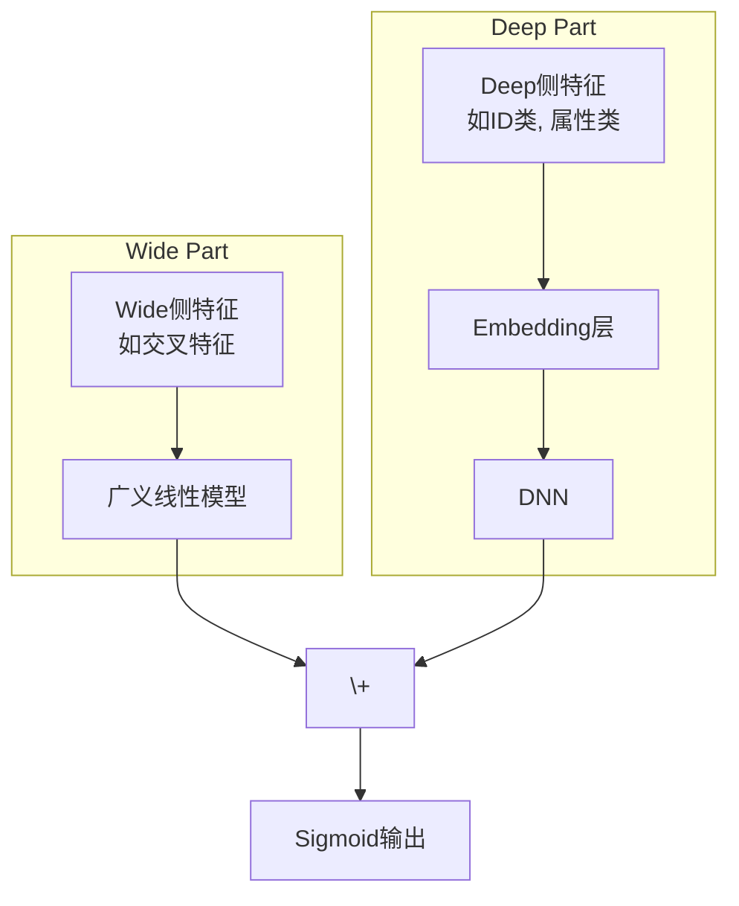

如果说召回是从亿万物料中"大海捞针"，那么**排序（Ranking）** 就是在这几百根"针"里找出最亮的那一根。它是推荐流程的"最后一公里"，负责对召回的候选集进行精准打分，预测用户对每个物品的偏好程度（如点击率 pCTR、转化率 pCVR），然后按分值高低呈现给用户。

排序模型的好坏，直接决定了用户的最终体验和平台的商业目标。这是一个于细微处见真章的"炼金"过程，模型的每一次微小迭代，都可能带来巨大的收益。

## 🎯 排序模型的一般数学框架

从数学上看，大多数 CTR/CVR 排序模型都可以抽象为一条流水线：

> **特征 $\to$ Embedding/交叉 $\to$ DNN 表示 $\to$ logit $z$ $\to$ 概率 $p$ $\to$ 损失 $\mathcal{L}$**

### 特征与 Embedding 表示

设一条样本包含：
- 稠密特征（如数值类特征） $\mathbf{x}_{\text{dense}}\in\mathbb{R}^{d_{\text{dense}}}$；
- $m$ 个离散特征域（如用户 ID、商品类目、城市等） $f_1,\dots,f_m$。

每个离散特征域通过 Embedding 映射到低维向量空间：

$$
\mathbf{v}_k = \text{Emb}_k(f_k) \in \mathbb{R}^d, \quad k=1,\dots,m.
$$

将所有域的向量与稠密特征拼接，得到排序模型的基础输入：

$$
\mathbf{e} = [\mathbf{v}_1;\dots;\mathbf{v}_m;\mathbf{x}_{\text{dense}}] \in \mathbb{R}^{d_e}.
$$

这里 $d$ 是 Embedding 维度，$d_e$ 是拼接后的总维度。

### DNN 与特征交叉

在最简单的“纯 DNN 排序模型”中，我们将 $\mathbf{e}$ 送入多层前馈网络：

$$
\begin{aligned}
\mathbf{h}^{(0)} &= \mathbf{e},\\
\mathbf{h}^{(\ell)} &= \sigma\big(W^{(\ell)}\mathbf{h}^{(\ell-1)} + \mathbf{b}^{(\ell)}\big), \quad \ell=1,\dots,L,\\
\end{aligned}
$$

其中 $W^{(\ell)}\in\mathbb{R}^{d_{\ell}\times d_{\ell-1}}$，$\sigma$ 为非线性激活（ReLU、PReLU 等）。

Wide&Deep、DeepFM、DCN 等模型的区别，主要体现在 **如何在 $\mathbf{e}$ 的基础上显式/隐式地构造特征交叉**：
- Wide&Deep：在 $\mathbf{e}$ 之外，额外引入线性的 Wide 交叉特征；
- DeepFM：用 FM 显式建模二阶交叉，同时用 DNN 学习高阶交叉；
- DCN：用 Cross Network 显式构造多阶交叉层；
- DIN/DIEN：通过注意力和序列网络，从用户历史序列中提取与当前候选强相关的“兴趣特征”。

### 从 logit 到 CTR 概率

无论特征交叉如何设计，最终都会得到某一层的输出 $\mathbf{h}^{(L)}$，再通过一个线性层映射到标量 logit：

$$
 z = w^\top \mathbf{h}^{(L)} + b, \quad w\in\mathbb{R}^{d_L}, b\in\mathbb{R}.
$$

并通过 **sigmoid** 得到点击概率预测：

$$
 p = p(y=1\mid x) = \sigma(z) = \frac{1}{1+e^{-z}}.
$$

这里 $y\in\{0,1\}$ 表示是否点击（或转化），$p$ 就是模型对 CTR 的估计值。

### 损失函数与优化目标

在排序阶段，常见的损失包括：

1. **二分类交叉熵（Binary Cross Entropy）**：

$$
\mathcal{L}_{\text{BCE}} = -\frac{1}{N}\sum_{n=1}^N\Big[y_n\log p_n + (1-y_n)\log(1-p_n)\Big].
$$

可以推得对 logit 的梯度：

$$
\frac{\partial \mathcal{L}_{\text{BCE}}}{\partial z_n} = p_n - y_n,
$$

这意味着排序模型在每个样本上的更新，本质上就是“**预测概率减去真实标签**”，这一简单形式极大地方便了反向传播的实现与分析。

2. **加权交叉熵（Weighted BCE）**：用于处理正负样本极度不平衡或者业务重视程度不同的情形：

$$
\mathcal{L}_{\text{WBCE}} = -\frac{1}{N}\sum_{n=1}^N\Big[w_1 y_n\log p_n + w_0(1-y_n)\log(1-p_n)\Big],
$$

其中 $w_1,w_0$ 为正负样本权重，用于在梯度层面放大“更关心”的样本。

3. **Focal Loss**：在极度不平衡场景（如曝光很多但点击很少）中常用，用于“聚焦难样本”：

$$
\begin{aligned}
\mathcal{L}_{\text{Focal}}
&= -\frac{1}{N}\sum_{n=1}^N \Big[\alpha(1-p_n)^\gamma y_n\log p_n\\
&\quad\quad + (1-\alpha)p_n^\gamma (1-y_n)\log(1-p_n)\Big],
\end{aligned}
$$

其中 $\gamma>0$ 控制“难样本加权”的强度，$\alpha\in(0,1)$ 控制正负样本整体权重。

> 直观理解：当一个样本已经被预测得很好（如 $p_n$ 接近标签），$(1-p_n)^\gamma$ 或 $p_n^\gamma$ 会让它的损失大幅缩小，从而把“注意力”更多地留给那些预测不好的样本。

### 与召回阶段的数学差异

与上一节的深度召回不同：
- **召回阶段**：典型做法是在候选集合（正样本 + 负样本）上做 **softmax**，目标是让“正确的那个物品”在该集合中的概率最大；
- **排序阶段**：面对的是已经较小的一组候选，对每个样本做 **二分类**（是否点击/转化），典型损失是交叉熵或其变体；
- 在实现上，召回更关心**向量检索效率**，排序更关心**预测校准、特征表达力与多目标权衡**。

接下来，我们将沿着这一统一框架，依次走近 Wide&Deep、DeepFM、DCN、MMoE 等经典排序模型；而基于注意力和序列建模的 DIN/DIEN/BST，将在下一节的注意力模型章节中单独展开。

## 🏛️ 模型演进之路：从分立到融合，从人工到自动

深度排序模型的演进，是一部追求"更高、更快、更强"的特征工程与模型结构创新史。

### 奠基时代：Wide & Deep —— "记忆"与"泛化"的首次联姻

Google在2016年提出的 `Wide & Deep` 模型，是深度学习在推荐领域里程碑式的作品，它奠定了现代排序模型的基本范式。

-   **核心思想**：任何推荐场景都离不开"记忆"（Memorization）和"泛化"（Generalization）。
    -   **Wide部分（记忆）**：一个广义线性模型，负责记忆那些频繁共现的、重要的交叉特征，比如"用户爱喝拿铁 & 城市是上海"。它的优点是简单、可解释性强。
    -   **Deep部分（泛化）**：一个标准的前馈神经网络（DNN），负责将稀疏特征嵌入到低维稠密空间，学习那些从未或很少出现的特征组合，探索未知的可能性。
-   **精髓**：将两者联合训练，让模型同时具备记住"历史经验"和探索"新鲜事物"的能力。

#### 🧮 数学建模：Wide 记忆 + Deep 泛化

设通过上一小节得到的拼接向量为 $\mathbf{e}$，同时人为构造了一组 Wide 侧的交叉特征向量 $\boldsymbol{\phi}(x)\in\mathbb{R}^{d_w}$（如「用户爱喝拿铁 & 城市是上海」）。

- **Wide 部分** 是一个广义线性模型：
  $$
  z_{\text{wide}} = \mathbf{w}_w^\top \boldsymbol{\phi}(x) + b_w,
  $$
  其中 $\mathbf{w}_w\in\mathbb{R}^{d_w}$、$b_w\in\mathbb{R}$ 为待学习参数。

- **Deep 部分** 对 $\mathbf{e}$ 做多层非线性变换：
  $$
  \begin{aligned}
  \mathbf{h}^{(0)} &= \mathbf{e},\\
  \mathbf{h}^{(\ell)} &= \sigma\big(W^{(\ell)}\mathbf{h}^{(\ell-1)} + \mathbf{b}^{(\ell)}\big), \; \ell=1,\dots,L,\\
  z_{\text{deep}} &= \mathbf{w}_d^\top \mathbf{h}^{(L)} + b_d.
  \end{aligned}
  $$

- **总 logit** 为两部分之和：
  $$
  z = z_{\text{wide}} + z_{\text{deep}}, \quad p = \sigma(z).
  $$

在交叉熵损失下，Wide 部分参数的梯度形如：
$$
\frac{\partial \mathcal{L}}{\partial \mathbf{w}_w} = (p-y)\, \boldsymbol{\phi}(x),
$$
这说明：
- 出现频率高、与目标强相关的交叉特征，其梯度累计效应显著，更容易被 **“记住”**；
- Deep 部分则通过 DNN 在向量空间中捕获从未见过的组合，实现 **“泛化”**。

从而在同一套参数中兼顾了「见多识广」与「触类旁通」。

::: details Wide&Deep模型示意图

:::


::: details 💻 Wide&Deep 模型实现 
```python
import torch
import torch.nn as nn
from torch_rechub.models.layers import MLP, EmbeddingLayer

class WideDeep(nn.Module):
    """
    Wide & Deep Model
    
    Args:
        wide_features (list): Wide侧的特征列表.
        deep_features (list): Deep侧的特征列表.
        mlp_params (dict): Deep侧MLP的参数.
    """
    def __init__(self, wide_features, deep_features, mlp_params):
        super().__init__()
        
        # Wide部分
        self.wide_feature_layer = EmbeddingLayer(wide_features)
        
        # Deep部分
        self.deep_feature_layer = EmbeddingLayer(deep_features)
        self.deep_mlp = MLP(self.deep_feature_layer.input_dim, **mlp_params)
        
        # 最终输出层
        self.output_layer = nn.Linear(mlp_params["output_dim"] + self.wide_feature_layer.input_dim, 1)

    def forward(self, x):
        """
        Args:
            x (dict): 输入特征, a dictionary with keys being feature names.
        """
        # Wide侧逻辑
        wide_input = self.wide_feature_layer(x) # (batch_size, wide_embed_dim)
        
        # Deep侧逻辑
        deep_input = self.deep_feature_layer(x) # (batch_size, deep_embed_dim)
        deep_output = self.deep_mlp(deep_input) # (batch_size, mlp_output_dim)
        
        # 拼接Wide和Deep的输出
        concat_out = torch.cat([wide_input, deep_output], dim=1)
        
        # 最终预测
        y_pred = self.output_layer(concat_out)
        return torch.sigmoid(y_pred)
```
:::

### 交叉时代：告别"人工炼丹"，拥抱"自动驾驶"

`Wide & Deep` 的一个痛点是，Wide部分的交叉特征仍然需要大量的人工设计和筛选，这是一项繁琐且经验依赖的"炼丹"工作。于是，一系列能**自动学习特征交叉**的模型应运而生。

#### DeepFM：FM与DNN的珠联璧合

`DeepFM` 是这个时代最耀眼的明星，至今仍是许多公司线上模型的主力。它巧妙地将因子分解机（FM）和DNN结合在了一个框架中。

-   **核心思想**：
    -   **FM部分**：与Wide部分类似，但它能自动学习所有特征之间的二阶交叉，无需人工指定。
    -   **Deep部分**：与`Wide & Deep`中的Deep部分一致，学习高阶交叉特征。
-   **精髓**：FM部分和Deep部分的输入Embedding是**共享**的！这带来了两大好处：
    1.  模型更小，训练更快。
    2.  Embedding层能被低阶和高阶交叉信号同时训练，学习更充分。

#### 🧮 数学建模：FM + DNN 的共享 Embedding

设共有 $m$ 个特征域，每个域的 one-hot/multi-hot 输入记为 $x_i$，共享的 Embedding 向量为 $\mathbf{v}_i\in\mathbb{R}^d$。则 FM 部分的输出可以写成：

- **一阶项**（类似 Wide 部分）：
  $$
  y_{\text{lin}} = w_0 + \sum_{i=1}^m w_i x_i;
  $$
- **二阶交叉项**：
  $$
  y_{\text{FM}}^{(2)} = \sum_{1\le i<j\le m} \langle \mathbf{v}_i, \mathbf{v}_j\rangle x_i x_j,
  $$
  其中 $\langle \mathbf{v}_i, \mathbf{v}_j\rangle = \mathbf{v}_i^\top\mathbf{v}_j$ 为内积。

在实现时常用等价的向量化形式：

$$
\begin{aligned}
\sum_{1\le i<j\le m} \langle \mathbf{v}_i, \mathbf{v}_j\rangle x_i x_j
&= \frac{1}{2}\Big[\big(\sum_{i=1}^m x_i\mathbf{v}_i\big)^2 - \sum_{i=1}^m x_i^2\mathbf{v}_i^{\odot 2}\Big],
\end{aligned}
$$

其中 $\mathbf{v}_i^{\odot 2}$ 表示逐元素平方，括号平方为逐元素平方再求和。于是 FM 的总输出为：

$$
 y_{\text{FM}} = y_{\text{lin}} + y_{\text{FM}}^{(2)}.
$$

另一方面，**Deep 部分** 使用同一批 Embedding，将所有 $\mathbf{v}_i$ 展平拼接作为 DNN 输入：

$$
\mathbf{e}_{\text{deep}} = [\mathbf{v}_1;\dots;\mathbf{v}_m;\mathbf{x}_{\text{dense}}],
$$

并经过多层 MLP 得到表示 $\mathbf{h}^{(L)}$，再线性映射为
$$
 z_{\text{deep}} = \mathbf{w}_d^\top \mathbf{h}^{(L)} + b_d.
$$

最终 DeepFM 的 logit 为：
$$
 z = y_{\text{FM}} + z_{\text{deep}}, \quad p = \sigma(z).
$$

从梯度角度看，同一个 Embedding 向量 $\mathbf{v}_i$ 同时出现在 FM 的交叉项和 Deep 的非线性表示中，
$$
\frac{\partial \mathcal{L}}{\partial \mathbf{v}_i}
= \underbrace{\frac{\partial \mathcal{L}}{\partial y_{\text{FM}}}\frac{\partial y_{\text{FM}}}{\partial \mathbf{v}_i}}_{\text{低阶交叉信号}}
+ \underbrace{\frac{\partial \mathcal{L}}{\partial z_{\text{deep}}}\frac{\partial z_{\text{deep}}}{\partial \mathbf{v}_i}}_{\text{高阶交叉信号}},
$$
这使得 Embedding 同时被**低阶交叉**和**高阶非线性交叉**的梯度共同“雕刻”，从而在语义空间中学到更细腻的结构。


::: details 💻 DeepFM 模型实现 
```python
import torch
import torch.nn as nn
from torch_rechub.models.layers import MLP, FM, EmbeddingLayer

class DeepFM(nn.Module):
    """
    DeepFM Model
    
    Args:
        deep_features (list): 用于Deep和FM部分的特征列表.
        mlp_params (dict): Deep侧MLP的参数.
    """
    def __init__(self, deep_features, mlp_params):
        super().__init__()
        # DeepFM中，所有特征都用于Deep和FM部分
        self.feature_layer = EmbeddingLayer(deep_features)
        
        # FM部分
        self.fm = FM(reduce_sum=True)
        
        # Deep部分
        self.deep_mlp = MLP(self.feature_layer.input_dim, **mlp_params)
        
        # 最终输出层
        # 1 (来自FM) + mlp_output_dim (来自Deep)
        self.output_layer = nn.Linear(mlp_params["output_dim"] + 1, 1)

    def forward(self, x):
        """
        Args:
            x (dict): 输入特征字典.
        """
        # 获取所有特征的Embedding
        embed_x = self.feature_layer(x) # (batch_size, n_fields, embed_dim)
        
        # FM部分输出
        fm_out = self.fm(embed_x) # (batch_size, 1)
        
        # Deep部分输入需要将Embedding展平
        deep_input = embed_x.flatten(start_dim=1) # (batch_size, n_fields * embed_dim)
        deep_out = self.deep_mlp(deep_input) # (batch_size, mlp_output_dim)
        
        # 拼接FM和Deep的输出
        concat_out = torch.cat([fm_out, deep_out], dim=1)
        
        # 最终预测
        y_pred = self.output_layer(concat_out)
        return torch.sigmoid(y_pred)
```
:::

#### DCN V2：更强大的显式交叉网络

`DCN` (Deep & Cross Network) 提供了另一种显式学习特征交叉的思路。它设计的`Cross Network`可以在每一层都保留之前所有层的交叉结果，并与原始输入进行新一轮的交叉。`DCN V2` 是其改进版，结构更稳定，表现更优。

-   **核心思想**：
    -   **Cross部分**：用一个特定的网络结构，在每一层都显式地、自动地进行特征交叉，交叉的阶数由网络深度决定。
    -   **Deep部分**：一个标准的DNN，与Cross部分并行。
-   **精髓**：相比于FM只能做二阶交叉，Cross网络能以一种高效且有界的方式，学习更高阶的交叉特征。

#### 🧮 数学建模：Cross Network 的显式多阶交叉

设输入为展平后的向量 $\mathbf{x}_0\in\mathbb{R}^d$，Cross Network 依次产生 $L_c$ 层交叉表示 $\mathbf{x}_1,\dots,\mathbf{x}_{L_c}$。经典 DCN 的第 $\ell$ 层交叉可写为：

$$
\mathbf{x}_{\ell+1} = \mathbf{x}_0\, (\mathbf{w}_\ell^\top \mathbf{x}_\ell) + \mathbf{b}_\ell + \mathbf{x}_\ell, \quad \ell=0,\dots,L_c-1,
$$

其中 $\mathbf{w}_\ell\in\mathbb{R}^d$、$\mathbf{b}_\ell\in\mathbb{R}^d$。

- $\mathbf{w}_\ell^\top \mathbf{x}_\ell$ 是一个标量，表示当前层根据 $\mathbf{x}_\ell$ 计算出的“缩放系数”；
- $\mathbf{x}_0\, (\mathbf{w}_\ell^\top \mathbf{x}_\ell)$ 表示用该系数在原始输入方向上做缩放；
- 再加上残差 $\mathbf{x}_\ell$，实现“在旧特征的基础上叠加一层新的交叉结构”。

展开来看，$\mathbf{x}_1$ 包含一阶与二阶项，$\mathbf{x}_2$ 将继续产生三阶项……堆叠 $L_c$ 层后，Cross Network 实际上在一个受控的参数量内，构造了从一阶到 $L_c+1$ 阶的多项式特征，而无需显式枚举所有组合。

在 DCN V2 中，Cross 层使用了更灵活的参数化形式（如向量-向量乘法替代标量缩放），但总体思想保持不变：**沿着原始输入 $\mathbf{x}_0$ 的方向，逐层构造高阶交叉项并叠加到当前表示上**。


::: details 💻 DCN V2 模型实现 
```python
import torch
import torch.nn as nn
from torch_rechub.models.layers import MLP, CrossNetworkV2, EmbeddingLayer

class DCNv2(nn.Module):
    """
    Deep & Cross Network V2
    
    Args:
        features (list): 所有特征列表.
        cross_layer_num (int): Cross网络的层数.
        mlp_params (dict): Deep侧MLP的参数.
    """
    def __init__(self, features, cross_layer_num, mlp_params):
        super().__init__()
        self.feature_layer = EmbeddingLayer(features)
        self.input_dim = self.feature_layer.input_dim
        
        # Cross部分
        self.cross_net = CrossNetworkV2(self.input_dim, cross_layer_num)
        
        # Deep部分
        self.deep_mlp = MLP(self.input_dim, **mlp_params)
        
        # 拼接Cross和Deep的输出
        self.output_layer = nn.Linear(self.input_dim + mlp_params["output_dim"], 1)

    def forward(self, x):
        embed_x = self.feature_layer(x).flatten(start_dim=1) # (batch_size, n_fields * embed_dim)
        
        # Cross部分输出
        cross_out = self.cross_net(embed_x)
        
        # Deep部分输出
        deep_out = self.deep_mlp(embed_x)
        
        # 拼接
        concat_out = torch.cat([cross_out, deep_out], dim=1)
        
        # 最终预测
        y_pred = self.output_layer(concat_out)
        return torch.sigmoid(y_pred)
```
:::

### 注意力时代：让模型知道该"看"哪里

用户的兴趣是多样且动态的。注意力机制的引入，让模型能够动态地聚焦于与当前候选物品最相关的历史行为，从而实现更精准的兴趣建模。

关于注意力机制在推荐系统中的深入应用（包括 DIN、DIEN、BST 等模型的数学原理、实现细节与工程优化），请参见下一章节：[注意力模型：让推荐模型"看"到你的兴趣焦点](./6.attention_models.md).


### 多目标时代：一个模型，多种使命

在真实的业务中，我们往往不只关心"点击率"，还关心"转化率"、"观看时长"、"分享率"等多个指标。**多任务学习（Multi-Task Learning, MTL）** 就是为了同时优化这些目标而生。

#### MMoE：巧妙平衡多个任务的"专家网络"

`MMoE` (Multi-gate Mixture-of-Experts) 是Google提出的经典多任务学习框架。

-   **核心思想**：不同的任务之间，既有共性，也有特性。强行让所有任务共享一个底层网络（Shared-Bottom）可能会导致"跷跷板效应"（一个任务提升，另一个任务下降）。
-   **精髓**：
    1.  设置多个**专家网络（Experts）**，每个专家都是一个独立的子网络，可以学习到某方面的共同知识。
    2.  为每个任务设置一个**门控网络（Gate）**。这个门控网络会根据当前输入，动态地为所有专家分配权重。
    3.  每个任务的最终输入，是所有专家输出的加权和。这样，每个任务都可以按需、灵活地组合专家的能力，既能共享信息，又能保留个性，有效避免了负迁移。

##### 🧮 数学建模：专家混合与多任务损失

设有 $K$ 个专家网络，每个专家接收相同的输入表示 $\mathbf{h}$，输出为 $\mathbf{e}_k\in\mathbb{R}^{d_e}$：
$$
\mathbf{e}_k = f_k(\mathbf{h};\theta_k),\quad k=1,\dots,K.
$$

对第 $t$ 个任务，门控网络根据输入 $\mathbf{h}$ 生成对各专家的权重分布：
$$
\mathbf{g}^{(t)} = \text{softmax}(W^{(t)}\mathbf{h})\in\mathbb{R}^K,
$$
其中 $g^{(t)}_k$ 表示任务 $t$ 对专家 $k$ 的依赖强度，且 $\sum_k g^{(t)}_k=1$。

任务 $t$ 的混合专家表示为：
$$
\mathbf{z}^{(t)} = \sum_{k=1}^K g^{(t)}_k\,\mathbf{e}_k,
$$
随后送入该任务的塔网络 $f^{(t)}_{\text{tower}}$，得到 logit $z^{(t)}$、概率 $p^{(t)}$ 与损失 $\mathcal{L}_t$（如二分类交叉熵）：
$$
 z^{(t)} = f^{(t)}_{\text{tower}}(\mathbf{z}^{(t)}),\quad
 p^{(t)} = \sigma(z^{(t)}),\quad
 \mathcal{L}_t = \text{BCE}(y^{(t)},p^{(t)}).
$$

多任务的总体损失常写为加权和：
$$
 \mathcal{L}_{\text{total}} = \sum_{t=1}^T \lambda_t\,\mathcal{L}_t,
$$
其中 $\lambda_t$ 控制各任务的重要程度。由于梯度会通过 $g^{(t)}_k$ 回流到门控网络与专家网络，MMoE 能够在训练中**自动学会**：哪些专家更适合被哪些任务“青睐”，从而缓解任务间的冲突与负迁移。


::: details 💻 MMoE 模型实现 
```python
import torch
import torch.nn as nn
from torch_rechub.models.layers import MLP, EmbeddingLayer

class MMoE(nn.Module):
    """
    Multi-gate Mixture-of-Experts Model
    
    Args:
        features (list): 所有输入特征列表.
        task_types (list): 任务类型列表, e.g., ['binary', 'binary'].
        n_expert (int): 专家数量.
        expert_params (dict): 每个专家网络的MLP参数.
        tower_params_list (list): 每个任务塔的MLP参数列表.
    """
    def __init__(self, features, task_types, n_expert, expert_params, tower_params_list):
        super().__init__()
        self.feature_layer = EmbeddingLayer(features)
        self.input_dim = self.feature_layer.input_dim
        self.n_task = len(task_types)
        
        # 专家网络
        self.experts = nn.ModuleList([
            MLP(self.input_dim, **expert_params) for _ in range(n_expert)
        ])
        
        # 门控网络
        self.gates = nn.ModuleList([
            nn.Linear(self.input_dim, n_expert, bias=False) for _ in range(self.n_task)
        ])
        
        # 任务塔
        self.towers = nn.ModuleList([
            MLP(expert_params["output_dim"], **tower_params) for tower_params in tower_params_list
        ])
        
    def forward(self, x):
        input_emb = self.feature_layer(x).flatten(start_dim=1)
        
        # 专家输出
        expert_outputs = [expert(input_emb) for expert in self.experts]
        expert_outputs = torch.stack(expert_outputs, dim=1) # (batch, n_expert, expert_dim)
        
        # 门控和任务塔计算
        outputs = []
        for i in range(self.n_task):
            gate_value = self.gates[i](input_emb).softmax(dim=1).unsqueeze(-1) # (batch, n_expert, 1)
            
            # 门控加权
            task_input = torch.sum(expert_outputs * gate_value, dim=1) # (batch, expert_dim)
            
            # 任务塔输出
            task_output = self.towers[i](task_input)
            outputs.append(task_output)
            
        return outputs
```
:::


## 🔑 关键超参数与调参心法

在排序阶段，很多“炼丹参数”其实都能从前文的数学公式中找到直觉依据。

1. **Embedding 维度 $d$**
   - 过小：$\mathbf{e}$ 容量不足，难以同时承载 FM/Deep/Attention/GRU 等各路信号，表现为训练损失降低缓慢、召回/排序都“卡在一个台阶上”。
   - 过大：$\|\mathbf{e}\|_2$ 往往增大，使得 logit $z$ 的方差变大，BCE/Focal Loss 的梯度也随之放大，更容易过拟合，推理时内存与 QPS 压力也明显升高。
   - **经验**：
     - 中小规模业务：$d\in[8,32]$；
     - 大规模、高维稀疏业务：$d\in[16,64]$，并配合 Dropout/L2 正则。
   - **与召回 Embedding 的关系**：常见做法是**物品侧复用、用户侧区分**：物品 Embedding 可以共享召回塔的向量（保证“同一物品在不同阶段语义一致”），排序侧再在此基础上叠加更多上下文特征；而用户兴趣在召回/排序中的侧重点不同，通常使用独立塔更灵活。

2. **DNN 深度与宽度（$L$ 与每层维度）**
   - 在 Wide&Deep、DeepFM、DCN 的 Deep 部分中，$L$ 和隐藏维度越大，$\mathbf{h}^{(L)}$ 对输入的高阶非线性组合越丰富，但也更容易出现梯度不稳定与过拟合。
   - 从梯度角度看，当 $L$ 增大时，$\frac{\partial \mathcal{L}}{\partial \mathbf{h}^{(0)}}$ 要通过更多链式乘积，容易出现梯度爆炸/消失，需要借助 **残差、归一化、合理初始化** 来稳定训练。
   - **经验**：排序阶段常用 2–4 层 MLP，每层 128–512 维即可；如果特征极多，可优先加宽而不是一味加深。

3. **样本不平衡：加权 BCE / Focal Loss / 采样策略**
   - 当正负样本极不平衡时，BCE 梯度 $p-y$ 在绝大多数负样本上接近 0 而在少数正样本上偏大，可能出现“模型总是预测 0 也不错”的局面。
   - **加权 BCE** 中的 $w_1,w_0$ 实质上在损失中放大了某类样本的梯度贡献；**Focal Loss** 中的 $(1-p)^\gamma,p^\gamma$ 则会自动减少“已经学会的简单样本”的权重。
   - 实战中，可以将：
     - 类别权重 $w_1:w_0$ 或 Focal 的 $\alpha$ 设置为近似于负样本:正样本比例的倒数；
     - 再通过调节 $\gamma$ 控制对“难样本”的聚焦程度（如 1–3）。

6. **多任务权重 $\lambda_t$**
   - 在 MMoE 中，总损失 $\mathcal{L}_{\text{total}}=\sum_t\lambda_t\mathcal{L}_t$ 中的 $\lambda_t$ 决定了梯度在不同任务间如何分配：
     - $\lambda_{\text{主任务}}$ 过小：主任务被“陪跑任务”拖累；
     - $\lambda_{\text{主任务}}$ 过大：辅助任务几乎不起作用，退化为单任务。
   - 常见做法包括：人工设定（如主任务权重大一些）、依据损失尺度自适应缩放、或使用不确定性加权等自动方法。

整体思路是：**先用小模型 + 简单配置快速跑通，再围绕上述关键超参做小步搜索**，每一步调参都能在公式层面找到“为什么要这么动手脚”的理由。

## 📖 **延伸阅读**
1. [Wide & Deep Learning for Recommender Systems](https://arxiv.org/abs/1606.07792) - Wide&Deep的开山之作。
2. [DeepFM: A Factorization-Machine based Neural Network for CTR Prediction](https://arxiv.org/abs/1703.04247) - DeepFM的经典论文。
3. [Modeling Task Relationships in Multi-task Learning with Multi-gate Mixture-of-Experts](https://dl.acm.org/doi/10.1145/3219819.3220007) - MMoE的经典论文，多任务学习的必读文献。
4. [Torch-RecHub Ranking Models](https://github.com/datawhalechina/torch-rechub/tree/main/torch_rechub/models/ranking) - Datawhale开源的torch-rechub项目中，包含了多种经典排序模型的PyTorch实现。
5. 关于注意力模型（DIN/DIEN/BST 等）的数学原理与工程实现，推荐阅读下一节文档：[注意力马达：让推荐模型"看"到你的兴趣焦点](./6.attention_models.md)。

> 🧠 **思考题**
>
> 1. DeepFM的Embedding共享机制是其亮点，但也可能带来参数更新的冲突。你认为在什么情况下，FM和Deep部分使用独立的Embedding可能会更好？
>
> 2. DCN和xDeepFM都致力于显式地学习高阶特征交叉，它们的核心区别是什么？在计算效率和效果上各有什么取舍？
>
> 3. 在纯排序模型（如Wide&Deep、DeepFM、DCN）之外接入注意力模型（如DIN/DIEN/BST），你认为在整体架构上应如何划分职责边界？
>
> 4. MMoE中的"专家"数量是一个超参，你认为它应该如何设置？是越多越好吗？它和任务的相关性有什么关系？

::: tip 🎉 章节小结
深度排序模型的演进历程展现了推荐系统从"手工炼丹"到"自动驾驶"的华丽转身。Wide&Deep奠定了记忆与泛化并重的基础范式，DeepFM实现了特征交叉的自动化突破，DIN引入注意力机制捕获动态兴趣，MMoE将单一目标扩展为多任务协同优化。每一次模型创新，都是对用户复杂偏好的更深层理解，也是对推荐精度极限的不懈追求。掌握这些模型的精髓，就是掌握了在推荐系统"最后一公里"中精雕细琢的艺术。
:::

---

> "The devil is in the details." —— Ludwig Mies van der Rohe  
> 在排序模型的世界里，魔鬼藏在细节中，而天使也在细节中诞生。

