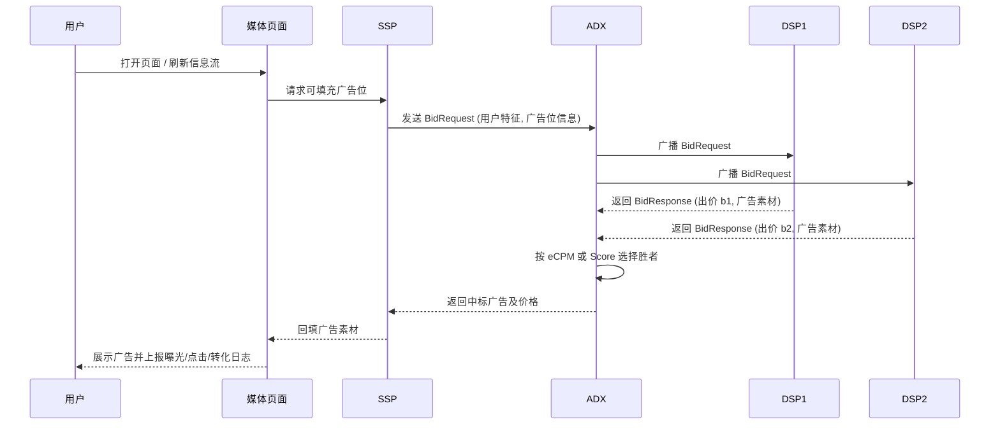

## 🌐 广告生态全景：从单点术语到多方博弈

在上一节的术语篇中，我们聚焦在“**单条广告**”视角，讲清了 CPM/CPC/CPA、eCPM、Score、GSP/VCG 等如何决定：

- 每次曝光/点击/转化收多少钱？
- 同一位置上多条广告如何排序？

但在真实世界里，广告系统不是一对一的小生意，而是一个由 **广告主、媒体/平台、用户、DSP、SSP、ADX、DMP** 等多方参与的“大市场”：

- 广告主希望：**花最少的钱，拿到尽量多的高质量转化**（高 ROI/ROAS）；
- 媒体/平台希望：**在不伤害用户体验的前提下，最大化 eCPM 与长期收益**；
- 用户希望：**少被打扰、多看有用/有趣的内容**；
- DSP/SSP/ADX/DMP 等技术角色，则是连接这些参与方的“算法经纪人”和“交易所”。

本节就在第一节的数学基础上，进一步把视角拉远：

- 把各参与方的 **目标函数** 写清楚；
- 把 RTB（实时竞价）的 **流程与数学机制** 讲明白；
- 把单个 Score/eCPM 概念，放进一个 **多方博弈的系统架构** 中来看。

---

## 🧑‍🤝‍🧑 关键参与方与目标函数

我们用最精简的方式刻画几类核心角色及其优化目标。

### 📣 广告主（Advertiser）

- 决策变量：出价 $b$、预算 $B$、投放策略（定向、创意等）。
- 目标：在预算约束下，最大化总收益或 ROI。

若每次转化平均价值为 $v$，转化数为 $N_{\text{conv}}$，总花费为 $C$，则：

$$
\max \; v N_{\text{conv}} - C \quad \text{s.t.} \quad C \le B.
$$

若改用 ROI 约束形式：

$$
\text{ROI} = \frac{v N_{\text{conv}} - C}{C} \ge R^{\ast},
$$

则需在满足 $\text{ROI} \ge R^{\ast}$ 前提下，尽量放大 $N_{\text{conv}}$。

### 🏙 媒体/平台（Publisher/Media）

- 决策变量：广告位数量、瀑布/混排策略、质量分规则 $q_i$ 等；
- 目标：最大化长期收益的同时维持用户体验和合规性。

可抽象为：

$$
\max \; \sum_{t} \text{eCPM}_t - \lambda \cdot \text{UXPenalty}_t,
$$

其中 $\text{UXPenalty}_t$ 可以是投诉率、跳出率、屏蔽率等的函数，$\lambda>0$ 控制“赚钱 vs 体验”的权衡。

### 👤 用户（User）

用户不会直接在系统里写目标函数，但可以被建模为对内容和广告有一个 **效用函数** $U$：

$$
U = U_{\text{content}} - \gamma \cdot U_{\text{ad	ext{-}disturb}} + U_{\text{ad	ext{-}value}},
$$

其中 $\gamma$ 表示用户对“打扰”的敏感度。平台往往通过 **留存率、时长、活跃度** 等指标间接感知这个效用，并反馈到质量分 $q_i$ 与广告负载策略中。

### 🧠 DSP / SSP / ADX / DMP：技术基建四件套

- **DSP（Demand-Side Platform）**：站在广告主一侧，接收 RTB 请求，
  选出最合适的广告并计算出价 $b$，目标是：
  $$
  \max \; \sum_{\text{impression } j} (v_j p_{\text{conv},j} - c_j) \quad \text{s.t.} \quad \sum_j c_j \le B.
  $$
  其中 $p_{\text{conv},j} = p_{\text{CTR},j} p_{\text{CVR},j}$，$c_j$ 是该次曝光实际支付成本。

- **SSP（Supply-Side Platform）**：站在媒体一侧，管理广告位库存，向 ADX 发起竞价请求，
  目标是最大化媒体整体 eCPM：
  $$
  \max \; \sum_{\text{slot } s} \text{eCPM}_s.
  $$

- **ADX（Ad Exchange）**：广告交易所，负责在多个 DSP 之间撮合交易，按照前一节的 Score/eCPM 规则选出优胜者并决定扣费。

- **DMP（Data Management Platform）**：数据管理平台，负责数据清洗、特征构建与人群分桶，为 DSP 提供画像特征，从而提升 pCTR/pCVR 预测的精度。

从数学角度看，DSP/SSP/ADX/DMP 共同构成了一套“**多方优化问题**”：每一方都有自己的目标函数，但又通过 **pCTR/pCVR、eCPM 和拍卖机制** 被绑在同一条价值链上。

---

## ⚙️ RTB 实时竞价流程与数学机制

RTB（Real-Time Bidding）可以理解为一场在几十毫秒内完成的“微型拍卖会”。用一个简化的时序图表示：

在这条链路上，最关键的数学步骤发生在 **DSP 出价** 和 **ADX 排序与扣费**：

1. 对于某个广告候选 $k$，DSP 依赖第三章模型给出的 $p_{\text{CTR},k}$、$p_{\text{CVR},k}$，估计其 **单次曝光的期望收益**：
   $$
   \mathbb{E}[\text{收益}_k \mid \text{一次曝光}] = v_k \cdot p_{\text{CTR},k} \cdot p_{\text{CVR},k}.
   $$
2. 在 ROI 约束下，根据前一节推导的公式，得到合理的出价区间 $b_k$；
3. ADX 对来自多个 DSP 的出价 $(b_1, b_2, \dots)$ 计算对应的 eCPM 或 Score：
   $$
   \text{Score}_i = b_i \cdot \text{pCTR}_i \cdot q_i,
   $$
   并通过 GSP/VCG 等机制选出赢家及实际扣费价格。

这样，术语篇中的 **eCPM、Score、GSP** 被自然嵌入到了 RTB 的完整链路之中。

---

## 🤝 多方博弈视角：一个极简的纳什均衡示意

在一个给定的广告位上，假设存在多个 DSP，同属 CPC 模式，每个 DSP $i$ 对其候选广告估计的 pCTR 为 $p_i$，希望在预算约束下最大化自身利润：

$$
\max_{b_i} \; (v_i p_i - \text{CPC}_i) N_{\text{clk},i}.
$$

在 GSP 近似下，若只考虑最高出价方与第二高出价方，$i$ 的实际 CPC 与对手出价 $b_{-i}$ 相关：

$$
\text{CPC}_i \approx \frac{b_{-i} q_{-i}}{q_i}.
$$

每个 DSP 都在根据自己对流量质量 $p_i$ 和价值 $v_i$ 的估计，选择一个 **出价策略** $b_i = f_i(p_i, v_i)$。当所有 DSP 都找到了在对方策略给定时的最优响应，且无人有动力单方面改变出价时，系统就达到了一个 **纳什均衡**。虽然实际工业系统远比这个模型复杂，但这种视角有助于我们理解：

- 为什么“盲目抬高出价”不一定带来更高 ROI；
- 为什么拍卖机制设计要兼顾 **激励相容性**（鼓励诚实出价）与 **收入最大化**。

---

## 🔗 与术语篇和推荐模型的衔接

- **术语篇** 聚焦在 **单条广告 + 单个平台** 的层面，说明了：
  - pCTR/pCVR 如何通过 eCPM、Score 影响排序；
  - CPM/CPC/CPA 如何决定一次曝光/点击/转化收多少钱。
- **本生态篇** 则把视角扩展到 **多方参与 + 全链路交易**：
  - DSP 如何用第三章的 pCTR/pCVR 预测和第一节的 ROI/eCPM 公式进行出价；
  - SSP/ADX 如何在多 DSP 之间用 GSP/VCG 机制完成实时竞价；
  - 媒体与用户体验如何通过质量分 $q_i$ 与预算/Pacing 策略被纳入统一的优化框架。

可以把第三章 + 本章第一节 + 本节理解为：

> **从“模型怎么预测” → “单条广告怎么算钱” → “一整个广告市场怎么运转”** 的三步走。

---

## 📖 延伸阅读

1. *Real-Time Bidding in Online Display Advertising* – 系统介绍 RTB 生态、DSP/SSP/ADX 架构与优化目标。
2. *Mechanism Design for Online Advertising* – 从博弈论视角讨论 GSP/VCG 及多方激励相容问题。
3. 各大 RTB 平台（如 OpenRTB 规范、Google Ad Manager 文档）对 BidRequest/BidResponse 字段的定义与示例，有助于从工程视角理解本文数学符号对应的真实字段。

> 🧠 **思考题**
>
> 1.  如果你在一个 DSP 中负责出价策略设计，面对不同价值密度的广告主（高客单价 vs 低客单价），你会如何调整 $f(p_{\text{CTR}}, p_{\text{CVR}}, v)$ 这类出价函数？
> 2.  SSP 为了兼顾媒体收益与用户体验，会在什么场景下选择“填充率优先”而不是“eCPM 优先”？你会如何用一个简单的目标函数来刻画这种权衡？
> 3.  当市场上 DSP 数量很多且竞争激烈时，你认为 GSP 机制下的均衡出价会更接近“真实价值”还是“抬价”？为什么？
> 4.  如果用户对“不相关广告”极其敏感，你会如何通过调整质量分 $q_i$ 或阈值策略，来在数学上显式地“惩罚”这类广告？
> 5.  结合术语篇中的 A/B 测试方法，设计一套实验来评估“引入一个新 DSP 或新出价策略”对整个平台 eCPM 与用户体验的长期影响。

::: tip 🎉 章节小结
本节从系统视角梳理了计算广告的生态：

- 用目标函数刻画了广告主、媒体/平台、用户以及 DSP/SSP/ADX/DMP 等参与方的诉求；
- 用 RTB 时序与 Score/eCPM 公式，把第三章的 pCTR/pCVR 预测与第一节的 eCPM/GSP 机制放进统一链路；
- 用极简的博弈论视角说明多 DSP 竞价下的出价策略与均衡含义；
- 通过与术语篇的对比，清晰地区分了“单条广告怎么算钱”和“整个广告市场如何运转”。

掌握本节内容，你不仅能看懂一条 BidRequest/BidResponse 后面发生了什么，还能在设计召回/排序/出价/预算策略时，时刻意识到自己所处的位置：**你改动的，不只是一条模型权重，而是整个广告市场上多方博弈的一环。**
:::
