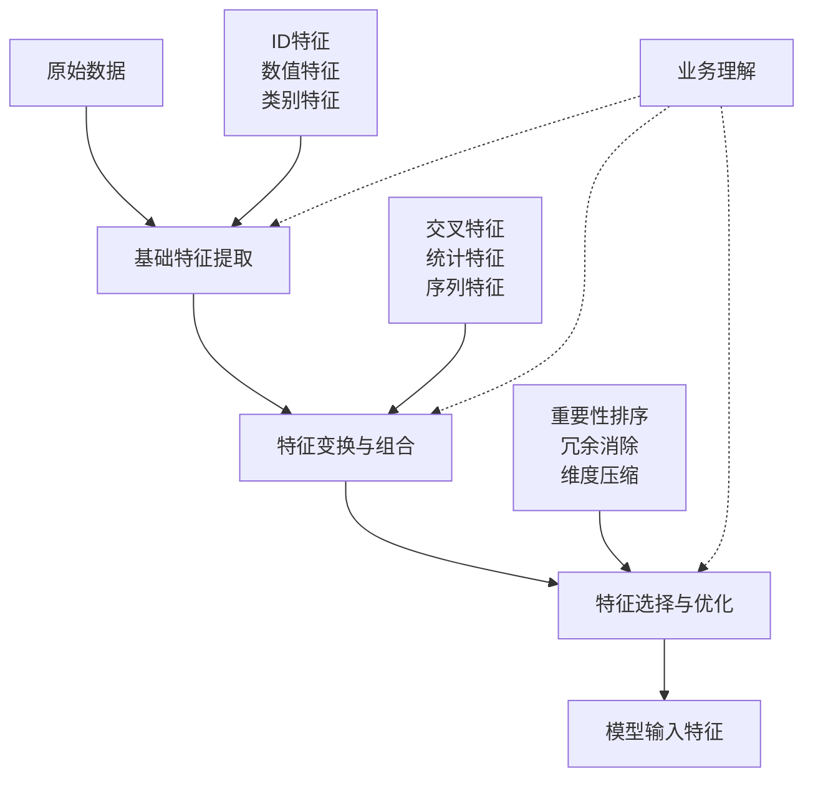
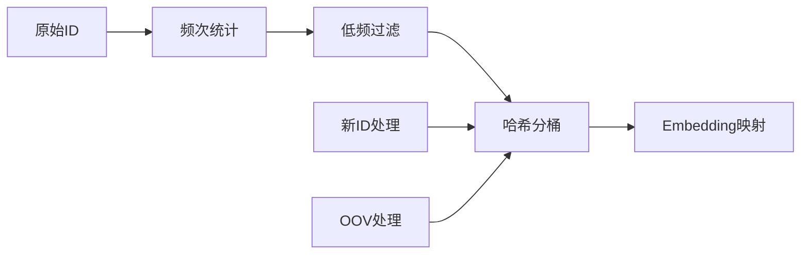

# 特征工程的'十八般武艺'

> "模型的上限由数据决定，特征工程是让模型逼近这个上限的关键"

## 🎯 特征工程在推荐系统中的定位

在前面的章节中，我们花了大量篇幅讨论模型架构——从 Wide&Deep 到 DeepFM，从 DIN 到 BST。但在工业实践中，一个残酷的事实是：**一个好特征带来的收益，往往远超一次模型架构升级**。模型架构决定了"怎么学"，而特征决定了"学什么"。

特征工程的核心目标只有一个：**把业务信号转化为模型能高效利用的数值表示**。

### 不同特征类型的工程侧重点

在推荐系统中，不同类型的特征面临的工程挑战截然不同：

- **ID 类特征**（用户 ID、物品 ID）：词汇表管理是核心问题——如何处理高基数、低频 ID 和新 ID，直接影响模型的泛化能力和内存开销。
- **数值特征**（价格、评分、时长）：分布差异是核心问题——价格可能跨越几个数量级，不做变换会让梯度被大值主导。
- **类别特征**（品类、品牌、地区）：基数和语义层次是核心问题——"品类"可能只有几十个值，而"品牌"可能有几十万个，处理策略完全不同。
- **序列特征**（行为序列、时序特征）：长度不一和时序衰减是核心问题——需要在变长序列中提取固定维度的表示，同时反映"近期行为比远期行为更重要"的先验。
- **交叉特征**（特征组合、高阶交互）：组合爆炸是核心问题——$m$ 个特征的二阶交叉就有 $O(m^2)$ 种，哪些值得做、哪些交给模型自动学，需要权衡。

## 🛠️ ID 类特征：推荐系统的基石

ID 类特征是推荐系统区别于其他机器学习任务的标志性特征。一个用户 ID 背后承载的是该用户全部的行为偏好，一个物品 ID 背后承载的是该物品的全部属性。处理好 ID 特征，是特征工程的第一课。

### 经典处理流程

**频次过滤**：出现次数低于阈值 $\theta$ 的 ID 统一映射为 `UNK`。这不仅减小词汇表，更重要的是避免模型在只出现一两次的 ID 上过拟合——这些 ID 的 Embedding 几乎没有被充分训练，留着反而是噪声。阈值 $\theta$ 的选择取决于数据规模，通常在 5–20 之间。

**哈希分桶**：对于新出现的 ID（线上推理时遇到训练集中没有的 ID），哈希分桶提供了一种优雅的兜底方案：$bucket = hash(ID) \bmod B$。与直接映射为 `UNK` 相比，哈希分桶至少保证了不同的新 ID 有概率落入不同的桶，保留了部分区分度。代价是哈希冲突——两个不相关的 ID 可能共享同一个 Embedding。桶数 $B$ 越大冲突越少，但内存开销也越大。

**两种方案的取舍**：词汇表方案对已知 ID 表达力强，但对新 ID 完全失效（退化为 UNK）；哈希方案对新 ID 友好，但冲突会损害已知 ID 的表达精度。工业界常见的做法是**两者结合**：高频 ID 走词汇表，低频和新 ID 走哈希分桶。

### Embedding 维度选择

一个常被引用的经验公式：

$$d = \min\big(600,\; \lfloor 1.6 \times |V|^{0.56} \rfloor\big)$$

其中 $|V|$ 为词汇表大小。这个公式的直觉是：词汇表越大，需要的维度越高来区分不同 ID，但增长是亚线性的（指数 0.56），因为高维空间的容量增长很快。

实际操作中更实用的参考：

| 词汇表规模 | 推荐维度范围 | 典型场景 |
|-----------|-------------|---------|
| < 1K | 8–16 | 城市、设备类型 |
| 1K–100K | 16–64 | 品牌、品类 |
| 100K–10M | 64–128 | 物品 ID |
| > 10M | 128–256 | 用户 ID（大平台） |

维度选择的本质是**表达力 vs. 过拟合**的权衡：维度越高，Embedding 的表达力越强，但每个 ID 需要更多样本才能把 Embedding 训练充分。对于低频 ID 占比高的特征域，适当降低维度反而效果更好。

## 🚀 高阶特征工程技巧

### 交叉特征：从人工到自动

交叉特征的演进史，本质上就是推荐模型的演进史：

- **Wide&Deep 时代**：交叉特征靠人工设计。算法工程师根据业务直觉手动构造"用户城市 × 物品品类"这样的组合，费时费力，且严重依赖个人经验。
- **DeepFM / DCN 时代**：模型自动学习二阶甚至高阶交叉（详见第三章排序模型一节）。但这并不意味着人工交叉特征失去了价值——模型自动学到的交叉是隐式的、分布在整个参数空间中的，而人工构造的显式交叉特征可以直接注入强先验，加速收敛。

**哪些交叉值得手动做？** 一个实用的判断标准：如果某个交叉组合在业务上有明确的语义（如"性别 × 品类"反映了不同性别的品类偏好差异），且该信号在数据中有足够的统计支撑（交叉后每个桶内样本量 > 100），那就值得显式构造。反之，交给模型自动学习即可。

### 时间特征：不只是"几点几分"

时间特征在推荐系统中的价值远超表面。关键在于从原始时间戳中提取出**对预测有帮助的信号**：

**绝对时间特征**：小时、星期几、是否节假日等。这些特征捕捉的是用户行为的**周期性模式**——比如工作日午休时间刷短视频、周末晚上看电影。

对于周期性特征，直接用整数编码（如 hour=23）会引入一个问题：模型会认为 23 点和 0 点差距很大（数值差 23），但实际上它们只差 1 小时。正弦余弦编码解决了这个问题：

$$hour\_sin = \sin\left(\frac{2\pi \times hour}{24}\right), \quad hour\_cos = \cos\left(\frac{2\pi \times hour}{24}\right)$$

在这个编码下，23 点和 0 点在二维空间中是相邻的。

**相对时间特征**：距离上次行为的时间间隔、会话持续时长、N 天内的活跃天数等。这些特征捕捉的是用户的**实时状态**——刚点击过某个品类的用户，对该品类的兴趣大概率还在。

**时间衰减**：用户 3 天前的点击和 30 天前的点击，对当前推荐的参考价值是不同的。指数衰减是最常用的建模方式：$w(t) = e^{-\lambda \cdot \Delta t}$，其中 $\Delta t$ 为时间间隔，$\lambda$ 控制衰减速度。

### 统计特征：用聚合信息构建全局画像

统计特征通过聚合历史数据，为用户和物品提供"全局视角"的信息。几个在工业界被反复验证有效的统计特征：

| 特征 | 计算方式 | 为什么有效 |
|------|---------|-----------|
| 用户近期活跃度 | 近 N 天行为数 / 历史总行为数 | 区分活跃用户和沉默用户，活跃用户的行为信号更可信 |
| 物品热度（对数） | $\log(1 + \text{交互数})$ | 热门物品的点击率天然更高；取对数是为了压缩长尾分布 |
| 用户兴趣多样性 | 唯一品类数 / 总行为数 | 兴趣集中的用户更容易预测，兴趣分散的用户需要更多探索 |
| 物品在该用户群的 CTR | 该物品在相似用户群中的历史点击率 | 直接反映物品对目标人群的吸引力，是最强的统计信号之一 |

**实时更新的挑战**：统计特征的一个工程难点是线上实时更新。用户刚刚点击了一个物品，这个行为需要多快反映到统计特征中？常见方案：
- **滑动窗口**：维护固定时间窗口（如最近 1 小时、1 天、7 天）的统计值
- **指数移动平均**：$stat_t = \alpha \times new\_value + (1-\alpha) \times stat_{t-1}$，无需存储历史明细
- **分层聚合**：秒级/分钟级/小时级分层计算，兼顾实时性和计算成本

## 🎨 推荐系统特有的特征设计

### 上下文特征

推荐系统的一个独特之处是：**同一个用户在不同上下文下的偏好可能完全不同**。在手机上通勤时刷的内容，和在电脑前工作间隙看的内容，差异很大。

关键的上下文维度：
- **设备上下文**：设备类型、操作系统、网络状态——WiFi 环境下用户更愿意看视频，4G 下更倾向图文
- **场景上下文**：入口页面、推荐位置、请求来源——首页推荐和搜索结果页的用户意图完全不同
- **会话上下文**：当前会话的点击历史、停留时长——反映用户此刻的即时兴趣

### 负反馈特征

大多数推荐系统过度关注正反馈（点击、购买），而忽略了负反馈信号。但负反馈往往包含更明确的信息——用户主动跳过或差评一个物品，比没有点击传递了更强的"不喜欢"信号。

值得挖掘的负反馈特征：
- **跳过率**：该物品被曝光但未点击的比例——持续高跳过率说明物品对该人群缺乏吸引力
- **短停留**：点击后快速返回（如 < 3 秒）——说明内容与预期不符，是一种"隐式差评"
- **显式负反馈**：点击"不感兴趣"、差评——最强的负信号，应给予高权重

## 🔧 工业实践中的关键问题

### 线上线下一致性

特征工程中最容易踩的坑是**线上线下不一致**：离线训练时用的特征计算逻辑，和线上推理时的不完全相同，导致模型效果打折。

常见的不一致来源：
- **时间窗口差异**：离线用全量数据算统计特征，线上只能用截止到当前时刻的数据
- **计算精度差异**：离线用 double 精度，线上为了性能用 float16
- **特征穿越**：离线不小心用了"未来"的信息（如用当天的 CTR 预测当天的点击）

解决方案的核心思路是**统一特征计算逻辑**：离线和线上共享同一套特征计算代码，或者通过特征日志（feature log）在线上记录每次请求时实际使用的特征值，离线训练时直接回放这些日志。

### 特征选择：做减法比做加法更难

特征不是越多越好。过多的特征会带来：过拟合风险、推理延迟增加、特征维护成本上升。

实用的特征选择流程：
1. **先看单特征 AUC**：每个特征单独训练一个简单模型（如 LR），看它对目标的预测能力。AUC < 0.51 的特征基本可以直接淘汰。
2. **再看增量贡献**：在基线模型上逐个加入特征，观察 AUC 的增量。增量 < 0.001 的特征，考虑到维护成本，通常不值得保留。
3. **最后做 AB 测试**：离线指标提升不等于线上效果提升。新特征必须通过线上 AB 测试验证。

### 常见陷阱

- **时间穿越**：用未来信息构造特征，离线指标虚高，上线后效果骤降。典型案例：用物品的"总点击数"作为特征，但这个数字包含了训练样本之后的点击。
- **标签泄露**：特征中间接包含了标签信息。典型案例：用"该物品在该用户群的 CTR"作为特征，但计算 CTR 时没有排除当前样本。
- **分布漂移**：特征的分布随时间变化，但模型没有感知到。典型案例：某个品类突然爆火，历史统计特征完全无法反映这种突变。

## 📖 延伸阅读

- [Torch-RecHub](https://github.com/datawhalechina/torch-rechub)：提供了工业级的特征工程工具和推荐模型实现
- [Featuretools](https://github.com/alteryx/featuretools)：自动特征工程框架，适合快速生成候选特征
- [Feature Engineering for Machine Learning (Zheng & Casari)](https://www.oreilly.com/library/view/feature-engineering-for/9781491953235/)：特征工程的系统性参考书

> 🧠 **思考题**
>
> 1. 在冷启动场景下（新用户或新物品没有历史行为），ID 类特征的 Embedding 几乎未被训练。你会用哪些替代特征来弥补？
> 2. "物品在该用户群的历史 CTR"是一个非常强的统计特征，但也最容易出现标签泄露。请设计一种计算方式，既能利用这个信号，又能避免泄露。
> 3. 假设你的推荐系统新增了一个"用户当前网络状态"（WiFi/4G/5G）的上下文特征，你会如何验证它是否真的有效？请描述从离线到线上的完整验证流程。
> 4. 在特征数量已经超过 500 个的成熟系统中，继续加特征的边际收益递减。此时你会如何决定"该优化特征还是该优化模型"？

---

*"数据和特征决定了机器学习的上限，而模型和算法只是逼近这个上限而已"* - Andrew Ng
