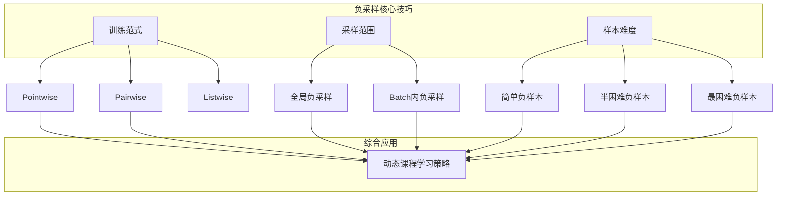
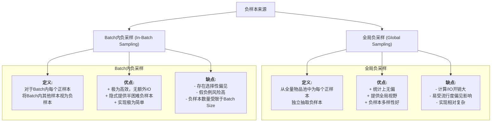
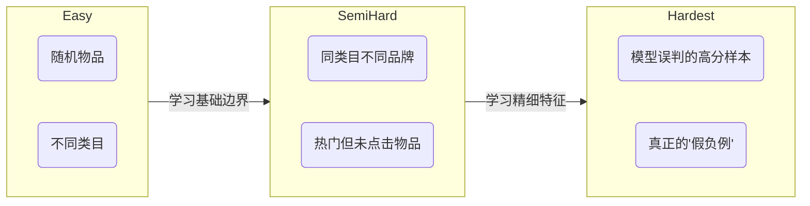

> "一个好的模型，不仅知道要学什么，更知道要对比什么来学。"

在推荐和搜索系统中，负采样不仅是应对海量数据、提升训练效率的必要手段，更是一门决定模型能力上限的艺术。一个精心设计的负采样策略，能引导模型学会细微的语义差别，从而构建出结构精良的表示空间。本文将从**训练范式**、**采样范围**和**样本难度**这三个核心维度，深入剖析负采样的实战技巧。

## 🎯 核心技巧概览

我们将围绕以下三个关键问题展开：

1.  **如何训练？ (训练范式)**：Pointwise、Pairwise、Listwise 哪种更适合你的任务？
2.  **从哪采样？ (采样范围)**：全局采样和Batch内采样如何权衡与选择？
3.  **采什么样？ (样本难度)**：如何从简单负样本平滑过渡到困难负样本，实现高效训练？

---

## 1. 训练范式：决定优化的目标

训练范式定义了我们如何看待"正"与"负"的关系，直接决定了损失函数的形式和模型的优化目标。

### Pointwise, Pairwise, Listwise 对比

| 范式 | 核心思想 | 损失函数示例 | 优点 | 缺点 | 适用场景 |
|---|---|---|---|---|---|
| **Pointwise** | 将每个 (用户, 物品) 对视为独立的分类或回归问题 | 交叉熵 (NCE Loss) | 简单直观，易于并行 | 忽略了样本间的相对顺序 | 点击率预估、召回阶段 |
| **Pairwise** | 优化正负样本对的相对顺序，让正样本得分高于负样本 | BPR Loss, Hinge Loss | 直接对排序目标进行建模，更符合排序任务 | 样本构造更复杂，收敛可能更慢 | 召回和排序，尤其是隐式反馈 |
| **Listwise** | 优化整个推荐列表的顺序，使其尽可能接近理想排序 | ListNet, LambdaRank | 理论上最接近排序评估指标 (NDCG等) | 复杂度高，计算开销大，实现复杂 | 主要用于精排阶段 |

### 核心数学模型详解

#### Pointwise: 噪声对比估计 (NCE)
它将问题转化为一个二分类问题：判断一个样本是来自真实数据分布 $P_{data}$（正样本），还是来自一个已知的噪声分布 $P_{noise}$（负样本）。

$$ \mathcal{L}_{NCE} = -\log \sigma(s(u, i^+)) - \sum_{j=1}^{k} \mathbb{E}_{i^-_j \sim P_{noise}}[\log(1 - \sigma(s(u, i_j^-)))] $$

其中 $s(u,i)$ 是模型评分，$\sigma$ 是 sigmoid 函数。它独立地看待每个正负样本，目标是让正样本得分高，负样本得分低。

#### Pairwise: 贝叶斯个性化排序 (BPR)
BPR 不关心单个样本的绝对得分，只关心正负样本对的相对顺序。其目标是最大化正样本得分高于负样本的后验概率。

$$ \mathcal{L}_{BPR} = \sum_{(u, i^+, i^-) \in D} -\log \sigma(s(u, i^+) - s(u, i^-)) $$

它直接优化了正负样本间的得分差，是目前召回模型中最主流、最有效的范式之一。

#### Listwise: 列表交叉熵 (ListNet)
Listwise 范式从一个更高的视角看待问题，它要优化的是一个完整的物品排序列表。以 ListNet 为例，它的核心思想如下：
1.  **得分概率化**：首先，使用 Softmax 将一个物品列表（例如一个正样本和k个负样本）的模型得分 $s(u, i_j)$ 转换为一个概率分布 $P_{scores}(i_j)$。
    $$ P_{scores}(i_j) = \frac{\exp(s(u, i_j))}{\sum_{l=0}^{k} \exp(s(u, i_l))} $$
2.  **真值概率化**：类似地，将这个列表的"真实标签"（例如，正样本为1，负样本为0）也转换为一个概率分布 $P_{labels}(i_j)$。
3.  **计算交叉熵**：最后，通过计算这两个概率分布的交叉熵来构造损失函数。
    $$ \mathcal{L}_{Listwise} = - \sum_{j=0}^{k} P_{labels}(i_j) \log(P_{scores}(i_j)) $$
通过这种方式，Listwise损失函数能够直接优化整个列表的排序，理论上与NDCG等排序指标更相关。

---

## 2. 采样范围：决定视野的广度

采样范围决定了负样本从哪里来，这在效率和偏差之间构成了一对核心矛盾。

### 实践中的权衡

- **In-Batch Sampling** 是目前大规模预训练模型（如BERT、SimCLR）和双塔召回模型的首选，因为它极致的效率和隐式提供高质量负样本的能力。其核心挑战在于如何通过增大Batch Size和避免同质化Batch来缓解其缺点。
- **Global Sampling** 提供了更准确的全局分布视图。为了解决其效率问题，通常采用**近似最近邻 (ANN)** 搜索来预先筛选出有价值的候选负样本，或者结合缓存策略。为了缓解流行度偏见，**频率加权采样**是一个常用技巧：
  $$P(i^-) = \frac{freq(i)^{\alpha}}{\sum_{j} freq(j)^{\alpha}}$$
  其中 $\alpha=0.75$ 是 Word2Vec 中的经典设置。

::: tip 混合才是王道
在实践中，最强大的策略往往是**混合采样**：即同时使用In-Batch负样本和全局负样本。例如，一个Batch中包含 $N$ 个正样本，我们可以使用 $N-1$ 个In-Batch负样本，再额外补充 $M$ 个通过全局采样（如频率加权采样）得到的"真·随机"负样本。这结合了两种方法的优点，既高效又能防止模型"视野狭隘"。
:::

---

## 3. 样本难度：决定学习的深度

负样本的"难度"是决定模型能否学会细粒度差异的关键。一个好的训练过程，应该像一个优秀的导师，循循善诱，从易到难。

### 负样本的难度光谱

| 样本类型 | 定义 | 作用 | 风险 | 获取方式 |
|---|---|---|---|---|
| **简单负样本** | 与正样本差异巨大，模型能轻松区分 | 帮助模型在训练初期快速收敛，建立基本的决策边界 | 训练后期贡献梯度小，学习停滞 | 均匀随机采样 |
| **半困难负样本** | 与正样本有一定相似性，但仍能区分 | **训练的核心**，迫使模型学习更细粒度的特征，最具性价比 | - | 1. 同品类采样   2. 基于热门度采样   3. Batch内采样天然提供 |
| **最困难负样本** | 模型眼中与正样本最相似的样本 | 挑战模型极限，挖掘潜在的"未知知识" | **极易是假负例**，可能导致模型训练不稳定甚至崩溃 | 1. 基于模型预测分数采样   2. 对抗生成 |

### 困难负样本挖掘方法详解

挖掘困难负样本是提升模型上限的关键，但必须谨慎使用。

#### 1. 静态困难样本 (Static Hard Negatives)
在训练前或训练过程中，基于一些不依赖模型分数的启发式规则来挖掘。
- **基于内容相似性**：利用物品的元数据（类别、标签、品牌）找到与正样本相似的物品作为负样本。例如，用户喜欢"A牌的篮球鞋"，我们可以选择"B牌的篮球鞋"或"A牌的跑鞋"作为困难负样本。
- **基于流行度**：选择全局热门但用户未交互的物品。这类物品被很多人喜欢，模型需要更强的用户个性化信号才能判断该用户不喜欢它，因此是天然的困难负样本。

#### 2. 在线/动态困难样本 (Online/Dynamic Hard Negatives)
这类方法在训练过程中，根据模型当前的状态动态地生成困难负样本，更具适应性。

##### a. 基于模型打分的采样 (Model-based Sampling)
这是最主流的困难样本挖掘方式。它又可以细分为两类：
- **最困难样本 (Hardest Negatives)**：对于一个正样本 $i^+$，在所有负样本中，选择那个被模型打分最高（即与 $i^+$ 最相似）的 $i^-$。这种方式非常激进，风险在于选出的样本很可能是"假负例"（False Negative），即用户未来可能会喜欢的物品，用它做负样本会误导模型。
- **半困难样本 (Semi-Hard Negatives)**：为了缓解上述问题，FaceNet论文提出一个更聪明的策略。选择那些虽然"困难"（即与正样本的距离 $d(u, i^-)$ 很近），但没有正样本那么近（即 $d(u, i^-) > d(u, i^+)$）的负样本。用公式表达，它满足：
  $$ d(u, i^+) < d(u, i^-) < d(u, i^+) + \alpha $$
  这里的 $\alpha$ 是一个边际（margin）。这类样本既为模型提供了有价值的梯度信号，又避免了"假负例"的风险，是目前公认非常有效和鲁棒的策略。

##### b. 对抗性训练 (Adversarial Training)
这是一种更高级的"黑科技"。它不是从存量样本中"挑选"困难样本，而是"创造"一个。其核心思想是：在用户或物品的Embedding向量上，施加一个微小的、能让模型损失最大的"扰动"（Adversarial Perturbation），从而生成一个虚拟的、极度困难的负样本。

以BPR损失为例，对抗性训练的目标是：
$$ \mathcal{L}_{APR} = \mathcal{L}_{BPR} + \lambda ||\Delta_{adv}||^2 $$
其中扰动 $\Delta_{adv}$ 是通过最大化BPR损失计算得到的：
$$ \Delta_{adv} = \epsilon \cdot \frac{g}{||g||_2} \quad \text{其中} \quad g = \nabla_{e_u, e_{i^+}, e_{i^-}} \mathcal{L}_{BPR} $$
$g$是损失函数对Embedding的梯度。这种方法能显著增强模型的鲁棒性，迫使其在非常平滑的决策边界上进行学习。

### 课程学习：从易到难的艺术

直接用困难负样本进行训练，就像让一个新手直接挑战世界冠军，结果往往是灾难性的。更科学的方法是采用**课程学习 (Curriculum Learning)** 的思想：

1.  **启动阶段 (Warm-up)**：仅使用简单负样本（随机采样）和In-Batch负样本，让模型快速学习到一个合理的初始表示空间。
2.  **进阶阶段 (Fine-tuning)**：逐渐引入更困难的负样本。可以设计一个动态混合比例，随着训练的进行，逐步提高半困难负样本（如来自ANN或模型打分）的比例。
3.  **稳定阶段 (Stabilization)**：在训练后期，可以适当降低最困难负样本的比例，防止模型在错误的"假负例"上过拟合，从而保证模型的泛化能力。

---

> 🧠 思考题
>
>1.  **In-Batch采样的陷阱**：如果一个Batch中的所有样本都来自同一个用户的行为序列，In-Batch采样会产生什么问题？如何缓解？
>2.  **困难样本的"度"**：如何动态调整困难样本的采样强度（例如上文的 $\alpha$ 参数）以适应不同训练阶段的需求？
>3.  **假负例问题**：除了采用Semi-Hard策略，还有哪些方法可以更主动地识别和处理"假负例"？（提示：可以参考 SOTA 论文中的去偏方法）
>4.  **多目标下的负采样**：在需要同时优化点击率和转化率的多目标模型中，两个目标的负采样策略应该如何设计和协调？

::: tip 🎉 章节小结
负采样的三个维度——训练范式、采样范围、样本难度——共同决定了模型的表示学习质量。Pairwise 范式（BPR）是召回阶段的主流选择；In-Batch 采样在效率上占据压倒性优势，搭配少量全局采样可进一步提升多样性；课程学习式的难度递进策略，以半困难样本为核心，是兼顾训练稳定性与模型上限的关键。
:::
